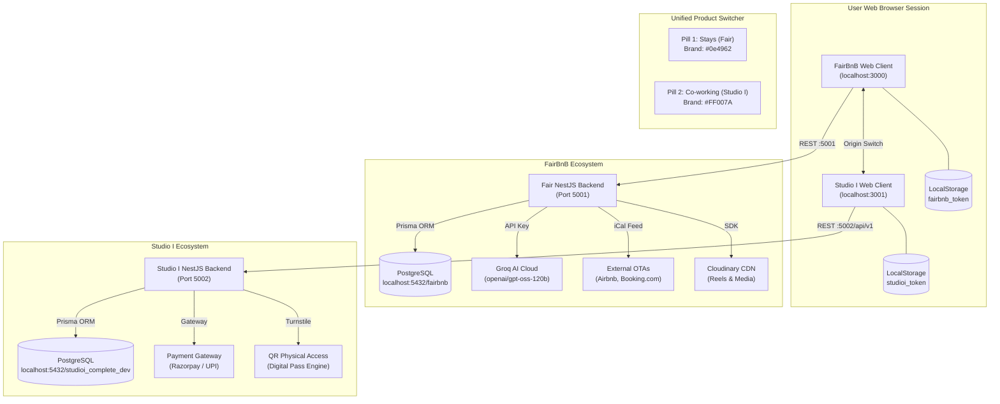
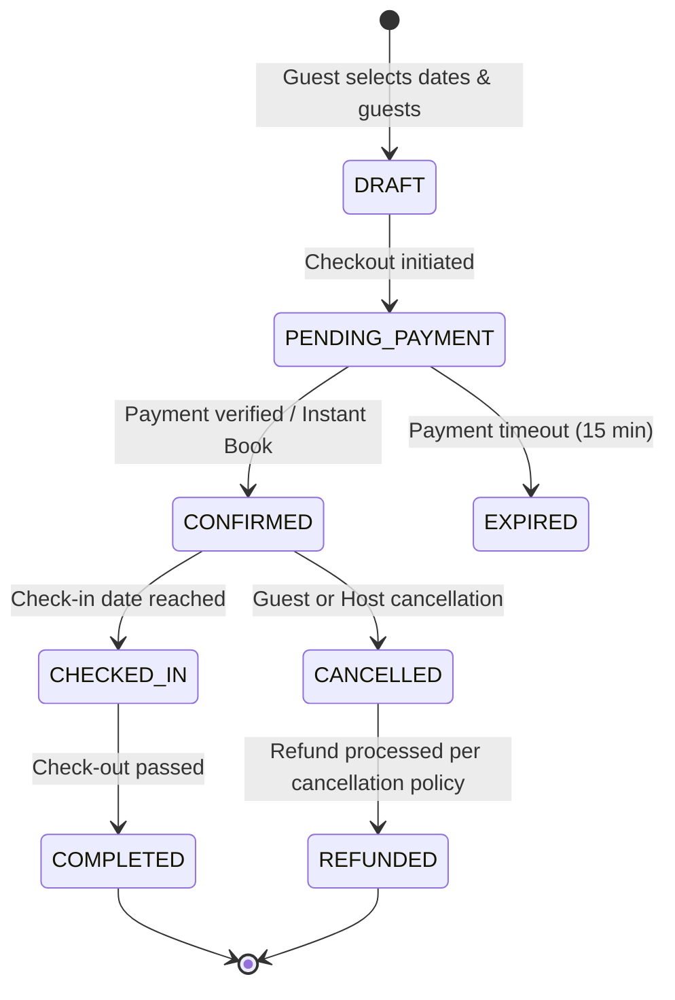
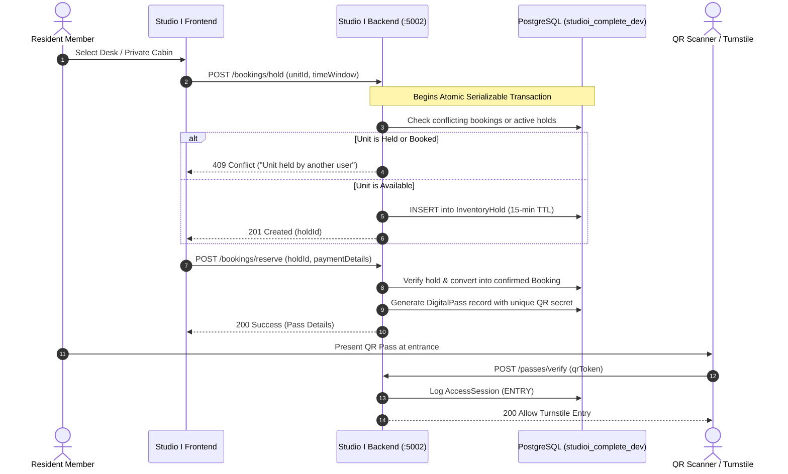

# BRAIN.md — VICINITY MONOREPO ENGINEERING SOURCE OF TRUTH

> **CONFIDENTIAL & AUTHORITATIVE SYSTEM ARCHITECTURE MANUAL**  
> **Workspace**: VICINITY Monorepo (`/Users/ideaind/Desktop/tech/vicinitywebsite`)  
> **Core Subsystems**: **FairBnB ("Fair" / "Stays")** & **Studio I ("Co-working")**  
> **Architecture Status**: VERIFIED VIA READ-ONLY CODEBASE AUDIT (October 2026)  
> **Operating Mode**: Production-Grade Multi-Origin Monorepo Architecture

---

## 1. Document Purpose

This document is the **single engineering source of truth** for the VICINITY monorepo. It serves as an architectural blueprint, design system reference, database dictionary, security guide, and onboarding foundation for staff and senior engineers, QA architects, and AI pair-programmers.

Every statement in this document is derived directly from verified code, configuration files, schemas, and runtime contracts in `/Users/ideaind/Desktop/tech/vicinitywebsite`.

---

## 2. Project Overview

**VICINITY** is an integrated ecosystem uniting two flagship hospitality and commercial real estate platforms:

1. **FairBnB ("Fair" / "Stays")**: A full-featured short-term vacation rental, homestay, boutique villa, and events booking platform (comparable to Airbnb) featuring AI-driven conversational discovery, vertical short-form video reels, host/co-host delegation, iCal channel synchronisation, and multi-party payout settlements.
2. **Studio I ("Co-working")**: A commercial co-working, flex-desk, private cabin, and conference space management system featuring atomic inventory locking, digital QR passes, physical check-in turnstile sessions, floor-plan zoning, corporate memberships, and partner beneficiary splits.

Both products maintain **complete origin and database isolation**, interconnected exclusively via a unified, client-side dual-pill product navigation switch established in their shared top-level navigation design.

---

## 3. Current System Status

| Subsystem | Component | Runtime Port / Prefix | Tech Stack | Status |
| :--- | :--- | :--- | :--- | :--- |
| **FairBnB** | Frontend Web App | `http://localhost:3000` | Next.js 16.3.1, React 19.2.8, Tailwind CSS v4 | **VERIFIED / ACTIVE** |
| **FairBnB** | Backend REST API | `http://localhost:5001` | NestJS 11.0.1, Prisma 6.19.3, Express | **VERIFIED / ACTIVE** |
| **FairBnB** | Database | `localhost:5432/fairbnb` | PostgreSQL 16+ (Prisma ORM) | **VERIFIED / ACTIVE** |
| **FairBnB** | AI Discovery (Groq) | `/ai/*` via Port 5001 | Groq Cloud API (`openai/gpt-oss-120b`) | **VERIFIED / ACTIVE** |
| **Studio I** | Frontend Web App | `http://localhost:3001` | Next.js 16.3.5, React 19.2.8, Tailwind CSS v4 | **VERIFIED / ACTIVE** |
| **Studio I** | Backend REST API | `http://localhost:5002/api/v1` | NestJS 11.0.1, Prisma 6.19.3, Express | **VERIFIED / ACTIVE** |
| **Studio I** | Database | `localhost:5432/studioi_complete_dev` | PostgreSQL 16+ (Prisma ORM) | **VERIFIED / ACTIVE** |

---

## 4. Technology Stack Inventory

### 4.1 Frontends

| Dimension | FairBnB Frontend | Studio I Frontend |
| :--- | :--- | :--- |
| **Framework** | Next.js `16.3.1` (App Router) | Next.js `16.3.5` (App Router) |
| **Runtime / Library** | React `19.2.8`, React DOM `19.2.8` | React `19.2.8`, React DOM `19.2.8` |
| **CSS & Design Engine**| Tailwind CSS `^4.0.0`, `@tailwindcss/postcss` | Tailwind CSS `^4.0.0`, `@tailwindcss/postcss` |
| **Animation Engine** | Framer Motion `^13.4.0` | Framer Motion `^13.4.0` |
| **Iconography** | Lucide React `^1.33.0` | Lucide React `^1.47.0` |
| **Media & Animation** | `hls.js` `^1.7.3`, `@dotlottie/react-player` `^1.6.19` | Native HTML5 Video & CSS Micro-animations |
| **TypeScript** | TypeScript `^5.0.0` | TypeScript `^5.0.0` |
| **Testing Engine** | Vitest `^5.0.1`, Testing Library React `^16.3.3` | Manual & E2E browser harness |

### 4.2 Backends

| Dimension | FairBnB Backend | Studio I Backend |
| :--- | :--- | :--- |
| **Framework** | NestJS `^11.0.1` | NestJS `^11.0.1` |
| **Language & Transpiler**| TypeScript `^5.7.3`, `ts-node` `^10.9.2` | TypeScript `^5.7.3`, `ts-node` `^10.9.2` |
| **ORM / Database Tool**| Prisma Client `^6.19.3`, Prisma CLI `^6.19.3` | Prisma Client `^6.19.3`, Prisma CLI `^6.19.3` |
| **Authentication** | `@nestjs/jwt` `^11.0.2`, `passport-jwt` `^4.0.1`, `bcrypt` `^6.0.0` | `@nestjs/jwt` `^11.0.2`, `passport-jwt` `^4.0.1`, `bcrypt` `^6.0.0` |
| **Validation** | `class-validator` `^0.15.1`, `class-transformer` `^0.5.1` | `class-validator` `^0.15.1`, `class-transformer` `^0.5.1` |
| **Scheduling & Tasks** | `@nestjs/schedule` `^6.1.3` (iCal, Auto-messages) | `@nestjs/schedule` `^6.1.3` (Hold release, cron) |
| **Media Cloud Storage**| Cloudinary SDK `^2.11.0` | Local / S3 signed URI architecture |

---

## 5. Repository Structure Map

```text
/Users/ideaind/Desktop/tech/vicinitywebsite
├── BRAIN.md                                  # THIS FILE: System Source of Truth
├── INTEGRATION_ARCHITECTURE.md               # Origin separation & cross-nav specs
├── REPO_MAP.md                               # Low-level service and repository map
├── ADMIN-USERS-BOOKINGS-ERROR-AUDIT.md       # Root-cause audit for admin lists
├── ADMIN-USERS-BOOKINGS-FIX-REPORT.md        # Resolution report for admin lists
├── FAIR-GUEST-DASHBOARD-AUDIT.md             # Guest isolation audit
├── FAIR-GUEST-DASHBOARD-IMPLEMENTATION-REPORT.md
│
├── fairbnb/                                  # FairBnB Git Repository (branch: kashish-temp)
│   ├── frontend/                             # Next.js 16.3.1 (Stays / Stays Events)
│   │   ├── src/
│   │   │   ├── app/                          # Next.js App Router routes
│   │   │   │   ├── admin/                    # Admin portal hub (19 submodules)
│   │   │   │   ├── host/                     # Host management portal
│   │   │   │   ├── co-host/                  # Co-host delegated portal
│   │   │   │   ├── guest/                    # Guest trips and profile
│   │   │   │   ├── properties/               # Listing details & checkout
│   │   │   │   ├── reels/                    # Video reels feed
│   │   │   │   ├── events/                   # Stays Events hub
│   │   │   │   └── page.tsx                  # Stays homepage
│   │   │   ├── components/                   # UI library, Navbar, AirbnbHeader
│   │   │   ├── context/                      # AuthContext, BookingContext
│   │   │   ├── features/ai/                  # Smart search, AI concierge client
│   │   │   └── lib/api-client.ts             # Fair REST client (`:5001`)
│   │   └── package.json
│   │
│   └── backend/                              # NestJS 11.0.1 (Fair REST API)
│       ├── prisma/schema.prisma              # 47 Models, 7 Enums
│       ├── src/
│       │   ├── admin/                        # Admin services and controllers
│       │   ├── admin-settings/               # Canonical SystemSetting toggles
│       │   ├── ai-feature/                   # Groq LLM integration & RAG
│       │   ├── auth/                         # JWT authentication & OTP
│       │   ├── bookings/                     # Bookings state machine & engine
│       │   ├── co-host/                      # Delegated permissions & invites
│       │   ├── ical/                         # External calendar sync
│       │   ├── payouts/                      # Multi-party settlements & Cashfree
│       │   ├── properties/                   # Listing lifecycle & pricing rules
│       │   └── reels/                        # Video stream & metrics engine
│       └── package.json
│
└── studioiwebsite/                           # Studio I Git Repository (branch: kashish)
    ├── frontend/                             # Next.js 16.3.5 (Co-working Platform)
    │   ├── src/
    │   │   ├── app/
    │   │   │   ├── admin/                    # Studio I Admin portal
    │   │   │   ├── host/                     # Space Partner portal
    │   │   │   ├── co-host/                  # Floor Manager portal
    │   │   │   ├── workspaces/               # Workspace detail & unit booking
    │   │   │   ├── my-bookings/              # Member passes & reservations
    │   │   │   └── page.tsx                  # Studio I homepage
    │   │   ├── components/                   # Shared UI, Studio I Navbar
    │   │   └── lib/api.ts                    # Studio I REST client (`:5002/api/v1`)
    │   └── package.json
    │
    └── backend/                              # NestJS 11.0.1 (Studio I API)
        ├── prisma/schema.prisma              # 44 Models, 13 Enums
        ├── src/
        │   ├── admin/                        # Operations, Ledger, Master Admin
        │   ├── auth/                         # JWT authentication
        │   ├── availability/                 # Atomic inventory lock & holds
        │   ├── bookings/                     # Coworking passes & reservations
        │   ├── co-host/                      # Space delegation & floor managers
        │   ├── digital-pass/                 # QR code check-in & turnstile engine
        │   ├── operations/                   # Floor layouts, zones & desk units
        │   ├── payments/                     # Razorpay / verification orders
        │   ├── pricing/                      # Day-pass & monthly rates calculation
        │   └── workspaces/                   # Campus, building, floor definitions
        └── package.json
```

---

## 6. System Architecture & Topology



### Architectural Isolation Guarantees:
1. **Zero Cross-Talk in Databases**: Neither NestJS service holds database connection strings, credentials, or Prisma client references to the other platform.
2. **Zero Shared Controllers or Endpoints**: Fair runs on `http://localhost:5001`; Studio I runs on `http://localhost:5002/api/v1`.
3. **Storage Partitioning**: Web storage (HTML5 `localStorage`) is strictly partitioned by the browser origin tuple `(scheme, host, port)`. A token issued by Fair cannot be read by Studio I code, eliminating session leakage.

---

## 7. Product & Business Domains

### 7.1 FairBnB ("Fair")
* **Stays / Homestays / Boutique Villas**: Individual units, entire villas, boutique private rooms with detailed amenities, rules, check-in instructions, dynamic nightly rates, and custom weekend/seasonal pricing rules.
* **Fair Stay Events**: Curated experiential events, workshops, culinary retreats, and destination celebrations linked directly to Fair properties.
* **Vertical Reels**: Short video property showcases with swipeable feeds, host attribution, view counts, engagement tracking, and instant listing deep-links.
* **AI Concierge**: Smart search parsing colloquial queries ("romantic quiet cabin under 5000 in Manali with fast wifi"), listing Q&A, and auto-drafted host responses.
* **Co-Hosting System**: Enables primary hosts to delegate listings to co-hosts with granular access masks (Calendar, Messaging, Pricing, Maintenance, Finances).
* **Automated Messaging & iCal Sync**: Real-time webhook and cron synchronisation with external calendars (Airbnb, VRBO) and rule-based messaging triggered on reservation milestones.

### 7.2 Studio I ("Studio I")
* **Workspaces & Campuses**: Physical commercial locations (e.g., *Jaipur Horizon Tower*, *Lehariya Campus*) segmented hierarchically: `Workspace -> Building -> Floor -> Zone -> Unit`.
* **Units & Plans**:
  * `DAY_PASS`: Single-day flexible access to open shared desks.
  * `HOT_DESK`: Flexible seating across zones with daily/weekly billing.
  * `DEDICATED_DESK`: Assigned private desk with lockable storage.
  * `PRIVATE_CABIN`: Lockable enterprise team suites (4-seater to 50-seater).
  * `MEETING_ROOM`: Hourly reservable conference and board rooms.
* **Atomic Inventory Locking**: Real-time 15-minute checkout hold preventing double-booking during payment.
* **Digital Pass & QR Turnstiles**: Generates cryptographically secure, time-bounded QR passes for entry, check-in, and check-out logs.
* **Multi-Beneficiary Settlements**: Automated gross-to-net financial splits between property partners, campus managers, and platform operators.

---

## 8. User Roles & Permission Matrix

### 8.1 FairBnB Role System

```prisma
enum UserRole {
  USER     // Guest: Book stays, browse reels, write reviews
  HOST     // Property Owner / Manager: Create listings, view earnings
  ADMIN    // Super-administrator: Governance, finance, settlements
}
```
*Note*: Co-hosts in FairBnB are authenticated users (typically `HOST` or `USER` base role) mapped via the `CoHostRelationship` model with specific delegated permission flags:
- `CALENDAR_MANAGE`
- `RESERVATIONS_MANAGE`
- `MESSAGING_ACCESS`
- `PRICING_MANAGE`
- `MAINTENANCE_LOG`
- `FINANCIAL_VIEW`
- `LISTINGS_EDIT`

### 8.2 Studio I Role System

```prisma
enum Role {
  USER     // Resident Member / Corporate Guest: Book passes, desks, cabins
  HOST     // Campus Partner / Realty Owner: Manage building & floor spaces
  ADMIN    // Master Administrator: System-wide ledger, scopes, approvals
  COHOST   // Floor Manager: Manage bookings, check-in, desk maintenance
}
```

### 8.3 Monorepo Permission Matrix

| Capability / Resource | Guest (`USER`) | Co-Host | Host | Master Admin |
| :--- | :---: | :---: | :---: | :---: |
| **Browse Listings / Workspaces** | ✓ | ✓ | ✓ | ✓ |
| **Instant Booking & Checkout** | ✓ | ✓ | ✓ | ✓ |
| **View Personal Trips / Passes** | ✓ | ✓ | ✓ | ✓ |
| **Host/Partner Dashboard Access** | ✗ *(Strictly Isolated)* | ✓ *(Scoped)* | ✓ | ✓ |
| **Create Property / Workspace** | ✗ | ✗ | ✓ | ✓ |
| **Manage Pricing & Calendar** | ✗ | ✓ *(If Granted)* | ✓ | ✓ |
| **Check-in Guests / Scan Passes** | ✗ | ✓ | ✓ | ✓ |
| **Access Financial Settlements** | ✗ | ✗ *(Unless Granted)* | ✓ *(Own Share)* | ✓ *(System-wide)* |
| **Global User Governance (Block/Verify)** | ✗ | ✗ | ✗ | ✓ |
| **Feature Toggles (Reels, AI)** | ✗ | ✗ | ✗ | ✓ |

---

## 9. Authentication & Session Architecture

### 9.1 FairBnB Authentication
- **Transport**: `POST http://localhost:5001/auth/login`
- **Payload**: `{ email: string, password: string }`
- **Validation**: Passwords verified via `bcrypt.compare(password, passwordHash)` (10 salt rounds).
- **Session Tokens**: JWT signed by `JWT_SECRET`. Contains payload `{ sub: userId, email, role }`.
- **Client Storage**:
  - `localStorage.setItem('fairbnb_token', token)`
  - `localStorage.setItem('fairbnb_user', JSON.stringify(user))`
  - `localStorage.setItem('fairbnb_is_cohost', String(isCoHost))`
- **Client API Wrapper**: `fairbnb/frontend/src/lib/api-client.ts` automatically attaches `Authorization: Bearer <fairbnb_token>`.
- **401 Interception**: Automatically purges stale tokens upon receiving HTTP 401 Unauthorized.

### 9.2 Studio I Authentication
- **Transport**: `POST http://localhost:5002/api/v1/auth/login`
- **Payload**: `{ email: string, password: string }`
- **Session Tokens**: JWT signed by independent `JWT_SECRET`. Contains payload `{ sub: userId, email, role }`.
- **Client Storage**:
  - `localStorage.setItem('studioi_token', token)`
  - `localStorage.setItem('studioi_user', JSON.stringify(user))`
- **Client API Wrapper**: `studioiwebsite/frontend/src/lib/api.ts` automatically attaches `Authorization: Bearer <studioi_token>`.

---

## 10. Route Map

### 10.1 FairBnB Frontend Routes (`fairbnb/frontend/src/app`)

| Route | Purpose | Access Control |
| :--- | :--- | :--- |
| `/` | Homepage, Search, Featured Stays, AI Concierge | Public |
| `/login` | Email/password login with demo quick-buttons | Public |
| `/register` | Guest onboarding & account creation | Public |
| `/properties/[id]` | Stay details, photo gallery, reviews, pricing quote | Public |
| `/book` | Booking checkout, guest details, payment review | Authenticated |
| `/guest/trips` | Guest reservation list, vouchers, trip status | Authenticated (`USER`) |
| `/reels` | Vertical property video feed | Public (Blocked if feature disabled) |
| `/events` | Fair Stay experiential events showcase | Public |
| `/host/dashboard` | Host command center, occupancy, listing stats | Host (`HOST`) |
| `/host/listings/new` | Multi-step property creation wizard | Host (`HOST`) |
| `/co-host/dashboard`| Co-host portal with delegated permissions | Delegated Co-Host |
| `/admin/dashboard` | Super-admin analytics & high-level KPIs | Admin (`ADMIN`) |
| `/admin/users` | Guest directory, verification, account blocks | Admin (`ADMIN`) |
| `/admin/hosts` | Host directory & 1-click admin impersonation | Admin (`ADMIN`) |
| `/admin/bookings` | System-wide booking ledger & cancel workflows | Admin (`ADMIN`) |
| `/admin/properties`| Property moderation, verification, approvals | Admin (`ADMIN`) |
| `/admin/settlements`| Partner payout splits & transfer intent logs | Admin (`ADMIN`) |
| `/admin/settings` | Feature flags (`REELS_FEATURE_ENABLED`) | Admin (`ADMIN`) |
| `/admin/ai-settings`| AI concierge runtime parameters & models | Admin (`ADMIN`) |

### 10.2 Studio I Frontend Routes (`studioiwebsite/frontend/src/app`)

| Route | Purpose | Access Control |
| :--- | :--- | :--- |
| `/` | Homepage, coworking spaces overview | Public |
| `/explore` | Workspaces directory, city filter, amenity filter | Public |
| `/workspaces/[id]` | Campus details, floor plan, unit selection | Public |
| `/checkout` | Inventory hold, plan selection, payment | Authenticated |
| `/my-bookings` | Member passes, QR codes, check-in history | Authenticated (`USER`) |
| `/host/dashboard` | Realty partner floor occupancy & desk list | Host (`HOST`) |
| `/co-host/dashboard`| Floor manager daily check-ins & passes | Co-Host (`COHOST`) |
| `/admin/dashboard` | Master admin occupancy, revenue, finance | Admin (`ADMIN`) |
| `/admin/users` | Member accounts, access scopes, block toggles | Admin (`ADMIN`) |
| `/admin/bookings` | Coworking passes & reservations ledger | Admin (`ADMIN`) |
| `/admin/spaces` | Campus, building, floor, zone & unit editor | Admin (`ADMIN`) |

---

## 11. Frontend Design System & Typography

### 11.1 Color Tokens

#### FairBnB Primary Identity (Deep Petrol Blue)
- **Primary Brand**: `#0e4962` (`--color-primary`)
- **Primary Hover**: `#093447` (`--color-primary-hover`)
- **Primary Light / Surface**: `#e8f2f6` (`--color-primary-light`)
- **Uniform Shade Mapping**: Tailwind CSS v4 `@theme` in `fairbnb/frontend/src/app/globals.css` maps both `--color-rose-*` and `--color-pink-*` ranges directly into the curated `#0e4962` tonal spectrum (`#edf4f7` through `#041822`) to guarantee complete visual coherence.

#### Studio I Identity
- **Primary Brand Accent**: `#0e4962` (Base branding across dashboards)
- **Co-working Pill Accent**: `#FF007A` (Established in navigation dual-pill switcher)
- **Dark Surfaces**: `#171717`, `#0f172a`, `#0b101e`
- **Text Standards**: Headings `text-white` or `text-neutral-900`, Subtitles `text-neutral-500` / `text-neutral-400`.

### 11.2 Typography Hierarchy

| Subsystem | Primary Font | Source | Weights Used | Key Utility Tokens |
| :--- | :--- | :--- | :--- | :--- |
| **FairBnB** | `Poppins` | Google Fonts (`@import`) | `300`, `400`, `500`, `600`, `700`, `800` | `--text-display`: `30px - 36px`<br/>`--text-h1`: `24px - 30px`<br/>`--text-h2`: `20px - 24px`<br/>`--text-body`: `14px` |
| **Studio I** | `Plus Jakarta Sans` | `next/font/google` | `300`, `400`, `500`, `600`, `700`, `800` | `font-black`, `tracking-tight`<br/>Headings: `text-2xl`, `text-3xl`<br/>Body: `text-xs`, `text-sm` |

---

## 12. Backend Architecture & Controller Inventory

### 12.1 FairBnB Backend Modules (`fairbnb/backend/src`)

1. **`AuthModule` (`/auth`)**: Registration, login, OTP verification, password reset, JWT generation.
2. **`AdminModule` (`/admin`)**: User directories, host directory, guest management, admin audit logs.
3. **`AdminBookingsModule` (`/admin/bookings`)**: Paginated reservations list, summaries, cancellations.
4. **`AdminSettingsModule` (`/admin-settings`)**: Canonical key-value store for feature flags (`REELS_FEATURE_ENABLED`).
5. **`AiFeatureModule` (`/ai`)**: Groq LLM integration, SmartSearch (`/ai/smart-search`), StayComparison, ListingQA, HostReplyDraft.
6. **`PropertiesModule` (`/properties`)**: CRUD, approval lifecycles, seasonal pricing rules, house rules.
7. **`BookingsModule` (`/bookings`)**: Reservation state engine, trip lookups, checkout quote computation.
8. **`ReelsModule` (`/reels`)**: Vertical video metadata, streaming endpoints, likes, comments, reports.
9. **`CoHostModule` (`/co-host`)**: Co-host invites, status updates, permission assignment.
10. **`IcalModule` (`/ical`)**: Inbound and outbound iCal sync for Airbnb, VRBO, Booking.com.
11. **`PayoutsModule` (`/admin/settlements`, `/payouts`)**: Multi-party split engine, transfers, adjustments.
12. **`NotificationsModule` (`/notifications`)**: User alerts, booking status emails, push notifications.
13. **`ReviewsModule` (`/reviews`)**: Verified guest ratings, host responses, score aggregation.
14. **`DisputesModule` (`/disputes`)**: Dispute ticketing between guests and hosts, resolution workflows.
15. **`AutomatedMessagesModule` (`/automated-messages`)**: Rule-based scheduled messages (pre-checkin, post-checkout).

### 12.2 Studio I Backend Modules (`studioiwebsite/backend/src`, Prefix `/api/v1`)

1. **`AuthModule` (`/auth`)**: Member registration, login, profile lookups.
2. **`AdminModule` (`/admin`)**: Space analytics, user access controls, member blocking, reservations ledger.
3. **`WorkspacesModule` (`/workspaces`)**: Campus definitions, buildings, floor layouts, zones, units.
4. **`OperationsModule` (`/operations`)**: Floor plan layout versions, desk coordinate mapping.
5. **`AvailabilityModule` (`/availability`, `/bookings/hold`)**: Atomic 15-minute checkout holds with raw SQL transaction locks.
6. **`PricingModule` (`/bookings/pricing/quote`)**: Dynamic quote engine factoring tax (18% GST), security deposits, and coupons.
7. **`BookingsModule` (`/bookings`)**: Coworking pass generation, reservations, manual admin bookings.
8. **`DigitalPassModule` (`/passes`)**: Cryptographic QR passes, turnstile entry/exit validation.
9. **`CoHostModule` (`/co-host`)**: Floor manager invite, permission grants, space scoping.
10. **`PaymentsModule` (`/payments`)**: Payment order creation, verification, refund tracking.
11. **`HealthModule` (`/health`)**: Liveness and readiness endpoints.

---

## 13. Database Architecture & Schema Inventory

### 13.1 FairBnB Database (`localhost:5432/fairbnb`)
**Prisma Models (47 total)**:
- **Core Entities**: `User`, `Property`, `Booking`, `Review`, `Payment`, `Refund`, `Invoice`, `Wishlist`, `Notification`.
- **Co-Hosting**: `CoHostRelationship`, `CoHostPermission`, `CoHostInvitation`, `PayoutRule`.
- **Finance & Settlements**: `Settlement`, `SettlementRevision`, `SettlementAllocation`, `PayoutTransferIntent`, `PayoutTransferAttempt`, `PayoutAdjustment`, `FinancialAuditEvent`, `BookingFinanceSnapshot`.
- **Reels Media Engine**: `Reel`, `ReelAnalytics`, `ReelViewSession`, `ReelListing`, `ReelLike`, `ReelComment`, `ReelReport`.
- **Operations & AI**: `SystemSetting`, `AuditLog`, `CustomPricingRule`, `ChatMessage`, `MaintenanceRequest`, `Coupon`, `Banner`, `Lead`, `Dispute`, `AutomatedMessageRule`, `ExternalIcalFeed`.

### 13.2 Studio I Database (`localhost:5432/studioi_complete_dev`)
**Prisma Models (44 total)**:
- **Core Hierarchical Spaces**: `Workspace`, `Building`, `Floor`, `Zone`, `Unit`, `FloorLayoutVersion`, `WorkspaceMedia`, `Amenity`, `WorkspaceAmenityItem`.
- **Booking & Inventory Engine**: `BookingPlan`, `InventoryHold`, `Booking`, `PaymentOrder`, `RefundRecord`, `DigitalPass`, `AccessSession`.
- **Commercial & Corporate**: `MembershipPlan`, `Membership`, `CreditLedger`, `WalletLedger`, `Beneficiary`, `SettlementAgreement`, `SettlementAllocation`, `TransferIntent`.
- **Floor Management**: `CohostInvitation`, `CohostPermission`, `AdminScope`, `MaintenanceIssue`, `SupportTicket`, `SupportMessage`.

---

## 14. Key Business Workflows

### 14.1 FairBnB Booking Lifecycle



### 14.2 Studio I Atomic Inventory Locking & Access Flow



---

## 15. Feature Flags & Admin Control System

### 15.1 Reels Feature Toggle (`REELS_FEATURE_ENABLED`)
- **Storage**: Model `SystemSetting` (FairBnB Prisma schema).
- **Admin Controller**: `AdminSettingsController` (`/admin-settings`).
- **Enforcement Guard**: `ReelsFeatureGuard` (`fairbnb/backend/src/reels/guards/reels-feature.guard.ts`).
- **Behavior**:
  - When disabled, all backend API calls to `/reels` immediately return `HTTP 503 Service Unavailable`.
  - Frontend components gracefully hide the reels tab or display the administrative maintenance state.

### 15.2 AI Concierge Feature Toggle (`AI_FEATURE_ENABLED`)
- **Storage**: Model `SystemSetting` & `RuntimeAiConfigService`.
- **Enforcement**: Feature assertions in `SmartSearchService.search()` (`this.runtimeConfig.assertFeatureEnabled('smartSearch')`).
- **Admin UI**: `/admin/ai-settings` allows instant enabling/disabling of LLM-based query parsing without redeployment.

---

## 16. AI / GenAI Architecture (FairBnB Stays)

- **Provider**: Groq Cloud High-Speed Inference (`https://api.groq.com/openai/v1/chat/completions`).
- **Default Model**: `openai/gpt-oss-120b` (Configurable via `GROQ_MODEL` env).
- **Fallback Model**: `openai/gpt-oss-20b`.
- **Circuit Breaker Engine** (`fairbnb/backend/src/ai-feature/provider/groq.provider.ts`):
  - Failure Threshold: 3 consecutive network/provider timeouts.
  - Cooldown Window: 30 seconds before probing half-open state.
  - Fallback: Deterministic database keyword and metadata filter fallback.
- **Natural Language Parsing**: Extracts budget basis (nightly vs total stay), guest count, city, amenity requirements, and multilingual intent (supporting English and Hindi phrases like *"har raat"*, *"pura budget"*).

---

## 17. Security, Auditing & Compliance

1. **Password Security**: Bcrypt with 10 salt rounds applied to all password creations and updates.
2. **SQL Injection Prevention**: 100% parameterised queries executed via Prisma Client. Raw queries in `AvailabilityService` exclusively use typed parameter placeholders (`$queryRawUnsafe` with validated UUIDs).
3. **Cross-Origin Resource Sharing (CORS)**:
   - Configured dynamically in both `main.ts` files to explicitly allow `localhost` and `127.0.0.1` origins while prohibiting unauthenticated third-party origins.
4. **Audit Logging**:
   - `fairbnb/backend`: Model `AuditLog` captures administrator actions (suspensions, KYC approvals, settlement modifications).
   - `studioiwebsite/backend`: Model `AuditLog` logs member blocks, permission delegations, and manual ledger entries.
5. **Session Safety**: Bearer JWT tokens with strict expiration; client cleans up credentials on 401 events.

---

## 18. Environment Configuration Matrix

> *All secret values are strictly REDACTED in accordance with security guidelines.*

### FairBnB Frontend (`fairbnb/frontend/.env.local`)
| Variable | Purpose | Classification |
| :--- | :--- | :--- |
| `NEXT_PUBLIC_API_URL` | Base URL of FairBnB NestJS backend (`http://localhost:5001`) | Public Runtime |
| `NEXT_PUBLIC_STUDIOI_URL` | Destination URL for Studio I cross-nav (`http://localhost:3001`) | Public Runtime |

### FairBnB Backend (`fairbnb/backend/.env`)
| Variable | Purpose | Classification |
| :--- | :--- | :--- |
| `PORT` | Local service port (`5001`) | Configuration |
| `DATABASE_URL` | PostgreSQL connection string (`localhost:5432/fairbnb`) | Sensitive Connection |
| `JWT_SECRET` | Secret key used for signing authentication tokens | Secret Token |
| `GROQ_API_KEY` | Authentication key for Groq LLM inference service | Secret API Key |
| `GROQ_MODEL` | Primary AI model identifier | Configuration |
| `CLOUDINARY_*` | Cloudinary credentials for media asset uploads | Secret API Keys |

### Studio I Frontend (`studioiwebsite/frontend/.env.local`)
| Variable | Purpose | Classification |
| :--- | :--- | :--- |
| `NEXT_PUBLIC_API_URL` | Base URL of Studio I backend (`http://localhost:5002/api/v1`) | Public Runtime |
| `NEXT_PUBLIC_FAIR_URL` | Destination URL for FairBnB cross-nav (`http://localhost:3000`) | Public Runtime |

### Studio I Backend (`studioiwebsite/backend/.env`)
| Variable | Purpose | Classification |
| :--- | :--- | :--- |
| `PORT` | Local service port (`5002`) | Configuration |
| `DATABASE_URL` | PostgreSQL connection string (`localhost:5432/studioi_complete_dev`)| Sensitive Connection |
| `JWT_SECRET` | Secret key used for signing Studio I tokens | Secret Token |
| `FRONTEND_URL` | Authorized frontend origin for CORS | Configuration |

---

## 19. Local Development & Operational Playbook

### 19.1 Prerequisites
- Node.js `v20.x` or higher
- PostgreSQL `v16.x` running on port `5432`
- Ports `3000`, `3001`, `5001`, `5002` available

### 19.2 Starting the Monorepo Services

```bash
# Terminal 1: FairBnB Backend
cd fairbnb/backend
npm install
npx prisma generate
npm run start:dev

# Terminal 2: FairBnB Frontend
cd fairbnb/frontend
npm install
npm run dev

# Terminal 3: Studio I Backend
cd studioiwebsite/backend
npm install
npx prisma generate
npm run start:dev

# Terminal 4: Studio I Frontend
cd studioiwebsite/frontend
npm install
npm run dev -- -p 3001
```

---

## 20. Known Issues & Technical Debt

1. **Multi-Origin Navigation Re-Authentication**:
   - *Impact*: Logging into FairBnB does not automatically log the user into Studio I because sessions use origin-isolated `localStorage` Bearer tokens.
   - *Status*: Working as designed under the current isolated architecture; if Single Sign-On (SSO) is required in the future, a shared cookie domain or central OAuth identity service must be established.
2. **Independent Monorepo Build Scripts**:
   - *Impact*: There is no top-level `package.json` with Turborepo or Nx orchestrating root `npm run dev`. Services are operated independently in their respective subdirectories.
3. **Recent Admin List Fix (October 2026)**:
   - *Historical Note*: Frontend list state bindings in `admin/users/page.tsx` and `admin/bookings/page.tsx` previously assumed arrays rather than paginated response objects (`{ users: [...], total }`). Fixed by unpacking objects safely with defensive `Array.isArray()` guards in both projects.

---

## 21. Protected Areas & Change Guidelines

### 🚨 PROTECTED CODE REGIONS — DO NOT MODIFY CASUALLY
1. **Database Schemas & Migrations**:
   - `fairbnb/backend/prisma/schema.prisma`
   - `studioiwebsite/backend/prisma/schema.prisma`
   - *Rule*: Never alter columns, enums, or relations without prior written approval.
2. **Independent Origins & CORS Boundaries**:
   - *Rule*: Do NOT merge both backends into a single service or port. Do NOT attempt to bridge `localStorage` tokens via URL query parameters.
3. **Inventory Locking Transaction**:
   - `studioiwebsite/backend/src/availability/availability.service.ts`
   - *Rule*: Atomic holds prevent double-booking. Must remain strictly wrapped in transactions.
4. **Design Tokens & Typography Rules**:
   - `fairbnb/frontend/src/app/globals.css`
   - `studioiwebsite/frontend/src/app/globals.css`
   - *Rule*: Never re-introduce raw `#FF385C` pinks or uncoordinated fonts. Maintain `#0e4962` brand integrity.

---

## 22. End-to-End Architectural Verification Checklist

- [x] FairBnB Frontend builds and runs (`next dev`, port 3000)
- [x] FairBnB Backend builds and runs (`nest start:dev`, port 5001)
- [x] Studio I Frontend builds and runs (`next dev`, port 3001)
- [x] Studio I Backend builds and runs (`nest start:dev`, port 5002)
- [x] Dual-pill cross-navigation functions between origins
- [x] TypeScript validation cleanly passes (`tsc --noEmit`) in all subprojects
- [x] Admin Users & Bookings pages load safely without runtime errors

*(End of BRAIN.md)*
