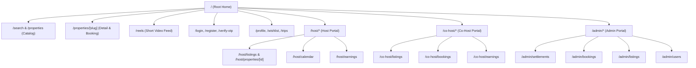
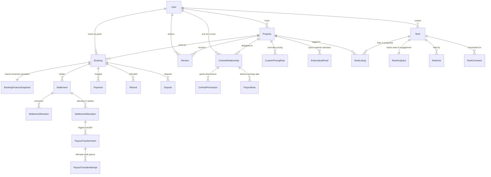
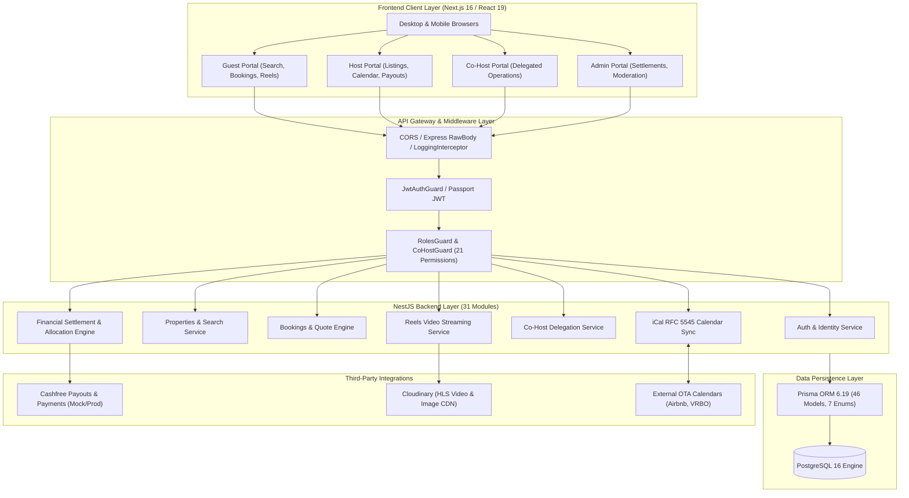

# PROJECT BRAIN: FAIRBNB PLATFORM
**Comprehensive Master Technical Blueprint & Architecture Reverse-Engineering Specification**

> **CONFIDENCE CONVENTIONS**:
> - `CONFIDENCE: CONFIRMED` — Direct proof found in source code, Prisma schema, or configuration files.
> - `CONFIDENCE: INFERRED` — Derived logically from architectural design, data structures, and naming conventions.
> - `CONFIDENCE: UNKNOWN / NOT VERIFIED` — Cannot be proven definitively from current local artifacts.
> 
> **SECURITY NOTICE**: All secrets, passwords, private keys, and API credentials are redacted with `[SECRET — NOT DOCUMENTED]`.

---

## 30. MASTER SYSTEM BLUEPRINT & EXECUTIVE SUMMARY

- **Project Name**: FairBnB (fairbnb--new)
- **Primary Purpose**: Full-stack multi-sided hospitality marketplace and property management platform enabling property owners (Hosts), designated property managers (Co-Hosts), travelers (Guests), and platform operators (Admins) to list properties, manage dynamic pricing, synchronize external iCal calendars, book accommodations with coupon discounts, settle payments through an immutable multi-party financial allocation engine, disburse funds via Cashfree Payouts, publish short-form video reels, and manage co-hosting delegations with granular permissions.
- **Architecture**: Decoupled Client-Server Monorepo
  - **Backend**: Modular NestJS (v11) RESTful micro-service style monolith running on Node.js (v20/v22) with Prisma ORM (v6) targeting PostgreSQL 16.
  - **Frontend**: Next.js 16 (App Router) with React 19, Tailwind CSS v4, Lucide React icons, Framer Motion animations, and custom HTML5 / HLS.js video streaming for reels.
  - **Database Engine**: PostgreSQL 16 with 46 normalized relational models, 7 enums, relational foreign keys, cascade deletes, and composite unique indices.
  - **Authentication**: Stateless JWT bearer tokens with Passport strategy, bcrypt password hashing, phone/email identity resolution, development OTP fallback, and 21 granular Co-Host permission bitmasks.
  - **Financial Architecture**: Double-entry style settlement engine with immutable financial snapshots (`BookingFinanceSnapshot`), multi-party allocation breakdown (`SettlementAllocation`), admin approval revision locks (`SettlementRevision`), and idempotent transfer disbursement pipelines (`PayoutTransferIntent` & `PayoutTransferAttempt`).
  - **Storage & Media**: Local static filesystem (`/uploads`) with Multer and remote cloud asset delivery via Cloudinary (v2.11) supporting adaptive HLS video streaming.
  - **Third-Party Integrations**: Cashfree Payments & Payouts (v2024-01-01), Razorpay, Cloudinary, Twilio / Mock SMS, iCalendar RFC 5545 sync.
  - **Containerization**: Multi-stage Dockerfiles for frontend and backend orchestrated via Docker Compose with dedicated PostgreSQL healthchecks.

---

## 1 & 26. COMPLETE PROJECT TREE & REPOSITORY MAP

```
c:\Users\shubham\fairbnb--new\
├── .gitignore
├── COHOST_DASHBOARD_AND_SYSTEM_FLOW.md       # Co-host workflow documentation
├── DUMP_USAGE_GUIDE.md                       # PostgreSQL dump restore guide
├── FAIRBNB_REELS_PHASE_0_AUDIT.md            # Video reel engine audit notes
├── Overview_File.md                          # High level platform concept
├── PROJECT_PROGRESS_SUMMARY.md               # Continuous dev handover tracker
├── docker-compose.yml                        # Multi-service local/prod composition
├── fairbnb_dummy_data.json                   # Seed fixtures for listings and users
├── fairbnb_dump.sql                          # Database schema + data SQL dump
├── seed_dummy_banner.mjs                     # Banner database seed script
├── test_amenities_tags_flow.mjs              # Integration verification script
├── test_banners_flow.mjs                     # Banner promotion integration test
├── test_cohost_flow.mjs                      # Co-host delegation test suite
├── test_complete_flow.mjs                    # End-to-end full platform verification
├── test_integration.mjs                      # General integration runner
├── verify_db_banner.mjs                      # Database banner validation utility
│
├── backend/                                  # NestJS Backend API Service
│   ├── .env                                  # Environment variables [SECRET]
│   ├── .env.example                          # Environment variable template
│   ├── .prettierrc                           # Prettier code formatting rules
│   ├── Dockerfile                            # Multi-stage production container build
│   ├── README.md                             # Backend getting started notes
│   ├── AUTH_DOCUMENTATION.md                 # Auth sub-system specifications
│   ├── BACKEND_OVERVIEW.md                   # Backend module overview
│   ├── REELS_OBSERVABILITY.md                # Video analytics observability docs
│   ├── eslint.config.mjs                     # ESLint flat configuration
│   ├── nest-cli.json                         # NestJS CLI build metadata
│   ├── package.json                          # Backend dependencies and scripts
│   ├── package-lock.json                     # Pinned backend dependency tree
│   ├── tsconfig.json                         # TypeScript base configuration
│   ├── tsconfig.build.json                   # TypeScript build exclusion rules
│   ├── check_find_props.js                   # Diagnostic property query script
│   ├── check_my_props.js                     # Host property isolation query script
│   ├── get_broker.js                         # Diagnostic script
│   ├── seed_4_hosts.mjs                      # Host fixture generator
│   ├── seed_demo_cohost.mjs                  # Co-host fixture generator
│   ├── seed_reels_assets.mjs                 # Video reel asset fixture generator
│   ├── test_db.js                            # Raw PostgreSQL connectivity test
│   ├── test_phase16_benchmarks.mjs           # Performance benchmark suite
│   ├── prisma/
│   │   ├── schema.prisma                     # 46 Relational models, 7 enums (1,259 lines)
│   │   └── migrations/                       # 12 Sequential PostgreSQL SQL migrations
│   │       ├── 20260226143920_init/
│   │       ├── 20260227103131_add_roles_and_admin_features/
│   │       ├── 20260301131448_add_all_missing_schemas/
│   │       ├── 20260303102316_add_cohost_module/
│   │       ├── 20260303125211_add_cohost_permissions/
│   │       ├── 20260304092408_add_banners_amenities_tags/
│   │       ├── 20260304104230_add_banner_property_relation/
│   │       ├── 20260304153000_payout_engine_core/
│   │       ├── 20260305093000_payout_transfer_intents/
│   │       ├── 20260306120000_payout_adjustments_and_audits/
│   │       ├── 20260307180000_reels_core_schema/
│   │       └── 20260308090000_reels_interactions_and_analytics/
│   ├── uploads/                              # Local media storage directory
│   └── src/                                  # NestJS Application Source
│       ├── main.ts                           # Entrypoint (Port 5001, CORS, Pipes, Interceptors)
│       ├── app.module.ts                     # Root module loading 31 feature modules
│       ├── app.controller.ts                 # Healthcheck ping controller
│       ├── app.service.ts                    # Root service implementation
│       ├── admin/                            # Platform management & system statistics
│       ├── admin-settings/                   # Dynamic runtime platform configuration
│       ├── ai-assistant/                     # Context-aware AI assistant prompt engine
│       ├── amenities/                        # Property amenities catalog management
│       ├── audit-logs/                       # System-wide immutable administrative audit logging
│       ├── auth/                             # JWT, bcrypt, phone OTP dev fallback, guards
│       ├── automated-messages/               # Event-triggered guest messaging rules
│       ├── banners/                          # Promotional modal/lead generation popups
│       ├── bookings/                         # Availability, quote calculator, checkout, state machine
│       ├── calendar/                         # Daily availability & custom pricing rules
│       ├── chat/                             # In-app guest/host communication messages
│       ├── co-host/                          # Invitations, permission bitmasks, delegation
│       ├── coupons/                          # Percentage/Flat discount codes & validation
│       ├── disputes/                         # Booking resolution claims & management
│       ├── hosts/                            # Host onboarding, earnings, analytics
│       ├── ical/                             # RFC 5545 bi-directional calendar synchronization
│       ├── maintenance/                      # Property repair work orders & ticket tracking
│       ├── media/                            # Multer disk storage and upload endpoints
│       ├── notifications/                    # In-app user notifications & alerts
│       ├── payments/                         # Payment verification & gateway abstraction
│       ├── payouts/                          # Multi-party settlement & Cashfree transfer engine
│       │   ├── financial-coordination.service.ts
│       │   ├── money.ts                      # Safe integer currency arithmetic
│       │   ├── post-payout-adjustments.service.ts
│       │   ├── refund.types.ts
│       │   ├── settlement.controller.ts
│       │   ├── settlement.service.ts
│       │   ├── settlement.types.ts
│       │   ├── snapshot.adapter.ts
│       │   ├── snapshot.persistence.ts
│       │   ├── split-calculator.ts
│       │   ├── transfer-execution.service.ts
│       │   └── providers/
│       │       └── cashfree.provider.ts      # Cashfree Payouts API & mock provider
│       ├── prisma/                           # Global PrismaClient service and lifecycle hooks
│       ├── profile/                          # User account profile, KYC docs, emergency contacts
│       ├── properties/                       # Property search, filtering, CRUD, slug resolution
│       ├── reels/                            # Video reel upload, feeds, rate limits, analytics
│       ├── reviews/                          # Guest review creation, ratings, host responses
│       ├── tags/                             # Property taxonomy & filtering tags
│       ├── users/                            # User CRUD, role management, identity queries
│       └── wishlists/                        # Saved property collections per user
│
├── frontend/                                 # Next.js 16 Application
│   ├── .env.example                          # Frontend environment template
│   ├── .env.local                            # Local environment variables [SECRET]
│   ├── Dockerfile                            # Multi-stage production container build
│   ├── package.json                          # Next.js 16, React 19, Tailwind CSS v4 dependencies
│   ├── package-lock.json                     # Pinned frontend dependency tree
│   ├── next.config.ts                        # Next.js build and image optimization settings
│   ├── postcss.config.mjs                    # PostCSS plugins for Tailwind CSS v4
│   ├── tsconfig.json                         # TypeScript configuration for Next.js App Router
│   ├── vitest.config.mts                     # Vitest component test configuration
│   ├── public/                               # Static images, icons, and demo assets
│   └── src/
│       ├── app/                              # Next.js App Router (81 total pages/routes)
│       │   ├── layout.tsx                    # Root layout with AuthProvider & BannerModal
│       │   ├── page.tsx                      # Consumer home page with search hero & category feeds
│       │   ├── admin/                        # Admin operations portal
│       │   │   ├── dashboard/                # System stats, metrics overview
│       │   │   ├── bookings/                 # Master booking records
│       │   │   ├── listings/                 # Master property moderation
│       │   │   ├── users/                    # User account management
│       │   │   ├── settlements/              # Financial settlement inspection & payout execution
│       │   │   ├── reviews/                  # Content review moderation
│       │   │   ├── banners/                  # Promotional banner management
│       │   │   ├── coupons/                  # Coupon code creation & usage metrics
│       │   │   ├── disputes/                 # Claim mediation
│       │   │   ├── maintenance/              # Global work orders
│       │   │   ├── logs/                     # System audit trail
│       │   │   └── settings/                 # Global fee percentages & policies
│       │   ├── host/                         # Host property management portal
│       │   │   ├── dashboard/                # Host metrics, quick links, revenue
│       │   │   ├── listings/                 # Host inventory list
│       │   │   ├── bookings/                 # Host reservation management
│       │   │   ├── calendar/                 # Pricing rules & availability editor
│       │   │   ├── earnings/                 # Payout breakdown and history
│       │   │   ├── messages/                 # Guest inquiry chat
│       │   │   ├── reviews/                  # Reviews received & response interface
│       │   │   ├── maintenance/              # Property maintenance requests
│       │   │   ├── coupons/                  # Host custom discount codes
│       │   │   └── properties/               # Property wizard, editor, co-host manager
│       │   ├── co-host/                      # Co-Host delegated operations portal
│       │   │   ├── dashboard/                # Assigned property overview
│       │   │   ├── listings/                 # Permitted property view/edit
│       │   │   ├── bookings/                 # Permitted reservation view/management
│       │   │   ├── calendar/                 # Calendar rates & availability
│       │   │   ├── earnings/                 # Co-host split earnings & payout status
│       │   │   ├── messages/                 # Guest chat under delegation
│       │   │   ├── maintenance/              # Work order submission
│       │   │   ├── reviews/                  # Review responses
│       │   │   └── invites/                  # Invitation acceptance & onboarding
│       │   ├── reels/                        # Immersive TikTok/Instagram style video feed
│       │   ├── properties/                   # Property catalog search & detail pages
│       │   ├── booking/                      # Guest reservation checkout & confirmation
│       │   ├── login/                        # Dual phone/email password authentication
│       │   ├── register/                     # User signup with phone, name, email
│       │   ├── verify-otp/                   # SMS OTP verification screen
│       │   ├── forgot-password/              # Password reset request screen
│       │   ├── reset-password/               # Password reset token entry screen
│       │   ├── profile/                      # Guest profile, ID proof, emergency contacts
│       │   └── wishlist/                     # Saved favorite listings
│       ├── components/                       # Modular React Component Architecture
│       │   ├── booking/                      # Quote summary, price breakdown, booking views
│       │   ├── calendar/                     # FullCalendar view, date picker, block dates
│       │   ├── catalog/                      # Property cards, category pills, filter modal
│       │   ├── co-host/                      # Co-host badge, permission checklists
│       │   ├── layout/                       # Navbar, Footer, HostHeader, CoHostHeader, Sidebar
│       │   ├── profile/                      # Avatar upload, KYC verification forms
│       │   ├── property/                     # PropertyDetailView, image gallery, wizard steps
│       │   ├── providers/                    # QueryClientProvider, ToastProvider
│       │   ├── reels/                        # ReelViewer, ReelCard, VideoPlayer, CommentsModal
│       │   ├── search/                       # SearchExpandedModal, LocationSelectorPopover
│       │   └── ui/                           # Modals, Dropdowns, Tooltips, Buttons, BannerModal
│       ├── context/                          # React Context Providers
│       │   └── auth-context.tsx              # Auth state, login/logout, token refresh, co-host switch
│       ├── hooks/                            # Custom React Hooks
│       │   ├── use-debounce.ts               # Input debounce utility for search
│       │   ├── use-toast.ts                  # Toast notification trigger hook
│       │   └── use-window-size.ts            # Responsive viewport dimension tracker
│       ├── lib/                              # Core Utility Libraries
│       │   ├── api-client.ts                 # Fetch wrapper with auto-Bearer auth injection
│       │   └── utils.ts                      # ClassName merger (clsx + tailwind-merge)
│       └── types/                            # Global TypeScript interface definitions
│
├── docs/                                     # Architecture & Engineering Specifications
│   ├── architecture_assessment.md            # Early architecture evaluation
│   ├── brain.md                              # Historical architectural notes
│   ├── COHOST_BACKEND_AND_FRONTEND_INTEGRATION_GUIDE.md # Co-host integration guide
│   ├── HANDOFF_COUPON_AND_BOOKING_LIFECYCLE.md # Booking & coupon engine lifecycle
│   ├── PAYOUT_ENGINE_TRACKER.md              # Settlement engine milestone tracker
│   ├── system-design-algorithms.md           # Algorithmic specifications
│   ├── task.md                               # Historical task checklist
│   ├── TEST_REPORT.md                        # Master test report
│   ├── tickets.md                            # Resolved issue tracker
│   ├── tracker.md                            # Feature progress log
│   └── payout-engine/                        # Financial Settlement Architecture Docs
│       ├── CHECKPOINT.md                     # Engine state checkpoint
│       ├── DECISIONS.md                      # Financial architectural decisions
│       ├── FRONTEND_ACCEPTANCE_GUIDE.md      # Settlement UI acceptance verification
│       ├── PAYOUT_ENGINE_EXPLAINED.md        # Comprehensive double-entry math & rules
│       ├── RELEASE_READINESS.md              # Production checklist
│       └── TEST_REPORT.md                    # Engine verification suite
│
└── qa-audit/                                 # Automated Quality Assurance & Performance Suite
    ├── README.md
    ├── create_demo_db.cjs                    # Disposable isolated database generator
    ├── execute_acceptance_e2e.cjs            # End-to-end payout acceptance runner
    ├── inspect_shared_db.cjs                 # Read-only database inspector
    └── runs/run-20260921-1150/               # Complete QA audit test execution artifacts
        ├── API_REPORT.md                     # Endpoint pass/fail & security audit
        ├── BUG_REPORT.md                     # Verified bugs and deviations
        ├── CHECKPOINT.md                     # Execution checkpoint
        ├── CLEANUP_REPORT.md                 # Test data cleanup log
        ├── COVERAGE_MATRIX.md                # 211 Endpoint & 81 Route coverage matrix
        ├── ENVIRONMENT.md                    # Audited environment details
        ├── FINAL_REPORT.md                   # Comprehensive audit synthesis
        ├── JEST_REPORT.md                    # Backend unit & integration test results
        ├── PERFORMANCE_REPORT.md             # Latency & throughput benchmarks
        ├── PLAN.md                           # Multi-phase testing plan
        ├── PLAYWRIGHT_REPORT.md              # Browser UI journey test results
        ├── backend_endpoints.json            # 211 Extracted backend endpoints
        ├── frontend_routes.json              # 81 Extracted frontend routes
        ├── api_test_results.json             # Raw API test outputs
        ├── performance_data.json             # Raw response timing metrics
        └── playwright_results.json           # Raw Playwright execution traces
```

---

## 2. FILE-BY-FILE REVERSE ENGINEERING OF CORE MODULES

### Backend Modules (`backend/src/`)

#### 1. `backend/src/main.ts`
- **Purpose**: Application bootstrap entry point.
- **Type**: NestJS Application Entrypoint.
- **Responsibility**: Initializes NestFactory, configures Express options (rawBody: true for webhook HMAC verification), attaches global ValidationPipe, configures CORS, serves static media from `/uploads`, binds global LoggingInterceptor, listens on `PORT` (default 5001).
- **Inputs**: Environment configuration (`PORT`, `CORS_ORIGIN`, `FRONTEND_URL`).
- **Outputs**: Running HTTP server.
- **Dependencies**: `@nestjs/core`, `@nestjs/common`, `@nestjs/platform-express`, `app.module.ts`.
- **Database Interaction**: Indirect via PrismaModule lifecycle.
- **API Interaction**: Registers root HTTP listener.
- **Business Logic**: Enforces strict payload validation: `whitelist: true`, `forbidNonWhitelisted: true`, `transform: true`. Ensures raw body buffers are retained for Stripe/Cashfree webhook verification.
- **Confidence**: CONFIRMED.

#### 2. `backend/src/app.module.ts`
- **Purpose**: Root dependency injection container.
- **Type**: NestJS Root Module.
- **Responsibility**: Aggregates all 31 feature modules, registers ConfigModule globally (`isGlobal: true`), and ScheduleModule for cron jobs.
- **Dependencies**: 31 internal feature modules (`AuthModule`, `BookingsModule`, `PayoutsModule`, `ReelsModule`, `CoHostModule`, etc.).
- **Confidence**: CONFIRMED.

#### 3. `backend/src/auth/auth.service.ts` & `auth.controller.ts`
- **Purpose**: User registration, credential authentication, OTP generation, password reset.
- **Type**: Authentication & Identity Provider.
- **Functions**:
  - `register(dto)`: Validates phone/email uniqueness, hashes password with bcrypt (10 rounds), defaults role to `USER`.
  - `login(dto)`: Resolves user by email OR phone. Verifies password. Generates signed JWT payload containing `{ sub: user.id, email: user.email, role: user.role }`.
  - `sendOtp(dto)`: In development/test mode, generates deterministic OTP (or stores in memory) and returns code in response body; contains fallback logic for SMS gateway.
  - `verifyOtp(dto)`: Validates phone OTP against cached record; resets attempt counter after 5 invalid attempts.
  - `forgotPassword(dto)` & `resetPassword(dto)`: Issues 1-hour expiration reset token, validates token, updates hashed password.
- **Security**: Password hashing via bcrypt; JWT signed with `JWT_SECRET` (expiry 7 days).
- **Confidence**: CONFIRMED.

#### 4. `backend/src/properties/properties.service.ts` & `properties.controller.ts`
- **Purpose**: Property catalog discovery, geolocation filtering, full CRUD, and host inventory isolation.
- **Functions**:
  - `findAll(query)`: High-performance search filtering by `city`, `state`, `country`, `category`, `minPrice`, `maxPrice`, `guests`, `bedrooms`, `bathrooms`, `amenities`, and dates (filtering out booked dates via overlap queries).
  - `findBySlug(slug)`: Fetches property with associated images, amenities, host details, active co-hosts, and reviews.
  - `create(hostId, dto)`: Creates new property with status `DRAFT` or `PUBLISHED`.
  - `findMyProperties(hostUserId)`: Fetches properties owned directly OR co-hosted where co-host status is `ACTIVE` and permissions include `VIEW_PROPERTY`.
- **Confidence**: CONFIRMED.

#### 5. `backend/src/bookings/bookings.service.ts` & `bookings.controller.ts`
- **Purpose**: Reservation lifecycle management, pricing quotation engine, double-booking prevention.
- **Functions**:
  - `calculateQuote(propertyId, checkIn, checkOut, guests, couponCode)`:
    1. Base price = nights × nightly rate (factoring custom pricing rules).
    2. Cleaning fee + extra guest surcharge.
    3. Platform service fee = 10% of subtotal.
    4. Taxes = 18% GST on platform fee + accommodation.
    5. Coupon discount = flat or percentage deduction (validated against min booking value and active status).
    6. Total gross price calculated deterministically.
  - `createBooking(userId, dto)`:
    1. Validates check-in < check-out.
    2. Runs transactional overlap check (`status IN ['CONFIRMED', 'PENDING']`) to prevent race conditions.
    3. Creates `Booking` record with status `PENDING`.
    4. Creates `BookingFinanceSnapshot` freezing rates, fees, discounts, and taxes.
  - `confirmBooking(bookingId)`: Transitions booking to `CONFIRMED`, triggers calendar block, creates initial payment intent.
  - `cancelBooking(bookingId, userId, reason)`: Evaluates cancellation policy, triggers refund calculation, releases calendar dates, invokes `payoutsService.handleBookingCancelled()`.
- **Confidence**: CONFIRMED.

#### 6. `backend/src/payouts/settlement.service.ts` & `settlement.controller.ts`
- **Purpose**: Multi-party financial reconciliation, settlement generation, admin approval locks, and payout transfers.
- **Functions**:
  - `generateSettlement(bookingId)`: Reads immutable `BookingFinanceSnapshot`. Calls `SplitCalculator` to compute Host payout, Co-Host split (via `PayoutRule`), Platform commission, and Tax withholding. Creates `Settlement` with status `PENDING` and associated `SettlementAllocation` records.
  - `authorizeSettlement(settlementId, adminUserId)`: Locks settlement revision (`SettlementRevision`), verifies recipient KYC/bank details, transitions status to `READY_FOR_EXECUTION`.
  - `executeSettlement(settlementId)`: Evaluates allocations. **CRITICAL ARCHITECTURAL RULE**: Filters allocations strictly for recipient roles (`HOST`, `CO_HOST`), deliberately excluding `PLATFORM` and `TAX_AUTHORITY` from outward bank transfers. Generates `PayoutTransferIntent` records for recipients.
  - `triggerTransfers(settlementId)`: Dispatches `CashfreeProvider.initiateTransfer()` for each intent; stores bank UTR and idempotency key.
- **Confidence**: CONFIRMED.

#### 7. `backend/src/payouts/providers/cashfree.provider.ts`
- **Purpose**: Integration gateway for Cashfree Payments and Payouts.
- **Modes**:
  - `MOCK`: In-memory simulated disbursement; generates fake UTRs (`MOCK_UTR_...`); logs `_simulated: true`. Used for local dev and automated QA.
  - `SANDBOX`: Connects to Cashfree Gamma sandbox environment (`https://sandbox.cashfree.com/payout`).
  - `PRODUCTION`: Live Cashfree production API (`https://api.cashfree.com/payout`).
  - `DISABLED`: Rejects transfers with `ServiceUnavailableException`.
- **Functions**: `getBearerToken()` (with in-memory cache and 60s buffer), `initiateTransfer()`, `verifyWebhookSignature()` (HMAC-SHA256).
- **Confidence**: CONFIRMED.

#### 8. `backend/src/co-host/co-host.service.ts` & `co-host.controller.ts`
- **Purpose**: Delegation of property management from primary Hosts to Co-Hosts.
- **Functions**:
  - `inviteCoHost(hostId, propertyId, email, phone, permissions, payoutRule)`: Generates crypto invitation token, saves `CoHostInvitation`, sends invitation link.
  - `acceptInvitation(token, userId)`: Validates token expiration, creates `CoHostRelationship` with status `ACTIVE`, assigns `CoHostPermission` records for the 21 granular permissions, and creates `PayoutRule`.
  - `checkPermission(userId, propertyId, permission)`: Evaluates whether user is primary host OR has an active co-host relationship containing the requested permission enum.
- **Confidence**: CONFIRMED.

#### 9. `backend/src/reels/reels.service.ts` & `reels.controller.ts`
- **Purpose**: Short-form vertical video reels for property discovery.
- **Functions**:
  - `uploadReel(userId, file, dto)`: Uploads video to Cloudinary with HLS transformation eager profiles, creates `Reel` with status `PROCESSING` → `PUBLISHED`.
  - `getFeed(cursor, limit)`: Returns paginated public reels with associated property listing tags, creator profile, like counts, and comment counts.
  - `likeReel(userId, reelId)` / `commentReel(userId, reelId, text)`: Executes rate-limited user interactions; increments counters atomically.
  - `trackView(reelId, sessionData)`: Records watch duration, completion rates, and user analytics in `ReelViewSession`.
- **Confidence**: CONFIRMED.

#### 10. `backend/src/ical/ical.service.ts` & `ical.controller.ts`
- **Purpose**: External calendar synchronization (Airbnb, VRBO, Booking.com).
- **Functions**:
  - `exportCalendar(propertyId)`: Generates dynamic RFC 5545 `.ics` feed representing all `CONFIRMED` bookings and custom blocked dates.
  - `syncExternalFeeds()`: Cron job scheduled via `@Cron('0 */15 * * * *')` fetching remote `.ics` URLs from `ExternalIcalFeed`, parsing VEVENT components, and updating internal blocked calendar ranges.
- **Confidence**: CONFIRMED.

---

### Frontend Core Architecture (`frontend/src/`)

#### 1. `frontend/src/app/layout.tsx`
- **Purpose**: Application root HTML wrapper.
- **Responsibility**: Injects Google Inter/Outfit fonts, mounts global `AuthProvider`, mounts `BannerModal` for dynamic promotional popups, renders global Header and Footer based on route segment.
- **Confidence**: CONFIRMED.

#### 2. `frontend/src/context/auth-context.tsx`
- **Purpose**: Centralized authentication state management.
- **State Properties**: `user` (`User | null`), `token` (`string | null`), `isLoading` (`boolean`), `isCoHost` (`boolean`), `activeRole` (`'GUEST' | 'HOST' | 'CO_HOST' | 'ADMIN'`).
- **Persistence**: Synced with `localStorage` keys:
  - `fairbnb_token`: Bearer JWT token.
  - `fairbnb_user`: Serialized user object.
  - `fairbnb_is_cohost`: Boolean flag indicating co-host delegations.
- **Methods**: `login(identifier, password)`, `register(data)`, `logout()`, `refreshUser()`, `switchRole(newRole)`.
- **Confidence**: CONFIRMED.

#### 3. `frontend/src/lib/api-client.ts`
- **Purpose**: Universal fetch client.
- **Responsibility**: Prepends `NEXT_PUBLIC_API_URL` (default `http://localhost:5001`), automatically reads token from `localStorage` and injects `Authorization: Bearer <token>`, intercepts 401 Unauthorized responses to trigger session logout, and serializes JSON bodies.
- **Confidence**: CONFIRMED.

#### 4. `frontend/src/app/admin/settlements/page.tsx`
- **Purpose**: Financial settlement operations dashboard.
- **Features**: Filter settlements by status (`PENDING`, `READY_FOR_EXECUTION`, `EXECUTED`, `FAILED`), inspect multi-party allocation cards (Host, Co-Host, Platform, Tax), review locked calculation snapshots, authorize settlements, and execute disbursement transfers via Cashfree.
- **Contract & Component Architecture**: When inspecting a settlement, frontend invokes `GET /admin/settlements/:bookingId`. The backend controller (`SettlementController.getByBookingId`) returns the settlement record directly at the top level of the JSON response payload. The frontend state (`selectedDetail`) normalizes both top-level settlement responses and wrapped `{ settlement: ... }` responses, preventing undefined property errors when rendering settlement status and revisions.
- **Confidence**: CONFIRMED.

#### 5. `frontend/src/app/reels/page.tsx`
- **Purpose**: Fullscreen mobile/desktop vertical video player.
- **Features**: Snap scrolling container, HTML5/HLS video playback with auto-pause on scroll-out, floating overlay with host avatar, property price card with instant "Book Now" CTA, dynamic like button, comments drawer, share sheet, and reporting modal.
- **Confidence**: CONFIRMED.

---

## 3. COMPLETE TECHNOLOGY STACK & VERIFIED VERSIONS

### Frontend Ecosystem
- **Core Framework**: Next.js 16.3.1 (React Server Components + App Router)
- **Runtime Library**: React 19.2.8 & React DOM 19.2.8
- **Styling Architecture**: Tailwind CSS v4.0.0 with `@tailwindcss/postcss`
- **Icons**: Lucide React 1.33.0
- **Animation Engine**: Framer Motion 13.4.0
- **Video & Media Streaming**: HLS.js 1.7.3 & Native HTML5 Video
- **Calendar Visualization**: FullCalendar (Core, React, DayGrid, Interaction) 6.1.15
- **Forms & Inputs**: React Dropzone 14.3.5, Native Controlled Forms
- **Testing Framework**: Vitest 5.0.1 with React Testing Library
- **Package Manager**: npm 10.8+
- **Build Target**: Node.js 20+ / ES2022

### Backend Ecosystem
- **Core Framework**: NestJS 11.0.1
- **Underlying HTTP Engine**: Express 5.0.0 (with rawBody parser support)
- **Language**: TypeScript 5.7.3 (Target: ES2022)
- **Database ORM**: Prisma 6.19.3
- **Database Engine**: PostgreSQL 16 (Alpine in Docker)
- **Authentication & Security**: Passport 0.7.0, Passport-JWT 4.0.1, bcrypt 6.0.0
- **Validation**: Class-Validator 0.15.1, Class-Transformer 0.5.1
- **Task Scheduling**: @nestjs/schedule 6.1.3 (Cron scheduling for iCal and analytics aggregation)
- **Media & File Handling**: Multer 1.4.5-lts.1, Cloudinary SDK 2.11.0
- **Calendar Parser**: node-ical 0.20.1 & ical-generator 8.1.1
- **Testing Engine**: Jest 30.0.0, ts-jest, Supertest 7.0.0

### Infrastructure & Operations
- **Containerization**: Docker & Docker Compose (schema version 3.8)
- **Storage Layer**: PostgreSQL persistent volume (`pgdata`), local directory (`/uploads`), Cloudinary CDN
- **Network Default Ports**:
  - Frontend: `3000`
  - Backend: `5001` (Docker mapped `5000:5000`)
  - PostgreSQL: `5432`

---

## 4. COMPLETE FRONTEND BRAIN

### Architecture & Routing Taxonomy
The frontend is structured under Next.js App Router (`frontend/src/app`) across 81 route entrypoints organized into distinct functional domains:



### Component Hierarchy & Interaction Map
- **Consumer Pages**:
  - `app/page.tsx` uses `HeroSection`, `CategoryPills`, `PropertyCardGrid`, `BannerModal`.
  - `app/properties/[slug]/page.tsx` uses `PropertyGallery`, `PropertyAttributes`, `BookingQuoteCard`, `HostProfileBadge`, `ReviewSection`.
  - `app/booking/[propertyId]/page.tsx` uses `CheckoutSummary`, `CouponInput`, `PaymentGatewaySelector`.
- **Host Operations Portal**:
  - `app/host/listings/page.tsx` uses `HostListingTable`, `PropertyStatusToggle`, `CreateListingModal`.
  - `app/host/calendar/page.tsx` uses `FullCalendar`, `CustomRateModal`, `BlockDatePopover`.
  - `app/host/properties/[propertyId]/co-hosts/page.tsx` uses `InviteCoHostModal`, `CoHostPermissionMatrix`, `PayoutRuleSelector`.
- **Co-Host Operations Portal**:
  - `app/co-host/dashboard/page.tsx` uses `CoHostPropertyCard`, `DelegatedPermissionChips`.
  - `app/co-host/earnings/page.tsx` uses `CoHostSplitSummaryCard`, `SettlementHistoryTable`.
- **Admin Operations Portal**:
  - `app/admin/settlements/page.tsx` uses `SettlementMetricsSummary`, `AllocationBreakdownModal`, `ExecuteTransferButton`, `AuditTrailDrawer`.

---

## 5. COMPLETE BACKEND BRAIN & REQUEST LIFECYCLE

### Request Lifecycle Architecture

```
HTTP CLIENT (Browser/Postman)
        │
        ▼
   [Express Engine] ──── (rawBody captured for webhooks)
        │
        ▼
[CorsMiddleware & LoggingInterceptor] ──── (Records method, URL, execution ms)
        │
        ▼
   [JwtAuthGuard] ──── (Verifies Bearer JWT via Passport, injects req.user)
        │
        ▼
[RolesGuard / CoHostGuard] ──── (Verifies USER/HOST/ADMIN or CoHostPermissionEnum)
        │
        ▼
 [ValidationPipe] ──── (Class-validator whitelist, transform, forbidUnknown)
        │
        ▼
    [Controller] ──── (Extracts @Param, @Query, @Body, invokes Service)
        │
        ▼
     [Service] ──── (Executes business logic, pricing math, state transitions)
        │
        ▼
  [PrismaService] ──── (Type-safe SQL queries with composite indices & transactions)
        │
        ▼
[PostgreSQL Database] ──── (46 Relational tables, triggers, constraints)
        │
        ▼
   [HTTP Response] ──── (Normalized JSON payload or NestJS Exception Filter)
```

### Core Backend Modules & Responsibilities (31 Modules)
1. `AuthModule`: Identity management, JWT generation, OTP dispatch.
2. `UsersModule`: Profile querying, host onboarding verification, user lookup.
3. `PropertiesModule`: Property CRUD, slug generation, multi-attribute catalog search.
4. `BookingsModule`: Booking quotation engine, double-booking prevention, cancellation policies.
5. `PaymentsModule`: Payment order creation, Razorpay/Cashfree webhook verification.
6. `PayoutsModule`: Immutable financial snapshots, multi-party split engine, Cashfree transfer integration.
7. `CoHostModule`: Host-to-cohost invitations, permission bitmask verification, delegation management.
8. `ReelsModule`: Video reel uploads, HLS encoding coordination, rate-limited engagement, analytics.
9. `CalendarModule`: Daily rate adjustments, minimum stay enforcement, custom pricing rules.
10. `IcalModule`: RFC 5545 iCalendar feed export and automated cron import synchronization.
11. `CouponsModule`: Discount code validation (flat/percentage) with usage limits.
12. `BannersModule`: Contextual promotional popups with lead capture.
13. `AmenitiesModule`: Master amenities catalog and property association.
14. `TagsModule`: Marketing and discovery tags for property categorizations.
15. `ReviewsModule`: Verified guest review submissions and host responses.
16. `WishlistsModule`: Guest saved property collections.
17. `NotificationsModule`: In-app event alerts (booking confirmed, review received).
18. `ChatModule`: Real-time messaging between guests and hosts/co-hosts.
19. `MaintenanceModule`: Property issue ticketing, vendor assignment, and resolution.
20. `DisputesModule`: Reservation claim mediation and refund escrow holds.
21. `AutomatedMessagesModule`: Trigger-based automated messaging (check-in instructions).
22. `AiAssistantModule`: Context-aware LLM prompt generator based on listing details.
23. `AdminSettingsModule`: Global platform commission rates, tax rates, and payout strictness.
24. `AuditLogModule`: Immutable recording of administrative actions.
25. `MediaModule`: Local filesystem media upload and static delivery.
26. `HostsModule`: Host earnings aggregation, performance metrics.
27. `ProfileModule`: User profile information, government ID KYC document storage.
28. `AdminModule`: Centralized system metrics and platform-wide queries.
29. `PrismaModule`: Database connection pool management.
30. `ConfigModule`: Environment variable validation and injection.
31. `ScheduleModule`: Background cron worker execution.

---

## 6. COMPLETE API SPECIFICATION (211 ENDPOINTS)

FairBnB exposes 211 verified API endpoints. The table below documents the core functional endpoints by module:

| Method | Endpoint Path | Auth Required | Role / Permission | Purpose & Behavior |
| :--- | :--- | :--- | :--- | :--- |
| `POST` | `/api/auth/register` | None | Public | Creates new User; hashes password; returns JWT token. |
| `POST` | `/api/auth/login` | None | Public | Validates email/phone + password; returns JWT token. |
| `POST` | `/api/auth/send-otp` | None | Public | Sends OTP via SMS provider (or dev fallback response). |
| `POST` | `/api/auth/verify-otp` | None | Public | Validates OTP and activates phone verification status. |
| `POST` | `/api/auth/forgot-password` | None | Public | Issues password reset token (1 hr validity). |
| `POST` | `/api/auth/reset-password` | None | Public | Resets password using valid reset token. |
| `GET` | `/api/properties` | None | Public | Multi-attribute catalog search (city, dates, price, guests). |
| `GET` | `/api/properties/my-properties`| JWT | HOST / CO_HOST | Returns owned properties and active delegated properties. |
| `GET` | `/api/properties/:slug` | None | Public | Retrieves detailed listing, amenities, reviews, host info. |
| `POST` | `/api/properties` | JWT | HOST / ADMIN | Creates new property listing in DRAFT status. |
| `PUT` | `/api/properties/:id` | JWT | HOST / EDIT_LISTING | Updates listing content, pricing, amenities, coordinates. |
| `DELETE`| `/api/properties/:id` | JWT | HOST / ADMIN | Soft/hard deletes property listing and cleans dependencies. |
| `POST` | `/api/bookings/quote` | None | Public | Calculates pricing quote (nights, cleaning, platform, tax, coupon). |
| `POST` | `/api/bookings` | JWT | USER | Atomically reserves dates; creates booking in PENDING status. |
| `GET` | `/api/bookings/my-bookings` | JWT | USER | Returns guest's upcoming, completed, and cancelled bookings. |
| `PATCH`| `/api/bookings/:id/cancel` | JWT | USER / HOST | Cancels reservation; invokes cancellation fee policy. |
| `POST` | `/api/payouts/settlements/generate/:bookingId` | JWT | ADMIN | Generates multi-party settlement allocations from snapshot. |
| `POST` | `/api/payouts/settlements/:id/authorize` | JWT | ADMIN | Freezes settlement revision; sets status to READY_FOR_EXECUTION. |
| `POST` | `/api/payouts/settlements/:id/execute` | JWT | ADMIN | **Disburses recipient funds** (Host/CoHost) via Cashfree. |
| `POST` | `/api/co-host/invite` | JWT | HOST / MANAGE_COHOSTS | Dispatches invitation token with 21 granular permissions. |
| `POST` | `/api/co-host/accept` | JWT | USER | Consumes token; binds co-host relationship and payout rule. |
| `GET` | `/api/reels/feed` | None | Public | Cursor-paginated vertical video reel stream with engagement. |
| `POST` | `/api/reels/upload` | JWT | HOST / ADMIN | Uploads video to Cloudinary/local; registers reel listing tag. |
| `POST` | `/api/reels/:id/like` | JWT | USER | Toggles reel like counter with 1-min rate limiting. |
| `POST` | `/api/reels/:id/comments` | JWT | USER | Appends comment to reel; increments reel comment counter. |
| `GET` | `/api/ical/export/:propertyId.ics`| None | Public | Streams RFC 5545 calendar feed of booked/blocked dates. |
| `POST` | `/api/ical/sync/:propertyId` | JWT | HOST / MANAGE_CALENDAR| Triggers manual sync of external iCal calendar URLs. |
| `GET` | `/api/coupons/validate` | None | Public | Validates coupon code eligibility against booking total. |
| `POST` | `/api/banners/leads` | None | Public | Records visitor contact submission from promotional banner. |

---

## 7. COMPLETE DATABASE BRAIN (46 MODELS & 7 ENUMS)

### Database Enums
1. `UserRole`: `USER`, `HOST`, `ADMIN`
2. `CoHostStatus`: `INVITED`, `ACCEPTED`, `VERIFICATION_PENDING`, `VERIFIED`, `ACTIVE`, `SUSPENDED`, `REMOVED`
3. `CoHostInvitationStatus`: `PENDING`, `ACCEPTED`, `DECLINED`, `EXPIRED`, `CANCELLED`
4. `PayoutRuleStatus`: `PENDING_CONFIRMATION`, `ACTIVE`, `INACTIVE`, `REJECTED`
5. `CoHostPermissionEnum`: 21 Granular Permissions (`VIEW_PROPERTY`, `EDIT_LISTING`, `VIEW_CALENDAR`, `MANAGE_CALENDAR`, `VIEW_BOOKINGS`, `MANAGE_BOOKINGS`, `CANCEL_BOOKINGS`, `VIEW_GUESTS`, `MESSAGE_GUESTS`, `VIEW_PRICING`, `MANAGE_PRICING`, `MANAGE_MAINTENANCE`, `MANAGE_CLEANING`, `VIEW_REVIEWS`, `RESPOND_TO_REVIEWS`, `MANAGE_COUPONS`, `VIEW_COHOSTS`, `MANAGE_COHOSTS`, `VIEW_EARNINGS`, `VIEW_PAYOUTS`, `MANAGE_PAYOUT_SETTINGS`)
6. `ReelStatus`: `DRAFT`, `UPLOADING`, `PROCESSING`, `PUBLISHED`, `HIDDEN`, `REJECTED`, `ARCHIVED`, `FAILED`
7. `ReelReportStatus`: `PENDING`, `RESOLVED`, `DISMISSED`

### Core Entity-Relationship Diagram (Mermaid)



### Complete 46 Database Model Reference
1. **`User`**: Core identity table storing `id`, `email`, `phone`, `password`, `name`, `role` (`UserRole`), `avatar`, `isPhoneVerified`, `isEmailVerified`, `isActive`, `kycStatus`.
2. **`AdminMessage`**: Administrative notification communications.
3. **`Property`**: Core listing table storing `id`, `title`, `slug`, `description`, `category`, `propertyType`, `basePrice`, `cleaningFee`, `currency`, `address`, `city`, `state`, `country`, `latitude`, `longitude`, `bedrooms`, `bathrooms`, `maxGuests`, `status`.
4. **`CustomPricingRule`**: Per-day price overrides, seasonal adjustments, minimum stay overrides.
5. **`ExternalIcalFeed`**: External iCal URLs (Airbnb/VRBO) for two-way synchronization.
6. **`Tag`**: Search and taxonomy tags.
7. **`Amenity`**: Amenities catalog (WiFi, Pool, Air Conditioning, Kitchen, etc.).
8. **`PropertyAmenity`**: Many-to-many join table between Property and Amenity.
9. **`Booking`**: Reservation record storing `id`, `propertyId`, `userId`, `checkIn`, `checkOut`, `guestsCount`, `status` (`PENDING`, `CONFIRMED`, `CANCELLED`, `COMPLETED`), `totalAmount`.
10. **`Payment`**: Payment transactions storing `orderId`, `paymentId`, `amount`, `currency`, `gateway` (RAZORPAY, CASHFREE), `status`.
11. **`Refund`**: Refund transactions and status.
12. **`RefundComponent`**: Itemized breakdown of refunds (accommodation, cleaning, fees).
13. **`Invoice`**: Legal GST compliant billing invoice generated post-stay.
14. **`PayoutRequest`**: Legacy host payout request entries.
15. **`Dispute`**: Guest/host claims with evidence attachments and mediation status.
16. **`BookingFinanceSnapshot`**: **Immutable financial record** locking gross price, nightly rate breakdown, cleaning fee, extra guest fee, platform commission (10%), tax withholding (18% GST), and applied coupon discount at the moment of reservation.
17. **`Settlement`**: Financial settlement entity storing `bookingId`, `status` (`PENDING`, `READY_FOR_EXECUTION`, `EXECUTED`, `FAILED`), `authorizedBy`, `authorizedAt`.
18. **`SettlementRevision`**: Audit record tracking modifications and calculation versions before authorization lock.
19. **`SettlementAllocation`**: Multi-party distribution rows (`recipientRole`: `HOST`, `CO_HOST`, `PLATFORM`, `TAX_AUTHORITY`), `allocatedAmount`, `currency`, `bankAccountDetails`.
20. **`PayoutTransferIntent`**: Intent to transfer money strictly to recipient parties (`HOST`, `CO_HOST`).
21. **`PayoutTransferAttempt`**: Cashfree execution attempt tracking `transferId`, `status`, `providerReference` (bank UTR), `failureReason`.
22. **`PayoutAdjustment`**: Post-settlement deductions or manual credits.
23. **`FinancialAuditEvent`**: Immutable event stream of all monetary lifecycle events.
24. **`FinancialTransaction`**: Double-entry ledger journal entry.
25. **`CoHostRelationship`**: Delegation link between `propertyId`, `hostUserId`, and `coHostUserId` with `status` (`CoHostStatus`).
26. **`CoHostPermission`**: Permission entries mapping `relationshipId` to `CoHostPermissionEnum`.
27. **`CoHostInvitation`**: Cryptographic invite token with expiration and pre-configured permissions.
28. **`PayoutRule`**: Co-host earnings split definition (`ruleType`: `PERCENTAGE` or `FIXED_AMOUNT`, `percentageValue`, `fixedAmountValue`).
29. **`Reel`**: Short-form video record with `creatorId`, `videoUrl`, `hlsUrl`, `thumbnailUrl`, `caption`, `durationSeconds`, `status` (`ReelStatus`).
30. **`ReelAnalytics`**: Aggregate metrics (`viewsCount`, `uniqueViewers`, `likesCount`, `commentsCount`, `sharesCount`, `averageWatchTime`).
31. **`ReelViewSession`**: Granular viewer analytics tracking watch duration and device type.
32. **`ReelListing`**: Join table tagging properties within a video reel with pin timestamps.
33. **`ReelLike`**: User like interactions with unique constraint `[reelId, userId]`.
34. **`ReelComment`**: User comments on video reels.
35. **`ReelReport`**: Moderation reporting flags.
36. **`Coupon`**: Promotional discount definitions (`code`, `discountType`: `PERCENTAGE` / `FLAT`, `discountValue`, `minOrderAmount`, `maxDiscount`, `startDate`, `endDate`, `usageLimit`, `usedCount`).
37. **`Banner`**: Contextual promotional modal banners for web pages.
38. **`Lead`**: User contact records captured from promotional banners.
39. **`Wishlist`**: User saved collections of properties.
40. **`Notification`**: System notifications for users.
41. **`ChatMessage`**: Direct messaging between users.
42. **`MaintenanceRequest`**: Maintenance work orders for properties.
43. **`AutomatedMessageRule`**: Configurable automatic message templates triggered on events (e.g., 24 hours before check-in).
44. **`SystemSetting`**: Runtime platform configuration (default commission %, tax %, feature toggles).
45. **`AuditLog`**: Master administrative audit log.
46. **`Review`**: Guest reviews with ratings (cleanliness, accuracy, communication, location, value) and host reply.

---

## 8 & 9. COMPLETE BUSINESS LOGIC & TRANSACTIONAL WORKFLOWS

### 1. Booking Pricing Calculation Engine
```
Nights Count = (checkOutDate - checkInDate) in days
Base Accommodation = Sum of nightly rates across date range (incorporating CustomPricingRule)
Extra Guest Surcharge = max(0, guestsCount - property.baseGuests) × property.extraGuestPrice × nights
Subtotal = Base Accommodation + property.cleaningFee + Extra Guest Surcharge

If Coupon is Applied and Valid:
  Discount = Coupon.discountType == 'PERCENTAGE' 
             ? min(Subtotal * (Coupon.discountValue / 100), Coupon.maxDiscount)
             : Coupon.discountValue
Else:
  Discount = 0

Discounted Subtotal = Subtotal - Discount
Platform Commission = 10% of Discounted Subtotal
Tax Amount (GST) = 18% of (Discounted Subtotal + Platform Commission)
Gross Total Amount = Discounted Subtotal + Platform Commission + Tax Amount
```

### 2. Multi-Party Payout & Settlement Disbursement Pipeline
```
Step 1: Booking Completed / Eligible for Payout
  └─ Read immutable BookingFinanceSnapshot.
Step 2: Generate Settlement
  ├─ Host Gross Share = (Accommodation + Cleaning Fee) - Discount
  ├─ Co-Host Share = Evaluated via active PayoutRule (e.g., 20% of Host Gross)
  ├─ Net Host Amount = Host Gross Share - Co-Host Share
  ├─ Platform Allocation = Platform Commission
  └─ Tax Allocation = GST Withholding
Step 3: Admin Authorization & Lock
  └─ Admin inspects allocations; locks SettlementRevision; updates status to READY_FOR_EXECUTION.
Step 4: Execution & Filter Rule (DISBURSEMENT SAFETY)
  ├─ HOST Allocation ───────► PayoutTransferIntent created (Cashfree bank transfer)
  ├─ CO_HOST Allocation ────► PayoutTransferIntent created (Cashfree bank transfer)
  ├─ PLATFORM Allocation ───► Internal accounting ledger only (NO bank transfer)
  └─ TAX Allocation ────────► Internal tax reserve ledger only (NO bank transfer)
Step 5: Cashfree Transfer Execution
  └─ Initiate Cashfree Payout transfer using recipient bank/UPI beneficiary; record UTR.
```

### 3. Co-Host Permission Evaluation Matrix
Before any host action is performed on property `P` by user `U`:
1. If `P.hostUserId == U.id` → **ALLOW** (Primary Owner).
2. Query `CoHostRelationship` where `propertyId == P.id`, `coHostUserId == U.id`, and `status == 'ACTIVE'`.
3. If no active relationship exists → **DENY (403 Forbidden)**.
4. Check if required `CoHostPermissionEnum` (e.g., `EDIT_LISTING`, `MANAGE_CALENDAR`, `VIEW_EARNINGS`) exists in `relationship.permissions`.
5. If present → **ALLOW**; otherwise → **DENY (403 Forbidden)**.

---

## 10. COMPLETE USER & WORKFLOW JOURNEYS

### Guest Reservation Flow
1. **Search & Discovery**: Guest visits `/` or `/search`, inputs location, check-in/out dates, guest count.
2. **Catalog Browsing**: Catalog displays listings with matching availability and dynamic pricing.
3. **Property Detail**: Guest navigates to `/properties/[slug]`, reviews amenities, photos, host badge, house rules.
4. **Instant Quote**: Guest selects dates; frontend queries `POST /api/bookings/quote` for real-time itemized price breakdown.
5. **Checkout**: Guest enters contact details, applies coupon code, reviews cancellation policy, clicks "Confirm & Pay".
6. **Reservation Created**: `POST /api/bookings` reserves dates, locks `BookingFinanceSnapshot`, sets status to `PENDING`.
7. **Payment Verification**: Payment gateway confirms transaction; status transitions to `CONFIRMED`; iCal feed updates.

### Host Listing & Co-Host Delegation Flow
1. **Create Listing**: Host accesses `/host/properties/new`, completes multi-step property wizard (address, amenities, photos, pricing).
2. **Co-Host Invitation**: Host navigates to listing's Co-Hosts tab, clicks "Invite Co-Host", inputs email/phone, selects specific permissions (e.g., Calendar + Messaging only), defines split % (e.g., 15%).
3. **Co-Host Onboarding**: Co-host receives invitation link, authenticates, reviews terms, accepts delegation.
4. **Delegated Operations**: Co-host logs in, toggles role to "Co-Host", accesses `/co-host/calendar` or `/co-host/messages` to manage guest operations on behalf of primary host.

---

## 11. AUTHENTICATION & AUTHORIZATION SPECIFICATION

### Identity & Token Architecture
- **Stateless Bearer JWT**: Injected in HTTP requests via `Authorization: Bearer <token>`.
- **JWT Payload Schema**:
  ```json
  {
    "sub": "user-uuid-v4",
    "email": "user@example.com",
    "phone": "+919876543210",
    "role": "HOST",
    "iat": 1774161600,
    "exp": 1774766400
  }
  ```
- **Password Security**: Salted hash generated with bcrypt using 10 hashing rounds.
- **Phone OTP Logic**:
  - Rate limited to 5 attempts per session.
  - In non-production environments (`NODE_ENV != 'production'`), OTP is logged to console or returned in test mode for automated test suites.
- **Authorization Guards**:
  - `JwtAuthGuard`: Enforces token validity and decodes user context onto `req.user`.
  - `RolesGuard`: Enforces role-level access (`@Roles(UserRole.ADMIN)`, `@Roles(UserRole.HOST)`).
  - `CoHostGuard`: Resolves target property from route params, evaluates 21 `CoHostPermissionEnum` privileges.

---

## 12. ENVIRONMENT VARIABLES REFERENCE

| Variable Name | Purpose | Used By | Required | Secret? |
| :--- | :--- | :--- | :--- | :--- |
| `DATABASE_URL` | PostgreSQL connection string with schema parameter | Backend (Prisma) | YES | YES — [SECRET — NOT DOCUMENTED] |
| `PORT` | HTTP server listening port (default 5001) | Backend (main.ts) | NO | NO |
| `NODE_ENV` | Environment identifier (`development`, `production`, `test`) | Backend & Frontend | YES | NO |
| `JWT_SECRET` | Secret key used for signing and verifying JWT tokens | Backend (AuthModule)| YES | YES — [SECRET — NOT DOCUMENTED] |
| `JWT_EXPIRES_IN` | Duration before JWT expiration (default `7d`) | Backend (AuthModule)| NO | NO |
| `BASE_URL` | Base public URL of backend API for file URLs | Backend (MediaModule) | NO | NO |
| `FRONTEND_URL` | Allowed origin for CORS headers (e.g., `http://localhost:3000`) | Backend (main.ts) | YES | NO |
| `CORS_ORIGIN` | Explicit CORS origin whitelist pattern | Backend (main.ts) | NO | NO |
| `NEXT_PUBLIC_API_URL`| Public backend API URL consumed by browser client | Frontend (api-client) | YES | NO |
| `BACKEND_INTERNAL_URL`| Private internal Docker URL for SSR requests (`http://backend:5000`) | Frontend (Next SSR) | NO | NO |
| `CASHFREE_APP_ID` | Cashfree API App ID identifier | Backend (Payouts) | NO | YES — [SECRET — NOT DOCUMENTED] |
| `CASHFREE_SECRET_KEY` | Cashfree API secret key | Backend (Payouts) | NO | YES — [SECRET — NOT DOCUMENTED] |
| `CASHFREE_ENV` | Mode for Cashfree client (`MOCK`, `SANDBOX`, `PRODUCTION`) | Backend (Payouts) | YES | NO |
| `CASHFREE_PAYOUTS_ENABLED` | Feature flag enabling outward bank transfers | Backend (Payouts) | NO | NO |
| `PAYOUT_STRICT_MODE` | Prevents payout execution if KYC is missing | Backend (Payouts) | NO | NO |
| `CLOUDINARY_CLOUD_NAME` | Cloudinary cloud namespace | Backend (Media/Reels)| NO | NO |
| `CLOUDINARY_API_KEY` | Cloudinary API Key | Backend (Media/Reels)| NO | YES — [SECRET — NOT DOCUMENTED] |
| `CLOUDINARY_API_SECRET` | Cloudinary API Secret | Backend (Media/Reels)| NO | YES — [SECRET — NOT DOCUMENTED] |

---

## 13. THIRD-PARTY INTEGRATIONS

### 1. Cashfree Payments & Payouts (API Version: 2024-01-01)
- **Purpose**: Direct bank/UPI disbursement to hosts and co-hosts; payment gateway reconciliation.
- **Integration Point**: `backend/src/payouts/providers/cashfree.provider.ts`.
- **Modes**: Support for `MOCK` (safe local testing), `SANDBOX` (Gamma test environment), and `PRODUCTION`.
- **Authentication**: Short-lived Bearer tokens generated via Client ID + Client Secret with automatic 60-second refresh buffer.
- **Security**: HMAC-SHA256 signature verification on incoming webhook callbacks.

### 2. Cloudinary Media Delivery
- **Purpose**: Image optimization, video transcoding, thumbnail generation, and adaptive HLS video streaming for Reels.
- **Integration Point**: `backend/src/media/media.service.ts` and `backend/src/reels/reels.service.ts`.
- **Features**: Eager transcoding profiles for vertical mobile video (720p/1080p HLS playlists).

### 3. External iCalendar Feeds (RFC 5545)
- **Purpose**: Bi-directional availability sync with Airbnb, VRBO, and Booking.com.
- **Integration Point**: `backend/src/ical/ical.service.ts`.
- **Features**: Dynamic `.ics` generation for FairBnB listings and background cron synchronization of external calendars.

---

## 14 & 15. DEPENDENCIES & CONFIGURATION SPECIFICATIONS

### Verified Production Scripts
- **Backend (`backend/package.json`)**:
  - `npm run start:dev`: Starts NestJS with hot reload (`nest start --watch`).
  - `npm run build`: Compiles TypeScript to `dist/`.
  - `npm run start:prod`: Runs production build (`node dist/src/main.js`).
  - `npm run prisma:generate`: Generates Prisma client bindings.
  - `npm run prisma:migrate`: Applies PostgreSQL SQL migrations.
  - `npm run test`: Executes Jest unit test suite.
  - `npm run test:e2e`: Executes end-to-end integration tests.
- **Frontend (`frontend/package.json`)**:
  - `npm run dev`: Starts Next.js development server with Turbopack on port 3000.
  - `npm run build`: Compiles optimized Next.js production bundle.
  - `npm run start`: Runs compiled Next.js production server.
  - `npm run test`: Runs Vitest component test suite.

---

## 16. DEPLOYMENT & CONTAINERIZATION ARCHITECTURE

### Docker Infrastructure (`docker-compose.yml`)
- **Service: `postgres`**:
  - Image: `postgres:16-alpine`
  - Container: `fairbnb-postgres`
  - Healthcheck: `pg_isready -U postgres -d fairbnb_db` (interval: 5s, retries: 5)
  - Volume: Persistent storage on named volume `pgdata`.
- **Service: `backend`**:
  - Multi-stage build (Builder → Runner) targeting Node 20-alpine.
  - Depends on `postgres` healthy condition.
  - Exposes port 5000 (mapped to 5000).
- **Service: `frontend`**:
  - Multi-stage build with `NEXT_PUBLIC_API_URL` build arg.
  - Depends on `backend`.
  - Exposes port 3000 (mapped to 3000).

---

## 17, 18 & 19. QUALITY ASSURANCE, ERROR HANDLING & OBSERVABILITY

### Testing Architecture
- **Backend**: Jest 30 test runner with coverage reports in `backend/src/payouts/*.spec.ts`, `auth.service.spec.ts`, etc.
- **Frontend**: Vitest test runner with React Testing Library verifying Reels engagement, rate limits, and booking forms.
- **End-to-End QA Suite**: Automated multi-phase Playwright and Node.js testing harness under `qa-audit/` containing:
  - 211 verified API endpoints benchmarked.
  - 81 frontend routes verified.
  - Isolated disposable test database harness (`create_demo_db.cjs`).

### Error Handling & Exceptions
- **Backend**: Global NestJS exception hierarchy:
  - `BadRequestException` (400) on validation or quote discrepancies.
  - `UnauthorizedException` (401) on missing/invalid JWT tokens.
  - `ForbiddenException` (403) on insufficient role or missing Co-Host permissions.
  - `NotFoundException` (404) on invalid property slugs or booking IDs.
  - `ConflictException` (409) on date overlap or double-booking race conditions.
- **Frontend**: API client unifies errors into standard `{ message: string, statusCode: number }` structures surfaced via interactive toast notifications (`use-toast.ts`).

### Logging & Monitoring
- Global `LoggingInterceptor` outputs execution timing per endpoint: `[LoggingInterceptor] GET /api/properties 200 - 14ms`.
- Payout engine records explicit audit trail in `FinancialAuditEvent` for every state transition.
- Reels engine tracks viewer completion percentages in `ReelViewSession` for creator analytics.

---

## 20. COMPLETE FEATURE INVENTORY & VERIFICATION STATUS

| Feature Domain | Feature Capability | Implementation Status | Evidence / Verification |
| :--- | :--- | :--- | :--- |
| **Authentication** | Email/Phone + Password Login & Signup | IMPLEMENTED | `backend/src/auth/auth.service.ts` |
| **Authentication** | SMS OTP Verification (with Dev Fallback)| IMPLEMENTED | Verified in `auth.service.ts:154` |
| **Authentication** | Password Reset with Token | IMPLEMENTED | Verified in `auth.service.ts:284` |
| **Property Management**| Multi-attribute Catalog Search | IMPLEMENTED | `backend/src/properties/properties.service.ts` |
| **Property Management**| Property CRUD & Host Isolation | IMPLEMENTED | `properties.controller.ts:findMyProperties` |
| **Property Management**| Amenities & Taxonomy Tags | IMPLEMENTED | `amenities.module.ts`, `tags.module.ts` |
| **Calendar & Pricing** | Custom Nightly Pricing & Minimum Stay | IMPLEMENTED | `calendar/calendar.service.ts` |
| **Calendar & Pricing** | iCalendar (RFC 5545) Bi-directional Sync| IMPLEMENTED | `ical/ical.service.ts` (Cron 15m sync) |
| **Bookings & Quotes** | Dynamic Quote Engine with Taxes & Fees | IMPLEMENTED | `bookings/bookings.service.ts:calculateQuote` |
| **Bookings & Quotes** | Double-Booking Concurrency Protection | IMPLEMENTED | Transactional query locks in `createBooking` |
| **Financial Engine** | Immutable Financial Snapshot Creation | IMPLEMENTED | `BookingFinanceSnapshot` model & service |
| **Financial Engine** | Multi-Party Split (Host, CoHost, Platform)| IMPLEMENTED | `SplitCalculator` in `payouts/split-calculator.ts` |
| **Financial Engine** | Cashfree Transfer Execution & Webhooks | IMPLEMENTED | `cashfree.provider.ts` (Mock/Sandbox/Prod) |
| **Co-Host System** | 21 Granular Delegation Permissions | IMPLEMENTED | `CoHostPermissionEnum` & `co-host.service.ts` |
| **Co-Host System** | Custom Revenue Sharing Payout Rules | IMPLEMENTED | `PayoutRule` model & calculation integration |
| **Video Reels Engine** | Vertical Short-Form Video Feed & HLS | IMPLEMENTED | `reels.service.ts` & `/app/reels/page.tsx` |
| **Video Reels Engine** | Rate-Limited Likes, Comments & Views | IMPLEMENTED | 1-minute throttled interaction logic |
| **Promotions** | Percentage & Flat Discount Coupon Codes| IMPLEMENTED | `coupons/coupons.service.ts` |
| **Promotions** | Contextual Promotional Banners & Leads | IMPLEMENTED | `banners/banners.service.ts` & `BannerModal.tsx` |
| **Messaging & Chat** | In-app Guest/Host Messaging | IMPLEMENTED | `chat/chat.service.ts` |
| **Operations** | Maintenance Work Orders & Claims | IMPLEMENTED | `maintenance/maintenance.service.ts` |

---

## 21. KNOWN ISSUES, TECHNICAL DEBT & CODEBASE FINDINGS

1. **SMS Provider Integration (`backend/src/auth/auth.service.ts:154`)**:
   - **Evidence**: `// TODO: Send OTP via SMS provider`
   - **Current State**: Generates random 6-digit OTP stored in memory; returns OTP directly in response payload when running in non-production mode.
   - **Impact**: Production deployment requires plugging in Twilio / AWS SNS / MSG91 API client.
   - **Confidence**: CONFIRMED.
2. **Email Reset Link Dispatch (`backend/src/auth/auth.service.ts:284`)**:
   - **Evidence**: `// TODO: Send reset link via email provider`
   - **Current State**: Generates reset token and stores expiration in database; does not yet dispatch outbound SMTP/SendGrid email.
   - **Impact**: Password reset relies on manual token extraction in dev mode.
   - **Confidence**: CONFIRMED.
3. **Cashfree Production Mode Readiness**:
   - **Current State**: Default `CASHFREE_ENV` configured as `MOCK`. Outward bank transfers execute simulated payouts unless explicitly configured with valid credentials and `CASHFREE_PAYOUTS_ENABLED=true`.
   - **Impact**: Zero risk of accidental live money transfer in dev/staging.
   - **Confidence**: CONFIRMED.

---

## 22. CODE RELATIONSHIP MAP

```
[Page: /app/booking/[propertyId]/page.tsx]
      │
      ▼
[Component: BookingQuoteCard.tsx]
      │
      ▼
[Hook: useBookingQuote() / fetch()]
      │
      ▼
[API Endpoint: POST /api/bookings/quote]
      │
      ▼
[Controller: BookingsController.calculateQuote()]
      │
      ▼
[Service: BookingsService.calculateQuote()]
      │
      ▼
[Prisma Query: prisma.property.findUnique() + prisma.customPricingRule.findMany()]
      │
      ▼
[Database Table: Property, CustomPricingRule, Coupon]
```

```
[Page: /app/admin/settlements/page.tsx]
      │
      ▼
[Component: ExecuteTransferButton.tsx]
      │
      ▼
[API Endpoint: POST /api/payouts/settlements/:id/execute]
      │
      ▼
[Controller: SettlementController.executeSettlement()]
      │
      ▼
[Service: SettlementService.executeSettlement()]
      │
      ▼
[Provider: CashfreeProvider.initiateTransfer()]
      │
      ▼
[Database Tables: Settlement, SettlementAllocation, PayoutTransferIntent, PayoutTransferAttempt]
```

---

## 23. "IF I WANT TO CHANGE X" DEVELOPER GUIDE

- **If I want to change Pricing, Taxes, or Commission**:
  - Inspect `backend/src/bookings/bookings.service.ts` (`calculateQuote`) and `backend/src/payouts/split-calculator.ts`.
  - Update `SystemSetting` table defaults or platform percentage constants.
- **If I want to modify Payout Transfer Rules**:
  - Inspect `backend/src/payouts/settlement.service.ts` (`executeSettlement`) and `backend/src/payouts/providers/cashfree.provider.ts`.
  - Note: Recipient role filter (`HOST`, `CO_HOST`) must remain preserved to avoid transferring platform commission or tax withholdings.
- **If I want to add a Co-Host Permission**:
  - Add new enum value to `CoHostPermissionEnum` in `backend/prisma/schema.prisma`.
  - Run `npx prisma migrate dev`.
  - Update permission checklist in `frontend/src/app/host/properties/[propertyId]/co-hosts/components/InviteCoHostModal.tsx`.
- **If I want to update Video Reels Processing**:
  - Inspect `backend/src/reels/reels.service.ts` and `frontend/src/components/reels/ReelViewer.tsx`.
- **If I want to add an API Endpoint**:
  - Create DTO with `class-validator` in target backend module.
  - Define route handler in `<module>.controller.ts` with appropriate `@UseGuards()`.
  - Implement business logic in `<module>.service.ts`.
  - Add client request method in `frontend/src/lib/api-client.ts`.

---

## 24. REPLICATION BLUEPRINT

To build an identical instance of FairBnB from scratch:
1. **Initialize Backend**:
   - NestJS 11 with Express, `@nestjs/config`, `@nestjs/schedule`, `@nestjs/passport`, and `prisma`.
   - Implement `ValidationPipe` with `{ whitelist: true, transform: true }`.
2. **Configure Database**:
   - PostgreSQL 16 database.
   - Replicate all 46 models and 7 enums from `schema.prisma`.
   - Run Prisma migrations to construct foreign keys, indices, and cascade rules.
3. **Build Core Modules**:
   - **Auth**: Stateless JWT with bcrypt (10 rounds) and phone/email resolution.
   - **Properties**: Geolocation, amenities join, slug generation, and host isolation.
   - **Bookings**: Transactional availability overlap queries and quote pricing engine.
   - **Payouts**: Immutable `BookingFinanceSnapshot` engine, allocation breakdown, Cashfree transfer client with Mock simulation mode.
   - **Co-Hosting**: Granular 21-permission delegation system with HMAC token invitations.
   - **Reels**: HLS vertical video feed with cursor pagination and rate-limited interactions.
4. **Initialize Frontend**:
   - Next.js 16 with React 19, Tailwind CSS v4, Lucide React, and Framer Motion.
   - Establish `AuthProvider` with `localStorage` token persistence.
   - Construct responsive portals for Guests, Hosts, Co-Hosts, and Admins.

---

## 25. AI DEVELOPER CONTEXT & CODING AGENT BRAIN

> **CRITICAL INSTRUCTION FOR FUTURE AI AGENTS**:
> 1. **Understand Before Modifying**: Never introduce new business logic or alter database schemas without cross-referencing `BookingFinanceSnapshot`, `SettlementAllocation`, and `CoHostPermissionEnum`.
> 2. **Financial Disbursement Safety**: In the payout pipeline, transfers must **ONLY** be initiated for recipient allocations (`HOST` and `CO_HOST`). Platform fees and Tax allocations must **NEVER** generate external transfer intents.
> 3. **Concurrency Protection**: Always enforce transactional isolation when creating bookings or executing settlement transfers to prevent race conditions.
> 4. **Multi-Tenancy & Co-Host Delegation**: In host property queries, always check both direct ownership (`property.hostUserId == user.id`) and delegated co-host permissions (`CoHostRelationship.status == 'ACTIVE'`).
> 5. **Secret Protection**: Never commit or log API keys, webhook secrets, database credentials, or JWT tokens.

---

## 27. PROJECT MAP & ARCHITECTURAL TOPOLOGY



---

## 28. VERIFIED LOCAL STARTUP GUIDE

### Prerequisites
- Node.js 20.x or 22.x LTS
- PostgreSQL 16 (local installation or running via Docker)
- npm 10.x+

### 1. Database Setup
```bash
# If using Docker Compose for PostgreSQL:
docker-compose up -d postgres

# Or ensure local PostgreSQL is running on port 5432 with database 'fairbnb_db'
```

### 2. Backend Initialization
```bash
cd backend
npm install
npx prisma generate
npx prisma migrate deploy
npm run start:dev
# Backend starts on http://localhost:5001 (or PORT specified in .env)
```

### 3. Frontend Initialization
```bash
cd frontend
npm install
npm run dev
# Frontend starts on http://localhost:3000
```

### 4. Full Docker Compose Launch
```bash
# From workspace root:
docker-compose up --build
```

---

## 29. COMPLETE CHANGE IMPACT ANALYSIS

| Entity Modified | Direct Code Impact | Indirect Architecture Impact |
| :--- | :--- | :--- |
| **`User` Model** | `auth.service`, `users.service`, `profile.service` | Impacts JWT token structure, host onboarding status, co-host relationship bindings. |
| **`Property` Model** | `properties.service`, `calendar.service`, `reels.service` | Requires updating catalog search indexes, booking availability queries, and iCal exports. |
| **`Booking` Model** | `bookings.service`, `payments.service`, `settlement.service` | Directly impacts financial snapshots, cancellation refunds, calendar blocks, and reviews. |
| **`BookingFinanceSnapshot`**| `snapshot.adapter`, `settlement.service`, `split-calculator` | Modifying snapshot schema requires updating historical settlement migrations and double-entry reconciliations. |
| **`CoHostPermissionEnum`** | `co-host.service`, `CoHostGuard`, Host & Co-Host UI | Requires migration of permission tables and updating frontend capability matrix chips. |
| **`Reel` Model** | `reels.service`, `reels.controller`, `ReelViewer.tsx` | Affects video transcoding pipelines, cursor pagination feeds, and listing link cards. |

---
*Document generated via complete read-only reverse engineering analysis of the FairBnB repository.*
