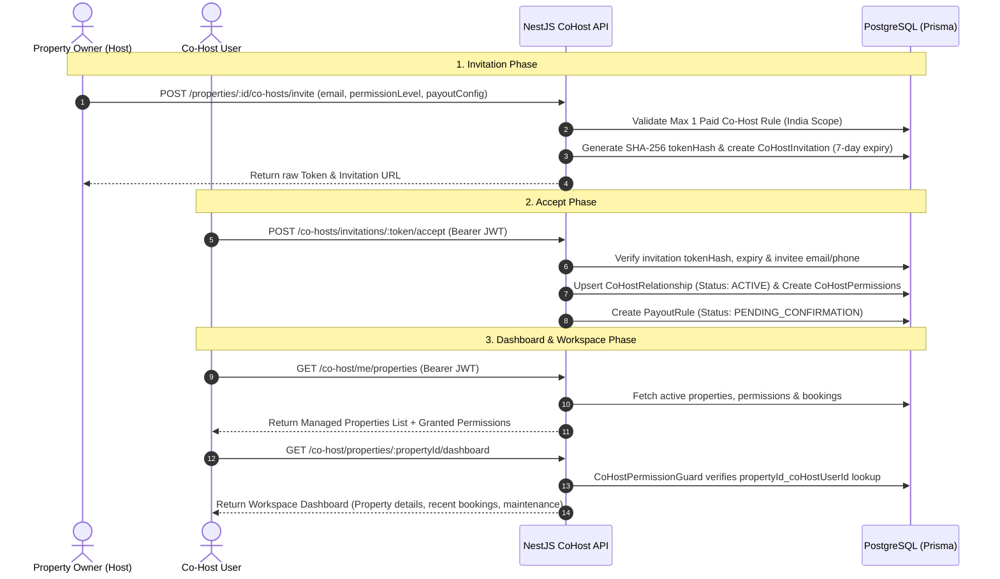

# 👑 Fairbnb Co-Host System: Complete Dashboard Display & End-to-End Architecture

Document generated on: **September 16, 2026**
Target Workspace: `Fairbnb Multi-Host & Co-Host Governance Portal`

---

## 📌 Executive Summary

Fairbnb ka **Co-Host Portal System** Co-Hosts ko ye facility deta hai ki wo ek se zyada Hosts (Property Owners) ki properties ko bina kisi confusion ke manage kar sakein. 

Co-Host ko exact pata chalta hai ki:
1. Unke paas kis property par konsi **Role/Permission Preset** (e.g. `Full Management`, `Property Manager`, `Guest Comm Only`, `Calendar Only`, `Custom`) hai.
2. Har property par 17 fine-grained permission codes me se konse features **Granted (`✓ Allowed`)** hain aur konse **Restricted (`🔒 No Access`)** hain.
3. Wo har property se kitni **Commission (e.g. 15%)** earn kar rahe hain.

---

## 🖥️ FRONTEND: Dashboard me kya-kya aur kaise display ho raha hai?

Frontend **Next.js 14 (App Router)** aur **TailwindCSS** me bana hai. Co-Host Portal me 4 primary views aur pages hain:

### 1️⃣ Main Co-Host Dashboard (`/co-host`)
*File Path: [src/app/co-host/page.tsx](file:///Users/ideaind/Desktop/tech/fairbnb/frontend/src/app/co-host/page.tsx)*

Dashboard par 4 major sections display hote hain:

1. **Welcome Hero & Metric Cards (Top Bar)**:
   - **Good morning, [Co-Host First Name] ☀️**: Personal greeting with logged-in user context.
   - **Total Properties**: Kitni properties Co-Host manage kar raha hai aur kitne alag-alag Hosts ke under.
   - **Active Bookings**: Combined active guest reservations count with month-over-month growth trend (↑ 12%).
   - **Total Earnings (You)**: Total revenue generated across managed properties.
   - **Commission Earned**: Co-Host ka estimated commission (15% of total bookings).

2. **Properties You Manage (Left Column - 2/3 Width)**:
   - **Host Filter Pills**: `All (N)` button and individual Host filter pills (`Host A`, `Host B`). Filter switch karte hi paginated grid filter ho jati hai.
   - **Property Cards**:
     - **Cover Image & Location**: Property photo, City, State.
     - **Owner Badge**: `Host: [Host Name]` overlay tag.
     - **Role/Preset Badge**: Color-coded level pill (🟢 `Full Management`, 🔵 `Property Manager`, 🟣 `Guest Comm`, 🟡 `Calendar Only`).
     - **Allowed Feature Chips**:
       - `📅 Calendar ✓ / 🔒`
       - `📑 Bookings ✓ / 🔒`
       - `💬 Messages ✓ / 🔒`
     - **Action**: `Workspace →` link to open single property portal.

3. **Bookings Across Hosts Table**:
   - Clean tabular view listing recent & upcoming reservations across all managed listings:
     - Guest Avatar & Name
     - Property Title
     - Host Owner
     - Check-In Date & Reservation Status (`CONFIRMED`, `CHECKED_IN`)
     - Calculated Co-Host Commission amount (`₹`).

4. **Sidebar Widgets (Right Column - 1/3 Width)**:
   - **Upcoming Bookings Widget**: Day-by-day check-in list (Today, Tomorrow, In 2 days).
   - **Co-Host Performance Widget**: Circular 15% Commission Rate badge & Month-To-Date earnings.
   - **Hosts You Work With Widget**: Paginated list of property owners with property counts and booking stats.
   - **Recent Activity Timeline**: Real-time event log (New booking received, Host updated listing, Commission credited).

---

### 2️⃣ Managed Properties & Access Matrix (`/co-host/properties`)
*File Path: [src/app/co-host/properties/page.tsx](file:///Users/ideaind/Desktop/tech/fairbnb/frontend/src/app/co-host/properties/page.tsx)*

Ye page 2 dedicated tabs me divided hai:

- **Tab 1: Managed Properties Grid**:
  - Grid of all assigned properties with live search bar.
  - Har card me Host Owner Avatar, Role Badge, aur Feature Chips.
  - Card par click karte hi Right Inspector Panel me property summary, photo preview, aur **17 Permission Checkboxes** ka live status (`✓ Allowed` / `🔒 Limited`) dikhta hai.

- **Tab 2: Access & Permissions Matrix**:
  - A comprehensive comparison table:
    - **Property & Host Name**
    - **Assigned Role Preset**
    - **📅 Calendar**: `✓ Manage` / `✓ View` / `🔒 No Access`
    - **📑 Bookings**: `✓ Manage` / `✓ View` / `🔒 No Access`
    - **💬 Guest Chat**: `✓ Allowed` / `🔒 Disabled`
    - **🔧 Maintenance**: `✓ Allowed` / `🔒 Disabled`
    - **💰 Earnings**: `✓ Allowed` / `🔒 Restricted`
    - **Direct Action Button**: `Workspace →`

---

### 3️⃣ Single Property Workspace (`/co-host/properties/[propertyId]`)
*File Paths: [page.tsx](file:///Users/ideaind/Desktop/tech/fairbnb/frontend/src/app/co-host/properties/[propertyId]/page.tsx) & [layout.tsx](file:///Users/ideaind/Desktop/tech/fairbnb/frontend/src/app/co-host/properties/[propertyId]/layout.tsx)*

Jab Co-Host kisi property par click karta hai, toh wo iss workspace me enter karta hai:

1. **Workspace Sub-Navigation Bar**:
   - Breadcrumb: `← Properties`
   - Property Title & Owner Name
   - Workspace Navigation Tabs: `Overview` | `Calendar 🔒` | `Bookings 🔒` | `Messages 🔒` | `Tasks 🔒`.
   - Lock `🔒` icon tab par tabhi dikhta hai jab uss specific module ki permission missing ho.

2. **Permission Transparency Summary Card**:
   - Top banner displaying active role level (e.g. `PROPERTY_MANAGER`) and 4 quick access blocks:
     - Calendar: `✓ Full Control` / `✓ View Only` / `🔒 Restricted`
     - Bookings: `✓ Manage Bookings` / `✓ View Bookings` / `🔒 Restricted`
     - Messaging: `✓ Enabled` / `🔒 Restricted`
     - Financials: `✓ Enabled` / `🔒 Restricted`

3. **Engaged Guests & Active Property Reservations**:
   - Guest profiles who booked this property with Avatar, Email, Phone, Stay Dates, Total Booking Amount, and direct `Message Guest` button.

---

### 4️⃣ Global Co-Host Navigation Sidebar
*File Path: [CoHostSidebar.tsx](file:///Users/ideaind/Desktop/tech/fairbnb/frontend/src/components/layout/CoHostSidebar.tsx)*

Left navigation bar contains links to:
- 📊 **Dashboard** (`/co-host`)
- 🏡 **Properties** (`/co-host/properties`)
- 📑 **Bookings** (`/co-host/bookings`)
- 💬 **Messages** (`/co-host/messages`)
- 🔧 **Tasks** (`/co-host/maintenance`)
- 📅 **Calendar** (`/co-host/calendar`)
- 💰 **Earnings** (`/co-host/earnings`)
- 👥 **Hosts** (`/co-host/hosts`)
- ⚙️ **Settings** (`/co-host/settings`)

---

## ⚙️ BACKEND: Functionality, Security & API Flow

Backend **NestJS**, **Prisma ORM**, aur **PostgreSQL** par built hai.

### 🗄️ Database Architecture (Prisma Schema)

```prisma
// 1. Permanent relationship between Property, Host Owner, and Co-Host
model CoHostRelationship {
  id              String               @id @default(uuid())
  propertyId      String
  hostUserId      String               // Property Owner
  coHostUserId    String               // Co-Host User
  status          CoHostStatus         // INVITED, ACTIVE, SUSPENDED, REMOVED
  permissionLevel String?              // FULL_MANAGEMENT, PROPERTY_MANAGER, GUEST_COMMUNICATION_ONLY, CALENDAR_ONLY, CUSTOM
  invitedAt       DateTime             @default(now())
  acceptedAt      DateTime?
  verifiedAt      DateTime?
  suspendedAt     DateTime?
  removedAt       DateTime?

  property        Property             @relation(fields: [propertyId], references: [id])
  hostUser        User                 @relation("HostRelationships", fields: [hostUserId], references: [id])
  coHostUser      User                 @relation("CoHostRelationships", fields: [coHostUserId], references: [id])
  permissions     CoHostPermission[]
  payoutRules     PayoutRule[]

  @@unique([propertyId, coHostUserId])
}

// 2. Granular 17-point permissions
model CoHostPermission {
  id                   String               @id @default(uuid())
  coHostRelationshipId String
  permission           CoHostPermissionEnum // 17 codes
  coHostRelationship   CoHostRelationship   @relation(fields: [coHostRelationshipId], references: [id], onDelete: Cascade)
}

// 3. 7-Day Secure SHA-256 Token-Hashed Invitations
model CoHostInvitation {
  id                   String                 @id @default(uuid())
  propertyId           String
  invitedById          String
  email                String?
  phone                String?
  tokenHash            String                 @unique
  requestedPermissions CoHostPermissionEnum[]
  permissionLevel      String?
  payoutConfig         Json?
  status               CoHostInvitationStatus // PENDING, ACCEPTED, DECLINED, EXPIRED, CANCELLED
  expiresAt            DateTime
}

// 4. Co-Host Payout & Commission Rule
model PayoutRule {
  id                   String           @id @default(uuid())
  propertyId           String
  recipientUserId      String
  coHostRelationshipId String?
  type                 PayoutType       // PERCENTAGE, FIXED_PER_BOOKING
  percentage           Float?           // e.g. 15.0
  fixedAmount          Float?
  status               PayoutRuleStatus // PENDING_CONFIRMATION, ACTIVE, INACTIVE
}
```

---

### 🛡️ Security Guard & Permission Decorator System

#### 1. `@RequireCoHostPermission(...permissions)` Decorator
Endpoint par specify karta hai ki konsi permission mandatory hai:
```ts
@Get('co-host/properties/:propertyId/bookings')
@UseGuards(JwtAuthGuard, CoHostPermissionGuard)
@RequireCoHostPermission(CoHostPermissionEnum.VIEW_BOOKINGS)
async getCoHostBookings(@Param('propertyId') propertyId: string) { ... }
```

#### 2. `CoHostPermissionGuard`
*File Path: [cohost-permission.guard.ts](file:///Users/ideaind/Desktop/tech/fairbnb/backend/src/co-host/guards/cohost-permission.guard.ts)*
Har HTTP request par execute hota hai aur 4-step verification karta hai:
1. **Admin / Property Owner Bypass**: Agar user Admin hai ya Property Owner (`hostId`), toh request instantly allow hoti hai.
2. **Active Relationship Check**: Prisma check karta hai ki `propertyId` aur `coHostUserId` ka relationship `status === 'ACTIVE'` hai ya nahi.
3. **Required Permission Check**: Decorator me required permissions ko granted permissions se match karta hai. Missing hone par `403 ForbiddenException` throw karta hai:
   `"Access denied: Missing required co-host permissions: VIEW_BOOKINGS"`

---

### 🔄 End-to-End Functionality & API Flow



---

### 📑 17 Fine-Grained Permission Codes (`CoHostPermissionEnum`)

| Category | Permission Code | Description |
| :--- | :--- | :--- |
| **Property** | `VIEW_PROPERTY` | View property details & photos |
| **Property** | `EDIT_LISTING` | Edit basic listing info & amenities |
| **Calendar** | `VIEW_CALENDAR` | View calendar availability & pricing |
| **Calendar** | `MANAGE_CALENDAR` | Block/unblock dates & sync iCal |
| **Bookings** | `VIEW_BOOKINGS` | View reservations & guest details |
| **Bookings** | `MANAGE_BOOKINGS` | Confirm/modify guest check-ins |
| **Bookings** | `CANCEL_BOOKINGS` | Cancel reservations (if authorized) |
| **Guests** | `VIEW_GUESTS` | Access guest profiles & contact details |
| **Guests** | `MESSAGE_GUESTS` | Send messages & reply to guest inquiries |
| **Pricing** | `VIEW_PRICING` | View base price & weekend rates |
| **Pricing** | `MANAGE_PRICING` | Update nightly rates & discounts |
| **Operations**| `MANAGE_MAINTENANCE` | Create & assign maintenance tasks |
| **Operations**| `MANAGE_CLEANING` | Schedule cleaning staff & turnarounds |
| **Reviews** | `VIEW_REVIEWS` | Read guest reviews & star ratings |
| **Reviews** | `RESPOND_TO_REVIEWS` | Reply publicly to guest reviews |
| **Coupons** | `MANAGE_COUPONS` | Create & apply promotional discount codes |
| **Financials**| `VIEW_EARNINGS` | View payout rules & commission earnings |

---

### 🇮🇳 Business & Governance Rules Enforced

1. **India Scope Rule (Max 1 Paid Co-Host)**:
   - Backend `validateMaxOnePaidCoHostRule()` enforce karta hai ki ek property listing par maximum 1 Co-Host ke paas active `PayoutRule` (Commission %) ho sakta hai.
2. **Invitation Security**:
   - Direct raw token DB me save nahi hota. SHA-256 `tokenHash` saved hota hai. Raw token 7 days me expire ho jata hai.
3. **Owner Revocation Authority**:
   - Host kisi bhi waqt `/co-hosts/:coHostId/suspend`, `/co-hosts/:coHostId/reactivate`, ya `/co-hosts/:coHostId` (Delete/Remove) call karke access alter kar sakta hai.

---

## 🚀 Key Takeaway Summary

- **Frontend**: High-visual clarity with role badges (`Full Management`, `Calendar Only`), 17-point comparison matrix tab, live feature chips (`📅`, `📑`, `💬`, `💰`), and lock indicators (`🔒`) on restricted routes.
- **Backend**: Strict RBAC via `CoHostPermissionGuard`, SHA-256 hashed invite tokens, India scope 1-paid-cohost rule validation, and NestJS controllers.
