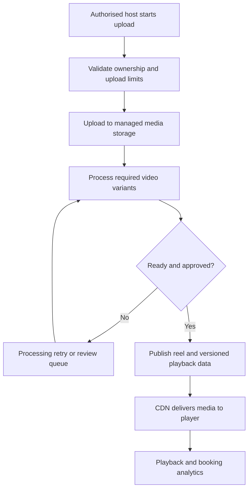
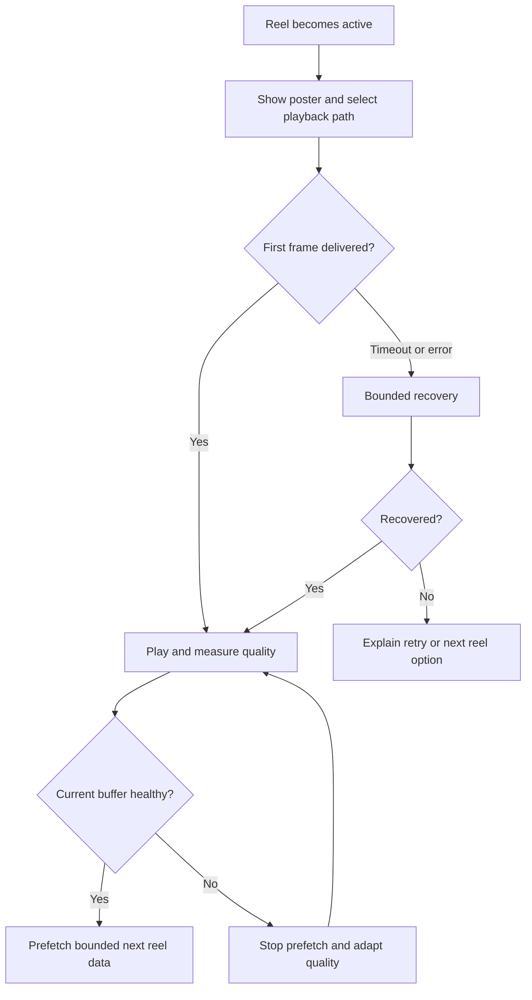

# Fairbnb Reels Production and Business Enhancement Plan

Prepared for Govind Gautam • 24 September 2026

## 1. Recommendation and evidence boundary

Fairbnb Reels should become a reliable visual way to discover and book the exact stay shown in a video. The strongest near-term investment is playback reliability, accurate listing links and high-quality property content. Retain the documented Cloudinary and HLS foundation unless measurements show it cannot meet your quality or cost needs.

This is a document-based assessment and implementation proposal, not an executed source-code audit. The supplied Fairbnb blueprint reports functionality as confirmed by its author; I have not independently inspected those implementations or reproduced reel bugs. Missing detail in the blueprint does not prove missing code. Public research checks provider capabilities and one relevant travel competitor, not competitors' private architectures or measured performance.

Zero buffering under every network/device condition cannot be guaranteed. A user can lose connectivity, a browser can block autoplay, and a device can fail to decode video. We can make stalls rare, identify where they occur and recover well. Do not hide a spinner, delay playback indefinitely or silently skip failed reels to claim zero buffering.

## 2. What your document already reports

| Existing capability | Evidence in supplied Fairbnb blueprint | What remains to validate |
|---|---|---|
| Media processing | `reels.service.ts`, Cloudinary eager HLS profiles | Actual generated variants, completion gate, retries |
| Feed | `getFeed(cursor, limit)` with creator, property tags and counters | Stable pagination, eligibility filters, query latency |
| Player | HTML5/HLS.js, full-screen snap scroll, scroll-out pause | Active-player ownership, cleanup, browser matrix, prefetch |
| Commerce | Property price overlay and Book Now CTA | Exact listing/room mapping and date-aware price accuracy |
| Engagement | Likes, comments, sharing and reporting | Retry behaviour, moderation, accessibility, abuse handling |
| Analytics | `ReelViewSession`, watch duration and completion | Startup, stalls, playback failures, dropped frames and attribution |
| Data model | Reel, ReelListing, ReelLike, ReelComment, ReelReport | Processing metadata, versioning, content provenance |
| Uniqueness | ReelLike unique on reelId and userId | Counter consistency during concurrent like/unlike requests |

The document names 720p/1080p eager profiles. It does not demonstrate a complete low-bandwidth ladder. It names `FAIRBNB_REELS_PHASE_0_AUDIT.md` and `REELS_OBSERVABILITY.md`, but those files themselves are not among the supplied attachments. Obtain these and the actual source before declaring specific implementation defects.

No reels-specific reproduced bug is established by this attachment. The confirmed weakness of the available evidence is the absence of playback-quality measurements, detailed encoding configuration and real-device results. Global API tests and watch-time analytics do not substitute for those.

## 3. Business positioning and competition

Expedia publicly describes Trip Matching, which connects travel reels shared on Instagram with travel planning and booking [S1]. Its 2025 launch announcement described US availability; do not assume identical availability everywhere today. The useful competitive signal is that inspiration-to-booking is an established product direction. An embedded vertical feed alone is not a unique market position.

| Competitive comparison | Fairbnb implication |
|---|---|
| Broad social entertainment | Do not require an equally large creator network to make the first feed useful |
| Expedia's inspiration-to-trip workflow | Connect the viewed property directly to an actionable stay decision |
| Conventional listing discovery | Use real room walkthroughs to reduce uncertainty before booking |
| Your early marketplace constraints | Curate a small useful catalogue and avoid repetitive low-quality inventory |

These are product-positioning judgments, not a tested feature ranking of Instagram, Airbnb, MakeMyTrip or Booking.com. No unsupported feature-gap claims are made about them.

### Recommended customer promise

“See the stay, understand the details, check your dates and book the right room.” The proof must include the property and room type shown, filming date, relevant facilities, honest price wording and a current availability check.

Prioritise three user groups: guests deciding between stays, hosts explaining their property, and operators who need attributable bookings and low support costs. Likes and watch time matter only when they help those outcomes.

### Content strategy for a small inventory

For each pilot property, produce several distinct clips: room walkthrough, bathroom and amenities, location/access, one distinctive experience, and a host explanation of practical details. Avoid repeatedly publishing the same room with different background music.

Use a 15–35 second editorial target initially, adjustable by content. Show the actual space in the opening seconds; capture steady footage, natural colour and readable captions. Include useful limitations such as stairs or a shared amenity where relevant. Ask the host to confirm that the video remains representative after renovations. A badge must identify the actual check performed; a paid promotion or uploaded video is not automatically verified.

Launch with perhaps 20–40 distinct clips across the available properties only if that volume can be produced honestly. This is an editorial planning range, not a growth forecast. If inventory is smaller, use a finite curated collection with a clear end state and “Explore all stays.”

### Monetisation and economics

First measure incremental booking contribution. Later options include a host media-creation service, transparently labelled sponsored placements and creator referral payouts on eligible completed stays. Delay ad-heavy feeds and pay-for-watch rewards; they can reward low-quality or fraudulent engagement.

Track contribution after host share, refunds, discounts, payment fees, media delivery, content production and moderation. An attributed booking is not necessarily incremental. Compare an experiment cohort with a control before claiming growth from reels.

## 4. User experience worth building now

| Feature | Recommended behaviour | Priority |
|---|---|---|
| Clean visual stage | 9:16 presentation, readable text, safe-area spacing; preserve useful room detail when cropping | P1 |
| Immediate feedback | Show a lightweight poster until a decoded frame is ready | P0 |
| Playback ownership | Exactly one foreground reel plays and produces audio | P0 |
| Audio and captions | Muted first autoplay, obvious unmute, captions and remembered preference | P0/P1 |
| Clear property card | Name, locality, room type, capacity and honest price label | P0 |
| Save stay | Reuse property wishlist; distinguish saving a property from liking a clip | P1 |
| Check availability | Open a date/guest sheet tied to the viewed listing | P0 |
| Return to reel | Preserve reel ID, feed position and eligible playback state after viewing details | P1 |
| Useful filters | Location, budget, trip purpose, verified amenities | P1 |
| Sharing | Stable reel deep link, poster preview, working deleted/private-content state | P1 |
| Accessibility | Keyboard controls, labelled buttons, captions, reduced motion and pause | P0/P1 |
| Data saver | Lower quality and reduced prefetch; user control even where network APIs are absent | P1 |

A suggested composition: restrained location/filter controls at the top, video in the centre, compact engagement controls at the side, and one property card with one primary CTA at the bottom. Avoid covering the room with simultaneous popups, coupons, chat prompts and animated banners.

When no dates are selected, use an explicitly qualified indicative price or omit it. Once dates and guests are supplied, request the authoritative booking quote. A reel about a premium room must not advertise the cheapest unrelated room as though it were the same product. Unavailable properties should show alternatives clearly, never silently substitute another listing.

Define drawer behaviour: when a substantial comments or booking drawer opens, pause the background reel and its qualified watch timer; resume only if it remains active and user intent permits. This avoids accidental audio and inflated engagement.

## 5. Production upload and publication pipeline

Cloudinary supports adaptive HLS delivery and eager transformations. Its notifications documentation supports asynchronous completion callbacks and signature verification [S2–S4]. Use those capabilities with your own durable state machine and validation; an uploaded source file is not proof that all playback assets are ready.

Implement a short-lived, restricted upload authorisation for direct provider upload where supported. Keep secrets server-side. Verify property ownership, file size, actual media type, duration, decodability and upload quotas. Provider-specific signed-upload capabilities must be confirmed before choosing the mechanism.

Separate upload completion, processing readiness and moderation approval. Use existing ReelStatus values where suitable and additional internal processing/moderation fields where needed; do not force every orthogonal state into one overloaded enum. Only publish when required variants, poster, duration and approved listing linkage are ready.

Persist provider asset ID, asset version, processing job ID, expected outputs, last error, retry count and status timestamps. Verify callbacks, handle duplicates idempotently and reject stale callbacks for an older asset version. A late success event must not republish an archived, hidden or rejected reel.

Use durable jobs for retries/reconciliation. For the current scope, a persistent job table and worker may be adequate; Redis/BullMQ is an option if already operated. A provider timeout should not force the original upload request to stay open. Reconcile stuck jobs using provider status rather than repeatedly re-uploading or re-transcoding the asset. Expose actionable upload progress to the host.

Production video should be served from managed media delivery. Local `/uploads` fallback must not silently publish an ephemeral local URL that will break after redeployment or on another instance.

## 6. Make buffering rare through the whole delivery path

### 6.1 Encoding experiment

Inspect an actual master playlist first: does it reference multiple playable variants, or just one bitrate? Do not assume that a URL ending in `.m3u8` proves useful adaptive delivery.

The following portrait H.264 targets are an experimental starting point, not a universal preset or a claim about existing Cloudinary configuration. Use supported provider profiles; test detailed indoor scenes, foliage and movement. Avoid upscaling lower-resolution sources.

| Portrait rendition | Illustrative video bitrate | Role |
|---|---|---|
| 360 × 640 | 0.3–0.6 Mbps | Weak connection fallback |
| 540 × 960 | 0.6–1.0 Mbps | Conservative initial quality candidate |
| 720 × 1280 | 1.2–2.2 Mbps | Normal mobile viewing |
| 1080 × 1920 | 2.5–4.0 Mbps | Larger viewport and strong connection |

Audio adds to these figures; test a modest AAC track, for example 64–96 kbps. Keep common frame rates around 24/30 fps unless the content needs more. Maintain compatible encoding, aligned segment/keyframe boundaries and verified portrait orientation. Test approximately 2–4 second VOD segments where configurable; shorter segments trade faster adaptation for request overhead. Use actual provider output if it controls packaging.

A 2-second segment at 1 Mbps contains approximately 0.25 MB before overhead. Raising every stream to 4K materially increases startup and bandwidth demand without necessarily helping a small viewport. Low-latency live streaming is not a prerequisite for pre-recorded reels.

### 6.2 CDN and assets

Use immutable/versioned media URLs and reusable CDN cache keys. Avoid per-request random query strings that fragment caches. Check HLS manifests, all variant playlists, segments, poster and subtitles for correct content types, CORS behaviour and HTTPS. Media bytes should not travel through the NestJS API as a default proxy.

The publish gate should test a manifest and required initial segments, plus a decode smoke test where possible. A warm fetch from one location does not pre-warm every CDN edge; measure both cold and warm playback. Configure provider cache invalidation or access controls for takedowns because removing an item from the feed alone does not revoke a previously public media URL.

### 6.3 Player lifecycle and selective prefetch

HLS.js exposes lifecycle and level-selection controls; validate exact behaviour against the installed lockfile version [S5]. MDN explains that autoplay policies vary and playback can be rejected [S6].

Recommended design:

1. A central playback coordinator chooses the active reel using visibility plus scroll-settled state. Resolve ties deterministically.
2. Mount a bounded neighbourhood around the active reel. At most one reel plays. Destroy detached HLS instances and release listeners, observers and media references.
3. Start with an appropriate conservative adaptive choice rather than forcing 1080p. Permit quality to increase with actual throughput and buffer evidence.
4. Prioritise current playback. Prefetch only the next likely reel's playlist and a bounded initial segment budget once current playback is healthy.
5. Cancel stale prefetch after rapid swipes and avoid downloading distant reels. A prefetch must be reusable by the eventual player; a separate hidden player can otherwise duplicate requests and decoding work.
6. Pause playback and speculative downloads when the page becomes hidden. Do not count background time as qualified watching.
7. Use native HLS where supported and the tested HLS.js path where appropriate. Feature detection and real-device tests decide the route; do not attach both players.
8. Handle the `play()` promise. Muted inline autoplay can still fail; show a clear tap-to-play state instead of an endless loader.
9. Display the poster until the first rendered frame; use rendered-frame callbacks where supported and a tested fallback elsewhere. `canplay` alone is not proof that a visible frame has been shown.

Initial prefetch tuning hypothesis: one upcoming reel, first segment only, on a healthy foreground connection; poster only when data saver is active or bandwidth is poor. Possible active forward-buffer experiments are 6–12 seconds with a small back buffer, but never deploy these as universal magic values. HLS.js buffer-length settings interact with byte limits, fragment sizes and browser memory; measure actual buffered duration and memory.

### 6.4 Recovery strategy

Classify network, manifest, missing-segment, decode, autoplay and unsupported-format failures. Use bounded retries with backoff and jitter. Lower the rendition for bandwidth stress; recreate a failed decoder only within a defined retry budget. Do not endlessly reset the same broken reel.

An optional optimised progressive MP4 fallback should be tested, support byte ranges/fast start, and not simply download the huge original. A source switch can cause a visible delay; measure it. A provider outage will not be fixed by retrying the same CDN URL. Initially prefer graceful fallback to photos/details over a costly second-provider architecture; evaluate redundancy only if incident data justifies it.

## 7. Quality targets and instrumentation

Mux's public documentation separates startup, rebuffering and playback failure metrics [S7]. Implement equivalent event definitions or use a compatible monitoring service; installing Mux Data does not inherently require migrating video hosting.

Proposed release targets below are engineering goals, not measurements or guarantees. Calibrate them against a baseline and declare network/device cohorts. For a healthy-connection cohort, explicitly define effective throughput, latency and no intentional offline interval; for example at least 5 Mbps and RTT below 100 ms in controlled tests. Also report all-network results so exclusions cannot hide poor experiences.

| Metric | Initial proposed goal |
|---|---|
| Cold first-frame startup | p95 at or below 1.5 seconds in agreed healthy cohort |
| Prefetched next-reel startup | p95 at or below 500 ms in same cohort |
| Aggregate rebuffer ratio | Below 0.5% in healthy cohort, then work toward 0.1% |
| Started sessions with zero stalls | At least 99% aspirational in healthy cohort; report sample size |
| Technical playback success | At least 99.5% eligible attempts in healthy cohort |
| Failed autoplay recovery | No indefinite spinner; tap-to-play state available |

Define startup from active playback intent to first rendered frame; report user-cancelled starts and blocked-autoplay attempts separately. Keep startup delay out of rebuffer time. One explicit internal definition is `stall time / (played wall-clock time + stall time)` after the first frame while playback is intended. If a vendor uses a different denominator, retain both labels instead of comparing them as identical.

Also report percent of sessions with stalls and p95 stall duration: an aggregate ratio can hide a bad subgroup. Pauses, seeks, background time, intentional end of video and drawer-induced pauses are not rebuffering. Conversely, count abandonment before startup and unrecovered failures; do not discard them from the experience report.

Events should include playbackAttemptId, anonymous session identifier, reel/asset version, app/player version, device/browser class, chosen rendition, timestamps and error category. Useful events: impression, play intent, first frame, stall start/end, quality change, pause reason, complete, error, retry, CTA, property view and booking attribution. Use bounded batches, deduplicate event IDs and avoid synchronous per-second database writes. Restrict retention and avoid unnecessary personal data.

Correlate bad sessions with provider segment errors, CDN/cache observations, API latency and recent releases. Add alerts for error spikes and processing backlog. Enough synthetic success runs alone do not establish a 99.5% real-world rate; use a rolling field sample with denominators and confidence appropriate to traffic.

## 8. Bugs and risks to reproduce before claiming fixes

All rows are audit hypotheses, not confirmed bugs. Priorities indicate impact if reproduced.

| Priority | Suspected failure mode | How to reproduce or inspect | Fix if confirmed |
|---|---|---|---|
| P0 | Reel published before encoding finishes | Upload a slow asset; request feed before callback | Readiness and moderation publication gate |
| P0 | Only high-bitrate rendition exists | Inspect master playlist and test throttled link | Add compatible lower variants and adaptive selection |
| P0 | Two reels play/audio overlaps | Rapid swipe, partially visible neighbours, return from drawer | Single active-player coordinator |
| P0 | Hidden reels still download | Network trace during rapid swipe/background | Pause, cancel loads and destroy offscreen instances |
| P0 | Memory rises until tab crashes | 100+ swipe device session with memory/decode observations | Bound mounted window and release resources |
| P0 | iOS autoplay rejection looks like buffering | Real Safari, low-power conditions, sound preference changes | Handle promise rejection and explicit user gesture |
| P0 | Local media fails after deploy | Inspect feed URLs across instances and redeploy | Durable provider assets; block local publication fallback |
| P0 | Invalid callbacks publish content | Bad signature, duplicate and stale-version callback tests | Verified callback, idempotency and transition guards |
| P0 | Host tags another host's property | Attempt upload/link edits across ownership boundary | Server-side ownership/delegation checks |
| P0 | Wrong/stale price or room in CTA | Change listing price, room type and publication state | Correct mapping and authoritative quote on date selection |
| P1 | Duplicate/omitted feed items | Scroll while publishing and hiding content | Stable sort with unique tie-breaker and cursor/filter validation |
| P1 | Like toggles undo retry intent | Retry same request; tap quickly from two sessions | Desired-state like/unlike semantics, DB uniqueness and counter repair |
| P1 | Watch counts inflate | Loop, background tab, replay same telemetry batch | Qualified-view definition and session/event deduplication |
| P1 | One-minute limiter blocks normal scrolling | Read actual limiter policy; like different clips rapidly | Separate endpoint/user/IP budgets with clear retry response |
| P1 | Hidden reel remains directly accessible | Open saved link after moderation/takedown | Consistent eligibility checks and provider takedown workflow |
| P1 | Comments abuse or unsafe rendering | Test malicious text, flood and blocked users | Safe rendering, sanitised limits, reporting and moderation |
| P1 | Login or booking loses feed position | Open booking, sign in, navigate back | Restore reel identity/cursor, filters and safe navigation state |
| P1 | CDN works in dev but fails in production | Production origin CORS, CSP, playlists and captions | Correct delivery permissions and headers |

A one-minute rate-limit window is not proof of one allowed interaction per minute. The source document does not specify that policy; inspect it before changing it. Similarly, the documented unique like constraint is a useful existing protection and should be preserved.

## 9. Discovery and recommendation strategy

Start with explicit user intent and a simple candidate ranking pipeline. Eligibility comes first: published and approved reel, active public property, serviceable location, playable asset and valid listing linkage. If dates exist, use current date-aware availability; without dates do not invent availability.

Rank candidates using location relevance, requested budget/category, content quality, freshness, saves and qualified listing visits. Apply host/property diversity, recently-seen suppression and a small exploration allocation for new inventory. Keep rule weights configurable and initially editorial. Watch time alone can promote entertaining but unbookable properties; booking clicks alone can promote misleading pricing.

Do not introduce a large machine-learning recommendation system before collecting sufficient trustworthy behaviour. Later, evaluate personalised ranking against a simple baseline with completed-booking contribution, negative feedback and playback quality as guardrails.

Use clear attribution windows, for example a proposed seven-day post-click reporting window, and store reelId plus listingId through the existing booking flow. Respect the platform's consent model. Separate click-attributed bookings, view-assisted bookings and experimentally incremental bookings. Cancelled or fraudulent bookings must not trigger final creator payouts.

## 10. Architecture and implementation map

Retain Next.js for the feed, NestJS for metadata/authorisation, PostgreSQL for durable records, and Cloudinary for the current media pipeline. Add a bounded player coordinator, processing reconciliation and quality telemetry. The API and CDN are different scaling surfaces.

| Area | Existing path or model named in blueprint | Proposed work |
|---|---|---|
| Upload/media | `backend/src/media/media.service.ts` | Restricted upload, outputs, metadata and durable references |
| Reel lifecycle | `backend/src/reels/reels.service.ts` | Readiness gates, job reconciliation, eligibility |
| Reel APIs | `backend/src/reels/reels.controller.ts` | Ownership, idempotency, feed cursor, event ingestion |
| Viewer | `frontend/src/components/reels/ReelViewer.tsx` | Active-player orchestration and bounded list |
| Player | `VideoPlayer` component named in blueprint | Adaptive playback, cleanup, recovery and telemetry; confirm actual file |
| Feed route | `frontend/src/app/reels/page.tsx` | Filters, restored navigation and booking handoff |
| Prisma schema | Reel and related models | Asset version, processing audit and event identifiers as needed |

Suggested additional internal fields/entities: MediaAsset, ProcessingJob, processingStatus, moderationStatus, providerAssetId, assetVersion, playbackManifestUrl, dimensions, codec, rendition metadata, failureReason and processing timestamps. Add only what the code lacks; migrate existing rows safely rather than recreating the reels system.

Potential API evolution: upload initiation and upload status endpoints, provider webhook handler, explicit desired-state like operations and batched playback events. Preserve old clients through compatibility during rollout. Public cacheable feed records must exclude private data; personalised liked/saved flags need a correctly scoped response or separate overlay. Do not leak one user's state through a shared cache.

### Provider decision

Cloudinary is the first candidate because it is already documented in the stack. Cloudflare Stream also documents managed upload/encoding/delivery with adaptive video [S8]; Mux offers playback monitoring [S7]. These are options to benchmark, not a declaration that any provider eliminates buffering.

Only run a migration comparison if current evidence points to a provider limitation or unacceptable cost. Use the same clips, devices, target geography and cold/warm conditions. Compare startup, stalls, failures, delivered bytes, operational effort and total bill. Do not change encoding provider, player and ranking simultaneously if you want to know which change helped.

## 11. Capacity and cost planning

Bandwidth can dominate before the feed API becomes expensive. Illustrative arithmetic: 10,000 daily viewers × 20 reels × 12 watched seconds × 1 Mbps / 8 ≈ 300 GB/day of video payload. At 25% extra speculative/unused transfer, that becomes about 375 GB/day or 11.25 TB per 30 days. Audio, overhead, retries and provider accounting add variation. This is a scenario, not a traffic forecast or provider quote.

Model storage for originals plus renditions, transcoding usage, video delivery, telemetry, moderation and media production. Observe bytes downloaded per watched second, unused prefetch share and costs per qualified listing visit and completed booking. Do not assume CDN cache hits remove delivery charges; they primarily reduce origin work and can improve latency.

Keep heavy video bytes off your application server. Bound feed payloads and DB queries, index the actual pagination/filter path after query inspection, and serve initial metadata efficiently. Autoscaling APIs will not fix a too-large startup segment or a leaked video decoder.

## 12. Testing and staged delivery

### Test matrix

Use production builds and a deployment representative of intended production. Cover Android Chrome on a low/mid-range phone, real iOS Safari, desktop Chrome/Safari/Edge as supported, and relevant in-app browsers. Playwright is useful for deterministic flows; real hardware is required for autoplay, decoder, thermal and memory behaviour.

Network profiles should include fast connection, constrained throughput/high RTT, changing bandwidth, packet loss, intermittent offline, cold CDN requests and cache hits. Test fresh upload, corrupt video, unsupported codec, rotated/HDR input, duplicate callback, deleted asset and a failed segment.

Journeys: first visit, 100 swipes, reverse swipe, background/foreground, sound toggling, opening comments, reporting, login return, sharing, deep link and booking handoff. Verify no hidden audio and no unbounded listener/player accumulation. Measure unused transfer as well as visible smoothness.

Do not blindly hammer a paid third-party CDN during API load testing. Separate metadata API load tests, controlled media tests and consented field monitoring.

### Work packages and exit gates

Indicative schedule assumes two engineers, QA support, source access and a small curated catalogue. It is a planning range, not a fixed quote: roughly 4–6 weeks for a robust pilot, subject to audit findings and content readiness.

| Package | Indicative effort | Exit evidence |
|---|---|---|
| Baseline audit | 2–3 days | Reproductions, sample playlists, actual dependency versions, current quality baseline |
| Processing reliability | 3–5 days | Ready-only publication, signature checks, retries and stuck-job recovery |
| Playback engineering | 5–8 days | Bounded lifecycle, adaptive ladder, usable prefetch, Safari path, recovery tests |
| UX and commerce | 4–6 days, partially parallel | Clean layout, captions, correct listing/date quote, save/share/return flows |
| Telemetry and QA | 4–6 days, instrumented from the start | Cohort dashboards, real-device evidence, abuse and fault tests |
| Canary and tuning | 3–5 days initially, then ongoing | Observed quality/cost gates before increasing traffic |

Release behind flags: internal users → a small public cohort → 25% → broader traffic only after predeclared gates and sufficient observations. Maintain a working previous player configuration and compatibility for old assets. If failures or stalls regress, roll back player/prefetch configuration; do not immediately bulk re-encode the entire catalogue. A backend upload issue should not interrupt existing playable reels.

Final handoff should include the reproduced bug register, before/after playback dashboard, exact encoding profiles, player settings with reasons, mobile recordings, test results, cost scenario, rollback procedure and known remaining limitations. Avoid a generic “100% production-ready” claim without these artifacts.

## 13. Recommended first implementation scope

1. Inspect actual reel/media/player source and referenced audit files; baseline 10 representative clips.
2. Resolve readiness, ownership, delivery URL and single-player failures first.
3. Verify lower-bitrate variants and add reusable next-reel prefetch with a strict budget.
4. Add startup/stall/error telemetry before tuning and evaluate both cold and warm playback.
5. Improve content, captions, property information and availability handoff.
6. Pilot with real guests on Indian mobile connections and monitor cost.
7. Add personalisation, sponsorships or alternative providers only when evidence supports the investment.

Your immediate product advantage should be a trustworthy visual stay decision with fast playback. The strongest visual polish will come from good real footage, minimal overlays and an uninterrupted path from curiosity to accurate booking.

## Sources and project evidence

Research checked 24 September 2026. Proposed bitrates, buffers, timelines and targets are engineering hypotheses to validate, not provider guarantees.

- Project: supplied `Pasted markdown(20260924-060055).md`, particularly reels service, reels page, model inventory, media integration and observability sections. This is reported implementation evidence, not direct source inspection.
- [S1 Expedia Trip Matching](https://www.expedia.com/tripmatching)
- [S2 Cloudinary Adaptive Bitrate Streaming](https://cloudinary.com/documentation/adaptive_bitrate_streaming)
- [S3 Cloudinary Eager Transformations](https://cloudinary.com/documentation/eager_and_incoming_transformations)
- [S4 Cloudinary Notifications](https://cloudinary.com/documentation/notifications)
- [S5 HLS.js API](https://hlsjs.video-dev.org/api-docs/hls.js.hls)
- [S6 MDN Autoplay Guide](https://developer.mozilla.org/en-US/docs/Web/Media/Guides/Autoplay)
- [S7 Mux Metric Definitions](https://www.mux.com/docs/guides/understand-metric-definitions)
- [S8 Cloudflare Stream Overview](https://developers.cloudflare.com/stream/)
