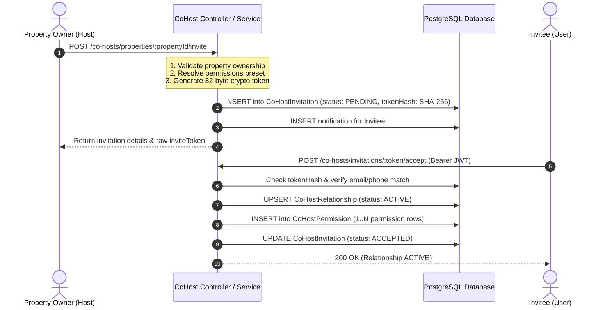

# FairBnb: Co-Host Role & Backend Data Storage Architecture

This document explains exactly **what gets saved in the backend database when a Co-Host is created or invited**, how the **"Role"** concept works under the hood, and why it is designed this way.

---

## 1. Quick Summary: What gets saved for the "Role"?

> **Key Takeaway:**  
> In FairBnb, **"CO-HOST" is NOT a global value in `User.role`**.  
> The `UserRole` enum only contains `USER`, `HOST`, and `ADMIN`.  
> Co-hosting is designed as a **Property-Scoped Relationship (Contextual RBAC)**, not a flat user-level role.

Here is what gets saved across the database tables:

| Location / Field | Type | What gets saved | Purpose |
| :--- | :--- | :--- | :--- |
| **`User.role`** (if new user auto-provisioned) | `UserRole` | `'HOST'` | Gives the account host portal access |
| **`User.role`** (if existing user invited) | `UserRole` | Unchanged (`USER` or `HOST`) | Preserves their existing account role |
| **`CoHostRelationship.status`** | `CoHostStatus` | `'ACTIVE'` (or `'INVITED'`, `'ACCEPTED'`) | The active co-host status on this property |
| **`CoHostRelationship.permissionLevel`** | `String` | `'FULL_ACCESS'`, `'OPERATIONS'`, etc. | High-level role preset tag |
| **`CoHostPermission`** (Multiple rows) | `CoHostPermissionEnum` | `VIEW_BOOKINGS`, `MESSAGE_GUESTS`, etc. | 17 granular permission records |
| **`PayoutRule`** (Optional) | `PayoutRuleStatus` | Percentage / Fixed Fee configuration | Compensation split rule for this property |

---

## 2. Why isn't `COHOST` a global role in `UserRole`?

In the Prisma schema ([`schema.prisma`](file:///Users/ideaind/Desktop/tech/fairbnb/backend/prisma/schema.prisma#L10-L14)):

```prisma
enum UserRole {
  USER
  HOST
  ADMIN
}
```

### The Multi-Tenant Problem:
If `User.role` was set to `'COHOST'`:
- What happens when User #10 owns **Property A** (Host) but helps a friend manage **Property B** (Co-Host), and books a vacation on **Property C** (Guest)?
- A single global `role = 'COHOST'` column would break property isolation. The user would either have co-host permissions across *all* properties or lose their ability to be an owner of their own listings.

### The Solution: Scoped Delegation (Contextual RBAC)
A user is a **Co-Host only within the scope of a specific `propertyId`**. Therefore, the co-host role is stored as a relational link between:
- `propertyId`
- `hostUserId` (Primary Owner)
- `coHostUserId` (Delegated Manager)

---

## 3. What happens step-by-step when a Co-Host is created?

### Case A: Inviting an Existing User
*(When the invited email or phone already exists in the `User` table)*



1. **`User.role` remains unchanged**: If they were `USER`, they remain `USER`. If they were `HOST`, they remain `HOST`.
2. **`CoHostInvitation` is created**:
   - `tokenHash`: SHA-256 hash of random 32-byte token.
   - `requestedPermissions`: Array of permission enum codes (e.g. `[VIEW_BOOKINGS, MESSAGE_GUESTS]`).
   - `permissionLevel`: Preset name (`FULL_ACCESS`, `CALENDAR_MESSAGING`, `OPERATIONS`, etc.).
   - `status`: `PENDING` (expires in 7 days).
3. **Upon Acceptance (`acceptInvitation`)**:
   - Record created in `CoHostRelationship` with `status: ACTIVE`.
   - Records created in `CoHostPermission` for each granted permission.

---

### Case B: Auto-Provisioning a Brand New Co-Host
*(When the invited email or phone does NOT exist yet in the database)*

As seen in [`co-host.service.ts`](file:///Users/ideaind/Desktop/tech/fairbnb/backend/src/co-host/co-host.service.ts#L134-L153):

```typescript
// 1. Generate random temporary password
const newPassword = crypto.randomBytes(4).toString('hex');
const passwordHash = await bcrypt.hash(newPassword, 10);

// 2. Auto-create User account with role 'HOST'
targetUser = await this.prisma.user.create({
  data: {
    name: dto.email ? dto.email.split('@')[0] : (dto.phone || 'New Co-Host'),
    email: dto.email || null,
    phone: phoneNum,
    passwordHash,
    role: 'HOST', // <--- Here! Saved as HOST so they have portal privileges
  },
});

// 3. Automatically accept the invitation
await this.acceptInvitation(rawToken, targetUser.id);
```

In this case:
1. **`User.role` is saved as `'HOST'`**:
   - This ensures the newly created account has base access to host/management portals.
2. **The invitation is automatically accepted**:
   - `CoHostRelationship` is immediately saved with `status: ACTIVE`.
   - `CoHostPermission` records are immediately populated.

---

## 4. Deep-Dive: Database Tables & Exact Fields Saved

### 1. `User` Model
```prisma
model User {
  id           String    @id @default(uuid())
  email        String?   @unique
  phone        String    @unique
  role         UserRole  @default(USER) // Saved as 'HOST' for auto-created co-hosts
  ...
}
```

### 2. `CoHostRelationship` Model
This is the core table representing the co-host role for a listing:

```prisma
model CoHostRelationship {
  id               String             @id @default(uuid())
  propertyId       String             // The listing being co-hosted
  hostUserId       String             // Primary Owner
  coHostUserId     String             // The Co-Host User
  status           CoHostStatus       @default(ACCEPTED) // 'ACTIVE', 'SUSPENDED', 'REMOVED'
  permissionLevel  String?            // e.g., 'FULL_ACCESS', 'CALENDAR_MESSAGING'
  
  invitedAt        DateTime           @default(now())
  acceptedAt       DateTime?
  verifiedAt       DateTime?
  suspendedAt      DateTime?
  removedAt        DateTime?

  permissions      CoHostPermission[]
  payoutRules      PayoutRule[]

  @@unique([propertyId, coHostUserId]) // Only 1 relationship per user per property
}
```

### 3. `CoHostPermission` Model
Stores the actual granular permissions assigned to this co-host:

```prisma
model CoHostPermission {
  id                   String               @id @default(uuid())
  coHostRelationshipId String
  permission           CoHostPermissionEnum // Granular enum value
  createdAt            DateTime             @default(now())

  @@unique([coHostRelationshipId, permission])
}
```

#### The 17 Permission Enums:
- **Listing & Calendar**: `VIEW_PROPERTY`, `EDIT_LISTING`, `VIEW_CALENDAR`, `MANAGE_CALENDAR`
- **Bookings & Guests**: `VIEW_BOOKINGS`, `MANAGE_BOOKINGS`, `CANCEL_BOOKINGS`, `VIEW_GUESTS`, `MESSAGE_GUESTS`
- **Pricing & Discounts**: `VIEW_PRICING`, `MANAGE_PRICING`, `MANAGE_COUPONS`
- **Operations & Reviews**: `MANAGE_MAINTENANCE`, `MANAGE_CLEANING`, `VIEW_REVIEWS`, `RESPOND_TO_REVIEWS`
- **Management & Payouts**: `VIEW_COHOSTS`, `MANAGE_COHOSTS`, `VIEW_EARNINGS`, `VIEW_PAYOUTS`, `MANAGE_PAYOUT_SETTINGS`

---

## 5. How Backend Authorizes Requests (`CoHostPermissionGuard`)

When a co-host attempts to access an endpoint (e.g. view bookings or update pricing):

```typescript
@UseGuards(JwtAuthGuard, CoHostPermissionGuard)
@RequireCoHostPermission(CoHostPermissionEnum.VIEW_BOOKINGS)
@Get('properties/:propertyId/bookings')
async getBookings(@Param('propertyId') propertyId: string) { ... }
```

In [`cohost-permission.guard.ts`](file:///Users/ideaind/Desktop/tech/fairbnb/backend/src/co-host/guards/cohost-permission.guard.ts#L35-L96):
1. **Admin check**: If `user.role === 'ADMIN'`, grant access.
2. **Owner check**: If `property.hostId === user.id`, grant access.
3. **Co-Host Relationship check**:
   ```typescript
   const coHostRel = await prisma.coHostRelationship.findUnique({
     where: {
       propertyId_coHostUserId: { propertyId, coHostUserId: user.id },
     },
     include: { permissions: true },
   });

   if (!coHostRel || coHostRel.status !== 'ACTIVE') {
     throw new ForbiddenException('Access denied: You are not an active co-host');
   }
   ```
4. **Permission check**: Ensures `coHostRel.permissions` contains the required permission (e.g. `VIEW_BOOKINGS`).

---

## 6. Summary Cheat Sheet

| Question | Answer |
| :--- | :--- |
| **Is there a `COHOST` role in `UserRole`?** | **No**. `UserRole` only has `USER`, `HOST`, `ADMIN`. |
| **What is saved in `User.role`?** | If auto-created by invite: `'HOST'`. If existing user: their original role (`USER` or `HOST`). |
| **Where is the Co-Host role actually recorded?** | In the **`CoHostRelationship`** table (`propertyId` + `coHostUserId`) with `status = 'ACTIVE'`. |
| **Where are the Co-Host's privileges saved?** | As individual rows in the **`CoHostPermission`** table linked to the `CoHostRelationship`. |
| **Can a user be a Host on Property A and a Co-Host on Property B?** | **Yes!** Because roles are scoped per property via relationships, not tied globally to the user profile. |
