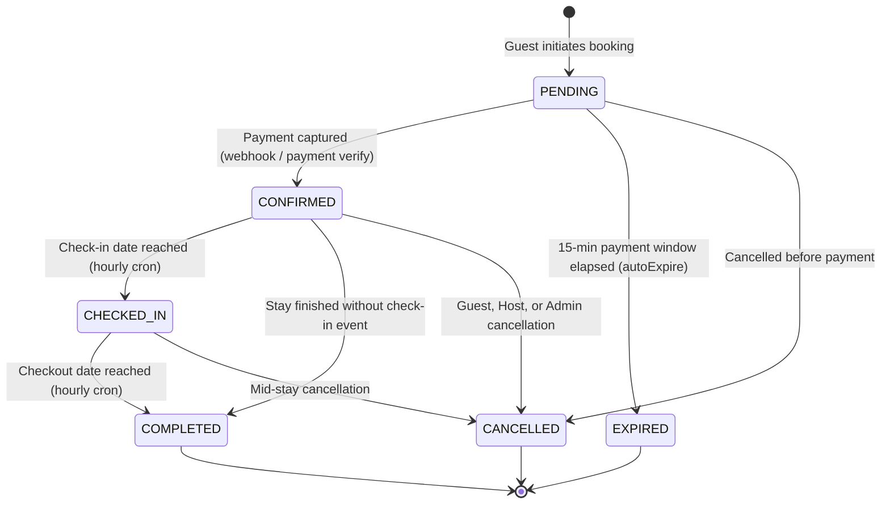

# FairBnB Handoff & Manual Testing Guide: Coupon Engine & Booking Lifecycle

This document is a practical guide for engineers and testers working with the **Coupon/Discount Engine** and the **Booking Lifecycle State Machine**. It assumes general familiarity with the FairBnB stack (Next.js, NestJS, Prisma, PostgreSQL), but zero prior knowledge of these two features.

---

## 1. Overview

* **What problem existed before these fixes:**
  Coupons were previously hardcoded in frontend/pricing calculations without validating real database records, meaning coupons created by admins had no effect, usage limits could be bypassed, and concurrent checkouts could grab the same limited coupon. At the same time, the booking system only checked for `CONFIRMED` bookings when verifying date availability, which meant that once a guest checked in (staying on-site), their dates were treated as open and could be double-booked by another guest.

* **What changed, at a high level:**
  The coupon engine was completely rebuilt into a rule-chain system where coupons are stored in the database, created strictly by Admins, validated dynamically, and incremented atomically inside database transactions. The booking lifecycle was formalized into a six-state machine (`PENDING`, `CONFIRMED`, `CHECKED_IN`, `COMPLETED`, `CANCELLED`, `EXPIRED`), with an automated hourly background job that moves bookings into `CHECKED_IN` on their check-in day and into `COMPLETED` on their checkout day, and date-availability queries were updated so active stays can never be double-booked.

---

## 2. Coupon / Discount Engine

### How It Works

* **The Rule-Chain Concept:**
  When a guest provides a coupon code, the system runs it through a pipeline of independent checks called a rule chain. Instead of giant nested `if-else` blocks, each rule checks one specific business requirement:
  1. `ActiveRule`: Is the coupon marked active in the database?
  2. `ExpiryRule`: Is today's date on or before `validUntil`?
  3. `UsageLimitRule`: Has the coupon been used fewer times than its allowed `usageLimit`?
  4. `MinOrderAmountRule`: Does the booking's base amount meet the coupon's minimum order requirement?

  If any rule fails, execution immediately stops and returns an exact, friendly error message explaining why the coupon cannot be applied.

* **Preview vs. Commit Split:**
  * **Preview:** When a guest enters a coupon code at checkout, the frontend calls the quote/validation endpoint. This performs a *read-only preview*. It checks the rules and calculates how much money the guest will save, but it **does not** increment the coupon's usage count.
  * **Commit (Redemption):** The coupon usage count is only incremented when the guest actually submits the booking (`POST /bookings`). This happens inside the exact same database transaction that creates the booking.

* **Atomic Usage-Limit Enforcement:**
  If a coupon only has 1 remaining use, and two guests click "Book Now" at the exact same fraction of a second, a traditional system could read `timesUsed = 0` for both and let both bookings succeed (overusing the coupon).
  To prevent this, FairBnB uses an **atomic database update**. The database query says:
  > *"Increment timesUsed by 1, but ONLY IF timesUsed is still less than usageLimit."*
  Because PostgreSQL serializes row updates, only the first transaction updates the row. The second transaction updates 0 rows, realizes the coupon just ran out, and immediately aborts the booking with a clear error (`409 ConflictException`). No extra locks or external queues are required.

* **Permissions & Anti-Farming Policies:**
  * **Admin-Only Creation:** Only users with the `ADMIN` role can create or view the full list of coupons (`POST /coupons` and `GET /coupons`). Property Hosts cannot create coupons.
  * **No Coupon Release on Guest Cancellation:** If a host or admin cancels a booking, or if an unpaid pending booking expires, the coupon use is refunded back to the pool. However, if a **guest cancels their own booking**, the used coupon is **deliberately NOT released**. This prevents an exploit where a user could repeatedly book with a limited single-use promo code, hold dates, cancel, and farm discounts.

---

### How to Manually Test the Coupon Engine

#### Test 1: Create a Test Coupon as Admin
1. Obtain an Admin JWT token (log in with an Admin account or inspect authorization headers in browser DevTools).
2. Send a `POST` request to `/coupons` with the following headers and body:
   * **URL:** `POST http://localhost:5000/coupons`
   * **Headers:** `Authorization: Bearer <ADMIN_JWT_TOKEN>`, `Content-Type: application/json`
   * **Body:**
     ```json
     {
       "code": "TEST500",
       "discountType": "FLAT",
       "discountValue": 500,
       "minOrderAmount": 2000,
       "maxDiscountAmount": 500,
       "validUntil": "2028-12-31T23:59:59.000Z",
       "usageLimit": 5
     }
     ```
   * **Expected result:** Status `201 Created`. The response returns the created coupon record with `timesUsed: 0` and `isActive: true`.

#### Test 2: Preview the Coupon as a Guest (API or Checkout UI)
* **Via API:**
  * **URL:** `POST http://localhost:5000/coupons/validate`
  * **Headers:** `Content-Type: application/json` (public endpoint, no auth required)
  * **Body:**
    ```json
    {
      "code": "TEST500",
      "orderAmount": 5000
    }
    ```
  * **Expected result:** Status `200 OK` with response:
    ```json
    {
      "valid": true,
      "code": "TEST500",
      "discountType": "FLAT",
      "discountValue": 500,
      "discountAmount": 500,
      "finalAmount": 4500
    }
    ```
* **Via Frontend UI:**
  1. Log in as a guest and browse to any property listing.
  2. Click "Reserve" or navigate to `/book/[propertyId]?checkin=YYYY-MM-DD&checkout=YYYY-MM-DD&guests=1`.
  3. Scroll down to the **Coupon code** input in the right sidebar price panel.
  4. Type `TEST500` and click **Apply**.
  * **Expected result:** The button switches to "Remove", a green success note appears (`Coupon applied — you saved ₹500`), and the total price updates with the ₹500 discount subtracted.

#### Test 3: Verify Discount Calculation Accuracy
1. Create a percentage coupon:
   * `code`: `"SAVE10"`
   * `discountType`: `"PERCENTAGE"`
   * `discountValue`: `10`
   * `validUntil`: `"2028-12-31T23:59:59.000Z"`
2. Validate against an order of ₹10,000:
   * **Body:** `{ "code": "SAVE10", "orderAmount": 10000 }`
   * **Expected result:** `discountAmount: 1000`, `finalAmount: 9000`.
3. Test with a `maxDiscountAmount` cap (e.g. `maxDiscountAmount: 300`):
   * Validate against ₹10,000:
   * **Expected result:** `discountAmount: 300`, `finalAmount: 9700`.

#### Test 4: Test Usage-Limit Enforcement
1. Create a one-time coupon as Admin:
   * **Body:**
     ```json
     {
       "code": "ONETIME100",
       "discountType": "FLAT",
       "discountValue": 100,
       "validUntil": "2028-12-31T23:59:59.000Z",
       "usageLimit": 1
     }
     ```
2. Make a real booking using this code:
   * `POST /bookings` with `{ "propertyId": "...", "checkIn": "...", "checkOut": "...", "guests": 1, "couponCode": "ONETIME100" }`.
   * **Expected result:** Booking succeeds with status `PENDING` (or `CONFIRMED` upon payment).
3. Now attempt to validate or book with `ONETIME100` a second time:
   * Call `POST /coupons/validate` with `{ "code": "ONETIME100", "orderAmount": 5000 }`.
   * **Expected result:** Status `400 Bad Request` with message: `"Coupon code usage limit exceeded"`.

#### Test 5: Test Expired and Inactive Coupons
1. Create a coupon whose `validUntil` is in the past:
   * `validUntil`: `"2020-01-01T00:00:00.000Z"`
2. Call `POST /coupons/validate` with that code:
   * **Expected result:** Status `400 Bad Request` with message: `"Coupon code has expired"`.
3. Deactivate an existing coupon directly in PostgreSQL (`UPDATE "Coupon" SET "isActive" = false WHERE "code" = 'TEST500';`):
4. Call `POST /coupons/validate`:
   * **Expected result:** Status `404 Not Found` with message: `"Invalid or expired coupon code"`.

#### Test 6: Verify HOST Role Cannot Create Coupons
1. Log in with a user account whose role is `HOST`.
2. Attempt to create a coupon:
   * `POST http://localhost:5000/coupons` with `Authorization: Bearer <HOST_JWT_TOKEN>`.
3. **Expected result:** Status `403 Forbidden` with message: `"Forbidden resource"`. Only `ADMIN` can access this route.

---

## 3. Booking Lifecycle State Machine

### How It Works

FairBnB bookings move through six strictly validated lifecycle states:

| State | Meaning |
|---|---|
| **`PENDING`** | The booking has been initiated. A temporary 15-minute payment hold is placed on the property dates. |
| **`CONFIRMED`** | Payment was captured and verified. The stay dates are locked and confirmed for the guest. |
| **`CHECKED_IN`** | The guest's check-in date has arrived. The stay is active and on-site. |
| **`COMPLETED`** | The guest's checkout date has passed. The stay has finished. (Terminal state) |
| **`CANCELLED`** | The booking was cancelled by the guest, host, or admin. (Terminal state) |
| **`EXPIRED`** | A `PENDING` booking exceeded its 15-minute payment window without payment. (Terminal state) |

### Allowed Transitions Diagram



### The Automated Hourly Cron Job
Nobody needs to manually push a button or mark guests as checked in or checked out.
In [`backend/src/bookings/bookings.service.ts`](file:///c:/Users/shubham/fairbnb--new/backend/src/bookings/bookings.service.ts), the method `handleStayLifecycleTransitions()` runs every hour via `@Cron(CronExpression.EVERY_HOUR)`:
1. It queries all bookings with `status = 'CONFIRMED'` where `checkIn <= now()`, and transitions them to `CHECKED_IN`.
2. It queries all bookings with `status = 'CHECKED_IN'` where `checkOut <= now()`, and transitions them to `COMPLETED`.

### The Double-Booking Bug Fix
* **Before the fix:** The availability check method ([`AvailabilityService.checkAvailability`](file:///c:/Users/shubham/fairbnb--new/backend/src/bookings/availability.service.ts)) only checked for overlapping bookings that had `status = 'CONFIRMED'`. As soon as the cron job moved an active guest from `CONFIRMED` to `CHECKED_IN`, the property dates looked completely free in the calendar. A second guest could book and pay for the exact same property and dates while the first guest was sleeping in the bed.
* **After the fix:** The availability check explicitly includes `{ status: 'CONFIRMED' }`, `{ status: 'CHECKED_IN' }`, and `{ status: 'COMPLETED' }` in its overlap check. An active stay in `CHECKED_IN` status blocks the calendar just as securely as a `CONFIRMED` reservation.

---

### How to Manually Test the Booking Lifecycle

#### Test 1: Create a Booking and Move It to CONFIRMED
1. Create a guest booking via API:
   * **URL:** `POST http://localhost:5000/bookings`
   * **Headers:** `Authorization: Bearer <GUEST_JWT>`, `Content-Type: application/json`
   * **Body:**
     ```json
     {
       "propertyId": "<PROPERTY_ID>",
       "checkIn": "2026-10-10",
       "checkOut": "2026-10-15",
       "guests": 2
     }
     ```
   * **Expected result:** Status `201 Created` with `booking.status: "PENDING"`.
2. Confirm payment using the mock payment webhook:
   * **URL:** `POST http://localhost:5000/payments/webhook`
   * **Headers:** `Content-Type: application/json`
   * **Body:**
     ```json
     {
       "event": "payment.captured",
       "payload": {
         "providerOrderId": "<PROVIDER_ORDER_ID_FROM_STEP_1>",
         "providerPaymentId": "pay_mock_12345"
       }
     }
     ```
   * **Expected result:** Status `200 OK`. Querying the booking now shows `status: "CONFIRMED"` and `paymentStatus: "PAID"`.

#### Test 2: Force-Test the CHECKED_IN Transition Without Waiting for the Cron
*There is currently no public HTTP endpoint specifically to trigger the cron method on demand.* To test it:
* **Option A (Admin API Endpoint):**
  Admins can trigger the transition directly via the status update endpoint:
  * **URL:** `PATCH http://localhost:5000/admin/bookings/<BOOKING_ID>/status`
  * **Headers:** `Authorization: Bearer <ADMIN_JWT>`, `Content-Type: application/json`
  * **Body:** `{ "status": "CHECKED_IN" }`
  * **Expected result:** Status `200 OK`. The booking status is updated to `CHECKED_IN`.
* **Option B (Database Date Manipulation for the Cron):**
  1. In PostgreSQL, set `checkIn` to yesterday:
     ```sql
     UPDATE "Booking" SET "checkIn" = NOW() - INTERVAL '1 day' WHERE "id" = '<BOOKING_ID>';
     ```
  2. Wait for the top-of-the-hour cron or run the unit/e2e test (`npm test -- test/booking-stay-lifecycle.e2e-spec.ts`).
  * **Expected result:** The booking transitions from `CONFIRMED` to `CHECKED_IN`.

#### Test 3: Confirm the Double-Booking Bug Fix
1. Ensure the booking from Test 2 is in `CHECKED_IN` status for dates `2026-10-10` to `2026-10-15`.
2. As a *different* guest, attempt to check availability or create a booking for the overlapping dates:
   * **URL:** `POST http://localhost:5000/bookings/quote`
   * **Body:**
     ```json
     {
       "propertyId": "<SAME_PROPERTY_ID>",
       "checkIn": "2026-10-11",
       "checkOut": "2026-10-14",
       "guests": 1
     }
     ```
   * **Expected result:** Status `200 OK` with `available: false` and `reason: "PROPERTY_ALREADY_BOOKED"`.
3. If attempting `POST /bookings` directly:
   * **Expected result:** Status `409 Conflict` with message: `"PROPERTY_ALREADY_BOOKED: Requested dates were reserved by another booking"`.

#### Test 4: Force-Test the COMPLETED Transition
1. In PostgreSQL, set `checkOut` to yesterday:
   ```sql
   UPDATE "Booking" SET "checkOut" = NOW() - INTERVAL '1 day' WHERE "id" = '<BOOKING_ID>';
   ```
2. Call `PATCH http://localhost:5000/admin/bookings/<BOOKING_ID>/status` with `{ "status": "COMPLETED" }`.
   * **Expected result:** Status `200 OK`. The booking transitions to `COMPLETED`.

#### Test 5: Verify Illegal Transitions Are Rejected
1. Take the `COMPLETED` booking from Test 4.
2. Attempt to revert it to `CONFIRMED`:
   * `PATCH http://localhost:5000/admin/bookings/<BOOKING_ID>/status` with `{ "status": "CONFIRMED" }`.
   * **Expected result:** Status `400 Bad Request` with message: `"Cannot transition COMPLETED booking back to PENDING"` (or similar transition guard error).
3. Take a `CANCELLED` booking and attempt to reactivate it to `CONFIRMED`:
   * `PATCH http://localhost:5000/admin/bookings/<CANCELLED_BOOKING_ID>/status` with `{ "status": "CONFIRMED" }`.
   * **Expected result:** Status `400 Bad Request` with message: `"Cannot re-activate a CANCELLED booking"`.

#### Test 6: Test Guest Cancellation Refund Math
FairBnB supports three policy tiers: `FLEXIBLE`, `MODERATE`, `STRICT` ([`backend/src/bookings/cancellation.service.ts`](file:///c:/Users/shubham/fairbnb--new/backend/src/bookings/cancellation.service.ts)).
1. Set up a confirmed booking for a property with a `FLEXIBLE` cancellation policy.
2. Ensure `checkIn` is more than 24 hours in the future.
3. Call guest cancellation:
   * **URL:** `POST http://localhost:5000/bookings/<BOOKING_ID>/cancel`
   * **Headers:** `Authorization: Bearer <GUEST_JWT>`, `Content-Type: application/json`
   * **Body:** `{ "reason": "Change of travel plans" }`
   * **Expected result:** Status `200 OK`. The booking status becomes `CANCELLED`, `paymentStatus` becomes `REFUNDED`, `refundStatus` becomes `FULL`, and a `Refund` record is created for 100% of the booking amount.
4. *Verify Anti-Farming:* If this booking used a coupon code, query `SELECT "timesUsed" FROM "Coupon" WHERE "code" = '<CODE>';`. Confirm `timesUsed` **did not decrease**.

#### Test 7: Test Host Cancellation Penalty & Full Refund
1. Have a host cancel an existing confirmed booking:
   * **URL:** `POST http://localhost:5000/bookings/<BOOKING_ID>/host-cancel`
   * **Headers:** `Authorization: Bearer <HOST_JWT>`, `Content-Type: application/json`
   * **Body:** `{ "reason": "Plumbing emergency" }`
2. **Expected results:**
   * Status `200 OK`.
   * `booking.status` is set to `CANCELLED`.
   * `booking.paymentStatus` is set to `REFUNDED`.
   * `booking.refundStatus` is set to `FULL`.
   * `booking.cancellation` JSON contains `{ "cancelledBy": "HOST", "penaltyFee": <10% of totalAmount> }`.
   * If a coupon was used, `timesUsed` on the `Coupon` table is **decremented by 1** (released back to the guest).

---

## 4. What's NOT Done Yet (Known Gaps & Limitations)

1. **Payout Split Engine is Not Integrated Into Booking Creation:**
   The exact split calculator and immutable financial snapshot models exist as isolated modules (Chunks 1 and 2A). They have **not** yet been wired into the live booking creation flow (`POST /bookings`). Real bookings currently calculate basic Float amounts (`baseAmount`, `taxAmount`, `totalAmount`) without storing payout splits.
2. **No Real Payment Gateway (Mock Provider Only):**
   The backend currently uses [`MockRazorpayProvider`](file:///c:/Users/shubham/fairbnb--new/backend/src/payments/providers/mock-razorpay.provider.ts). Real credit card charges, Cashfree API calls, and automated bank payouts are simulated.
3. **Host-Cancellation Payment Gateway Refund Call ([`TICKET-001`](file:///c:/Users/shubham/fairbnb--new/docs/tickets.md)):**
   When a host cancels a booking (`hostCancelBooking`), the database marks the refund as `status: 'COMPLETED'`, but does not call `paymentProvider.processRefund()`. In production with a real gateway, this would need to notify the payment gateway.
4. **Admin Cancellation Does Not Insert a `Refund` Row ([`TICKET-002`](file:///c:/Users/shubham/fairbnb--new/docs/tickets.md)):**
   The admin cancellation route sets `booking.refundStatus = 'PENDING'`, but does not create a corresponding record in the `Refund` table for financial teams to review or process.
5. **No Frontend Cancellation Buttons for Host and Admin ([`TICKET-003`](file:///c:/Users/shubham/fairbnb--new/docs/tickets.md)):**
   The backend endpoints (`POST /bookings/:id/host-cancel` and `PATCH /admin/bookings/:id/cancel`) are fully tested and functional via API, but the host dashboard and admin web UI pages do not yet have buttons or modals wired to call them.
6. **No On-Demand HTTP Trigger for the Lifecycle Cron:**
   `handleStayLifecycleTransitions()` runs automatically on an hourly cron schedule, but has no dedicated admin trigger endpoint like `POST /bookings/cleanup-expired`.

---

## 5. Where the Code Lives

### Coupon / Discount Engine Files
All coupon changes are committed and merged into branch `govind-temp`:

| File Path | Description |
|---|---|
| [`backend/src/coupons/coupons.controller.ts`](file:///c:/Users/shubham/fairbnb--new/backend/src/coupons/coupons.controller.ts) | Admin-only coupon creation (`POST /coupons`) and public validation (`POST /coupons/validate`). |
| [`backend/src/coupons/coupons.service.ts`](file:///c:/Users/shubham/fairbnb--new/backend/src/coupons/coupons.service.ts) | Core validation chain runner, atomic `redeemCoupon`, and `releaseCoupon`. |
| [`backend/src/coupons/coupons.dto.ts`](file:///c:/Users/shubham/fairbnb--new/backend/src/coupons/coupons.dto.ts) | Request validation schemas for creating and checking coupons. |
| [`backend/src/coupons/rules/`](file:///c:/Users/shubham/fairbnb--new/backend/src/coupons/rules/) | Rule chain implementations: `active.rule.ts`, `expiry.rule.ts`, `usage-limit.rule.ts`, `min-order-amount.rule.ts`, `index.ts`. |
| [`backend/src/coupons/strategies/`](file:///c:/Users/shubham/fairbnb--new/backend/src/coupons/strategies/) | Discount math strategies: `flat-discount.strategy.ts`, `percentage-discount.strategy.ts`. |
| [`frontend/src/app/book/[id]/page.tsx`](file:///c:/Users/shubham/fairbnb--new/frontend/src/app/book/[id]/page.tsx) | Guest checkout UI with live coupon input, quote preview, and discount summary. |
| [`backend/test/coupon-concurrency.e2e-spec.ts`](file:///c:/Users/shubham/fairbnb--new/backend/test/coupon-concurrency.e2e-spec.ts) | E2E test verifying atomic race-condition safety under parallel requests. |
| [`backend/test/coupon-release.e2e-spec.ts`](file:///c:/Users/shubham/fairbnb--new/backend/test/coupon-release.e2e-spec.ts) | E2E test verifying coupon release policies across guest, host, and admin cancellations. |

### Booking Lifecycle State Machine Files
Originally developed on `feature/booking-lifecycle` and merged into `govind-temp` (commits `0641a37`, `7300385`, `1c49c8c`):

| File Path | Description |
|---|---|
| [`backend/src/bookings/bookings.service.ts`](file:///c:/Users/shubham/fairbnb--new/backend/src/bookings/bookings.service.ts) | `updateStatus()` transition validation, `handleStayLifecycleTransitions()` hourly cron, `finalizeCancellationRefund()`, and cancellation handlers. |
| [`backend/src/bookings/availability.service.ts`](file:///c:/Users/shubham/fairbnb--new/backend/src/bookings/availability.service.ts) | Overlap availability query fixed to treat `CHECKED_IN` and `COMPLETED` as unavailable dates. |
| [`backend/src/bookings/cancellation.service.ts`](file:///c:/Users/shubham/fairbnb--new/backend/src/bookings/cancellation.service.ts) | Policy math for `FLEXIBLE`, `MODERATE`, and `STRICT` cancellation tiers. |
| [`backend/src/bookings/bookings.controller.ts`](file:///c:/Users/shubham/fairbnb--new/backend/src/bookings/bookings.controller.ts) | Guest cancellation (`POST /bookings/:id/cancel`), host cancellation (`POST /bookings/:id/host-cancel`), and pending expiration. |
| [`backend/src/bookings/admin-bookings.controller.ts`](file:///c:/Users/shubham/fairbnb--new/backend/src/bookings/admin-bookings.controller.ts) | Admin status override (`PATCH /admin/bookings/:id/status`) and cancellation (`PATCH /admin/bookings/:id/cancel`). |
| [`backend/src/bookings/dto/update-booking-status.dto.ts`](file:///c:/Users/shubham/fairbnb--new/backend/src/bookings/dto/update-booking-status.dto.ts) | Enum validator for allowed lifecycle status strings. |
| [`backend/src/calendar/calendar.service.ts`](file:///c:/Users/shubham/fairbnb--new/backend/src/calendar/calendar.service.ts) | Updated host calendar queries to display `CHECKED_IN` reservations. |
| [`backend/src/hosts/hosts.service.ts`](file:///c:/Users/shubham/fairbnb--new/backend/src/hosts/hosts.service.ts) | Updated host dashboard overview to count `CHECKED_IN` guests. |
| [`backend/src/ical/ical.service.ts`](file:///c:/Users/shubham/fairbnb--new/backend/src/ical/ical.service.ts) | Updated external iCal export feed to block dates for `CHECKED_IN` stays. |
| [`backend/test/booking-stay-lifecycle.e2e-spec.ts`](file:///c:/Users/shubham/fairbnb--new/backend/test/booking-stay-lifecycle.e2e-spec.ts) | E2E tests validating the hourly cron, check-in transitions, and double-booking protection. |

### Branch & Merge Status
* **Active Branch:** `govind-temp` (contains all coupon and booking lifecycle fixes).
* **Merged Feature Branches:** `feature/booking-lifecycle` was merged into `govind-temp` in merge commit `7300385`.
