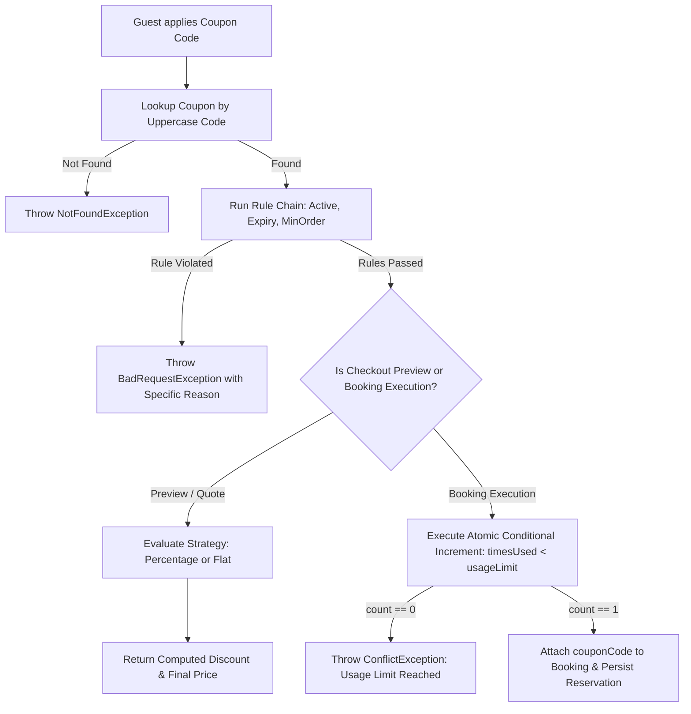
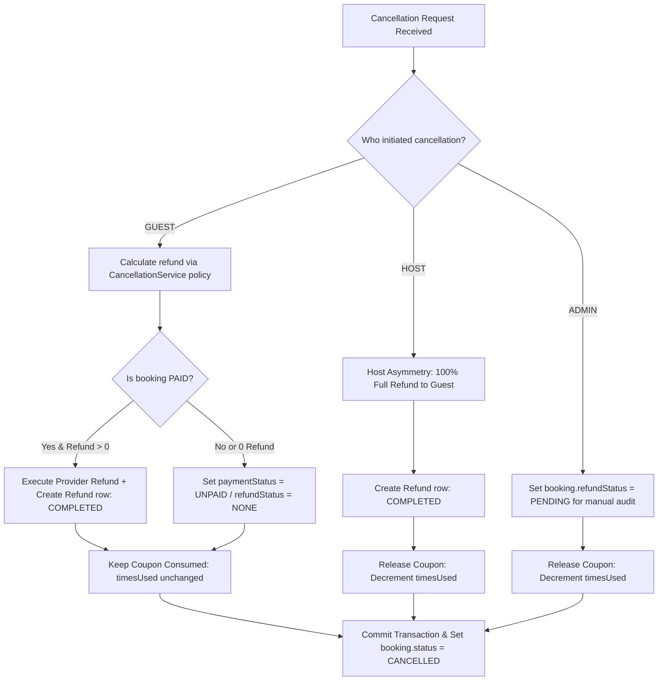

# Core System Algorithms: Discount Resolution & Cancellation Lifecycle

This document describes the architecture, correctness guarantees, and implementation details of two critical backend algorithms in the FairBnB platform:
1. **The Discount/Coupon Resolution Engine**
2. **The Booking Cancellation Lifecycle (Refund Handling & Coupon Release)**

---

## 1. Discount/Coupon Resolution Engine

### Problem
Previously, the platform suffered from two disconnected coupon systems:
- A legacy validator in the booking/pricing flow that evaluated coupon codes in-memory or against hardcoded mocks (`WELCOME10`), calculating discounts without database persistence.
- A database-backed `CouponsService` that defined schema models but was bypassed by the actual checkout and quote endpoints.

This decoupling created critical flaws:
1. **Usage Limit Overselling (Race Conditions):** A check-then-act pattern (`findUnique` followed by `update`) allowed concurrent checkout requests to all pass the `timesUsed < usageLimit` check, overselling limited-quantity promotional coupons.
2. **Double Release on Failure / Expiry:** If a payment failed or a pending booking auto-expired, lack of atomic guard conditions during coupon release could decrement `timesUsed` multiple times or drop it below zero under duplicate webhook deliveries.
3. **Rigid Validation:** Validation logic mixed expiry checks, order minimums, and discount calculations into monolithic conditional blocks, making it difficult to extend with new discount models (e.g., capped percentages vs. flat deductions).

---

### Design

The engine is decoupled into two complementary patterns and backed by database-level atomic conditional updates:

1. **Chain of Responsibility (`backend/src/coupons/rules/`):**
   - Each validation constraint is encapsulated as an independent rule implementing `CouponRule`:
     - `ActiveRule`: Ensures `coupon.isActive === true`.
     - `ExpiryRule`: Ensures current timestamp is between `validFrom` and `validUntil`.
     - `UsageLimitRule`: Ensures `timesUsed < usageLimit`.
     - `MinOrderAmountRule`: Ensures `orderAmount >= minOrderAmount`.
   - Rules are composed into distinct execution pipelines depending on context:
     - `FULL_VALIDATION_CHAIN`: Runs all four rules for quote generation and guest checkout previews.
     - `REDEMPTION_CHAIN`: Runs `ActiveRule` and `ExpiryRule` during booking creation, delegating the usage limit check directly to the database transaction.

2. **Strategy Pattern (`backend/src/coupons/strategies/`):**
   - Discount calculation is extracted from business validation into polymorphic strategies (`DiscountStrategy`):
     - `PercentageDiscountStrategy`: Computes `(orderAmount * discountValue) / 100` and clamps it to `maxDiscountAmount` if defined.
     - `FlatDiscountStrategy`: Deducts a fixed currency amount, capped at the total `orderAmount` (preventing negative totals).

3. **Atomic Conditional Updates (Concurrency Control):**
   - *Why this instead of row-level locks:* Prisma does not provide native `SELECT ... FOR UPDATE` row-locking primitives without falling back to raw, untyped SQL. Instead, we use SQL-level atomic conditional updates (`tx.coupon.updateMany`) that leverage PostgreSQL's native row-level write locks. The row is locked and incremented only if the predicate `timesUsed < usageLimit` still holds true at execution time.

#### Core Implementation Snippet
*From [`backend/src/coupons/coupons.service.ts`](file:///c:/Users/shubham/fairbnb--new/backend/src/coupons/coupons.service.ts#L90-L104):*

```typescript
const result = await tx.coupon.updateMany({
  where: {
    code: uppercaseCode,
    timesUsed: { lt: coupon.usageLimit },
  },
  data: { timesUsed: { increment: 1 } },
});

if (result.count === 0) {
  throw new ConflictException(
    'Coupon usage limit reached — this coupon just reached its usage limit, please retry without it or with a different code.',
  );
}
```

#### Decision Flow Diagram



---

### Correctness Guarantees

1. **Zero Overselling Under High Concurrency:**
   Because PostgreSQL serializes concurrent `UPDATE` statements on the same row, transactions queue at the row lock. The `WHERE timesUsed < usageLimit` predicate is re-evaluated against the freshly committed state for each incoming transaction. If the limit was reached by preceding transactions, PostgreSQL updates 0 rows (`count === 0`), triggering an immediate `ConflictException` and transaction rollback.
2. **Underflow Protection:**
   In `releaseCoupon()`, decrementing uses `WHERE timesUsed >= amount`. If a duplicate refund or webhook calls release on an already decremented counter, the statement affects 0 rows, guaranteeing `timesUsed` never falls below 0.
3. **Idempotent Webhook Recovery:**
   Payment failure webhooks check the booking's `paymentStatus`. Once transitioned to `FAILED`, repeated deliveries are no-ops and will not double-release the associated coupon.

---

### Testing

The engine is verified across unit, integration, and high-concurrency end-to-end suites:

- **[`backend/src/coupons/rules/rules.spec.ts`](file:///c:/Users/shubham/fairbnb--new/backend/src/coupons/rules/rules.spec.ts) (8 unit tests):**
  - Verifies rule failures independently: inactive flag, past expiry, zero/exhausted usage limit, and sub-minimum order values.
- **[`backend/test/coupon-concurrency.e2e-spec.ts`](file:///c:/Users/shubham/fairbnb--new/backend/test/coupon-concurrency.e2e-spec.ts) (3 e2e scenarios):**
  - *Scenario 1 (20 parallel requests against limit of 5 on distinct dates):* Exactly 5 succeed with HTTP 201; exactly 15 fail with HTTP 409 (`ConflictException`). Database `timesUsed` finishes at exactly 5.
  - *Scenario 2 (20 parallel requests on overlapping dates):* Proves date availability locks and coupon atomic increments work concurrently without race conditions or deadlock.
  - *Scenario 3 (Race condition on the final remaining slot):* Fires two simultaneous checkout calls when `timesUsed = usageLimit - 1`. Exactly one succeeds; the second receives a clean 409 conflict.

---

## 2. Booking Cancellation Lifecycle

### Problem
Before refactoring, booking cancellations were fragmented across three isolated controller handlers (`cancelMyBooking`, `hostCancelBooking`, and `cancelBooking`):
- **Casing Inconsistencies:** The database schema defined `status String @default("pending")` on `Refund`, while admin approval routes checked uppercase `'COMPLETED'`, leading to casing mismatches and queries failing to filter active refunds properly.
- **Coupon Discount-Farming Loophole:** If a guest used a single-use coupon, booked a property, and cancelled, there was no consistent policy on whether the coupon was returned. Without strict controls, guests could repeatedly book, cancel, and re-use limited coupons to hold inventory or exploit promotions.
- **Scattered Refund Math & Asymmetry:** Guest cancellations require tiered policy deductions (e.g., Flexible, Moderate, Strict via `cancellation.service.ts`), while Host cancellations require full 100% guest refunds plus a host penalty fee. These calculations were duplicated inline across different methods rather than unified through a centralized finalizer.

---

### Design

1. **Centralized Finalization Helper (`finalizeCancellationRefund`):**
   - Extracted a private, transaction-bound helper method in `BookingsService` that standardizes:
     - Policy-based calculation parsing for guest cancellations.
     - 100% full refund guarantees for host-initiated cancellations.
     - PENDING refund status reviews for admin interventions.
     - Standardized uppercase `status` literals (`'PENDING'`, `'COMPLETED'`, `'FAILED'`).
2. **Actor-Differentiated Coupon Release Policy:**
   - **Host or Admin Cancellation:** The guest is not at fault. If a coupon was attached (`booking.couponCode`), `this.couponsService.releaseCoupon(tx, booking.couponCode)` is called to restore the guest's coupon slot.
   - **Guest Cancellation:** The coupon usage is deliberately **not released**. The coupon remains consumed (`timesUsed` is not decremented), closing the discount-farming and inventory-churn loophole.
3. **Idempotent Refund Creation:**
   - Client-provided `idempotencyKey` values are checked within the transaction before issuing refunds or creating database records, preventing double-refunding on network retries.

#### Core Implementation Snippet
*From [`backend/src/bookings/bookings.service.ts`](file:///c:/Users/shubham/fairbnb--new/backend/src/bookings/bookings.service.ts#L368-L399):*

```typescript
} else if (initiatedBy === 'HOST') {
  // Host cancellation asymmetry: 100% full refund to guest
  if (booking.paymentStatus === 'PAID') {
    refundRecord = await tx.refund.create({
      data: {
        bookingId: booking.id,
        amount: booking.totalAmount,
        reason: `Host cancellation full refund: ${options?.reason || 'Host cancelled booking'}`,
        status: 'COMPLETED',
        processedAt: new Date(),
      },
    });
    newPaymentStatus = 'REFUNDED';
    newRefundStatus = 'FULL';
  }
} else if (initiatedBy === 'ADMIN') {
  // Admin cancellation: pending refund review
  if (booking.paymentStatus === 'PAID') {
    newRefundStatus = 'PENDING';
  }
}

// Coupon release handling: release if cancelled by HOST or ADMIN; do NOT release if GUEST
if (initiatedBy === 'HOST' || initiatedBy === 'ADMIN') {
  if (booking.couponCode) {
    await this.couponsService.releaseCoupon(tx, booking.couponCode);
  }
} else if (initiatedBy === 'GUEST') {
  // Guest-initiated cancellation must not return coupon usage,
  // to prevent a book→discount→cancel→rebook farming loophole.
}
```

#### Decision Flow Diagram



---

### Correctness Guarantees

1. **Transactional Integrity (`prisma.$transaction`):**
   Booking status update, refund record creation, and coupon release execute within a single atomic database transaction. If the refund provider call fails or an error occurs, no state is partially written.
2. **Schema & Data Casing Normalization:**
   Prisma schema default is normalized to `@default("PENDING")` and tracked via migration `20260915143000_normalize_refund_status_casing`. Database queries filtering by uppercase literals are guaranteed consistent across all cancellation triggers.
3. **Loophole Elimination:**
   Coupon timesUsed decrement is strictly guarded by the cancellation actor check, ensuring guest-cancelled bookings cannot recycle promotional coupons.

---

### Testing

Verified in [`backend/test/coupon-release.e2e-spec.ts`](file:///c:/Users/shubham/fairbnb--new/backend/test/coupon-release.e2e-spec.ts) (6 comprehensive end-to-end tests):

1. `Payment failed webhook releases coupon and is idempotent on duplicate delivery`: Confirms duplicate failure webhooks do not double-decrement usage.
2. `autoExpirePendingBookings expires stale bookings past expiresAt and releases coupons in batch`: Confirms background expiry worker safely restores coupon counts.
3. `Host cancels a confirmed booking that used a coupon -> timesUsed decrements, refund status uses uppercase COMPLETED`: Verifies full guest refund and successful coupon release.
4. `Admin cancels a confirmed booking that used a coupon -> timesUsed decrements, refund status uses uppercase PENDING`: Verifies refund status transitions to uppercase `PENDING` and coupon is restored.
5. `Guest cancels a confirmed booking that used a coupon -> refund created, but timesUsed does NOT change (stays consumed)`: Confirms coupon slot remains consumed.
6. `Refund status casing is consistent across all three paths (assert exact string, not case-insensitive match)`: Verifies exact uppercase string equality across all generated refund rows.

---

## Known Limitations & Tracked Technical Debt

As documented in [`docs/tickets.md`](file:///c:/Users/shubham/fairbnb--new/docs/tickets.md), three known follow-up items remain open:

1. **[TICKET-001] Host-cancellation refund doesn't call actual payment provider (Severity: High):**
   In `finalizeCancellationRefund()`, the `HOST` branch creates a `Refund` record with `status: 'COMPLETED'` directly without dispatching `paymentProvider.processRefund()`. While the database marks the refund complete, real payment gateways (Stripe/Razorpay) are not notified. The fix requires mirroring the `GUEST` branch flow.
2. **[TICKET-002] Admin cancellation never creates a Refund row (Severity: Medium):**
   The `ADMIN` branch marks `booking.refundStatus = 'PENDING'` but does not call `tx.refund.create()`. Needs investigation to determine whether an admin UI "review refund" action creates the record downstream or if the cancellation step itself must persist a pending `Refund` row.
3. **[TICKET-003] No frontend UI for Host and Admin booking cancellation (Severity: Medium):**
   Both host cancellation (`POST /bookings/:id/host-cancel`) and admin cancellation (`PATCH /admin/bookings/:id/cancel`) are fully implemented and covered by backend tests, but the frontend currently lacks UI buttons or dialogs to trigger them.

---

## Author's Note

These two algorithms were designed and implemented iteratively through paired engineering review, with close attention to catching distributed-system edge cases—such as disconnected validation systems, race conditions under high concurrency, and webhook idempotency—prior to writing code. Where database tooling constrained options (e.g. lack of native row-locking in Prisma), architectural choices were selected to leverage PostgreSQL's underlying transactional guarantees directly.
